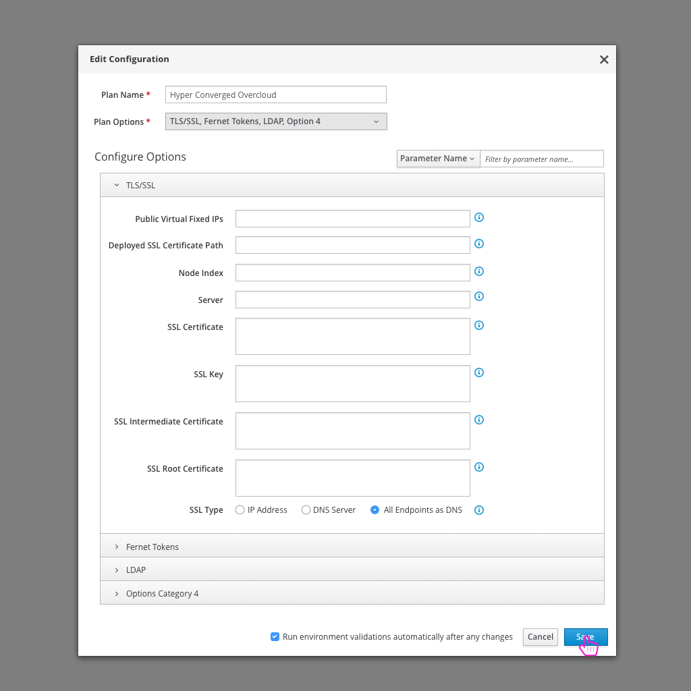

# Deployment by Edge Technician Jacques
Jacques is an edge technician who is looking to deploy OpenStack at a number of edge sites over the next week. You can read more about Jacques and his role here:

[Jacques Persona](https://etherpad.openstack.org/p/edge-technician-persona-tripleo-ui)

## Login

- Jacques opens the TripleO UI and logins to start working through the OpenStack deployment.
- On login, Jacques is taken right to the details of the one deployment plan that exists for this site.

## Discover Infrastructure

- The first step that Jacques needs to take is to discover the infrastructure at the site he's deploying at.
- Clicking on the "Discover Infrastructure" buttons presents him with a modal to enter network details.

- Jacques chooses the discovery protocol (IPMI), then defines the IPMI Username and Password for the machines that will be discovered. The Subnet IP ranges along with ports are also specified. Each of these can include multiple ranges.
- Once Jacques fills out the required information and clicks the "Discover" button, the discovery process will run.

- After the discovery process runs, any nodes that have been discovered will be listed in the left panel of the Add Infrastructure modal. Jacques can select any of these nodes listed and update the node parameters in the right hand panel as they see fit.
- Clicking the "Add Infrastructure" button will kick off the process to register these nodes.
- Note: A checkbox next to the buttons allows Jacques to specify whether or not he wants the hardware validations to run automatically after nodes are registered.

## Validations

- After adding the infrastructure, a number of validations will be kicked off to test the hardware.
- Jacques can take a look at the validations panel to view the status or details of validations. They can also kick off, pause, or stop validations from this panel.

## Edit Configuration

- Once Jacques has added any infrastructure that will be used in this deployment, he can double check the configuration that will be deployed. Most likely, he shouldn't need to change anything even at the high level.

## Assign Nodes to Roles

- At this point, Jacques needs to decide how many nodes will be assigned to which roles. He can use the arrows to increase or decrease the number of nodes assigned to each role.
- Note: If nodes have previously been tagged, they will be selected for the appropriate role. If the user requests a node to play a role and there aren't any tagged nodes, the system will choose the next available untagged node.

## Deploy Overcloud

- Once the details of the deployment look good, Jacques can click the "Deploy" button to kick off the deployment process.

- Jacques will get a confirmation window before going forward with the deployment.
- Note: If any validations haven't completed, or have failed, the user will see a warning message within this confirmation modal.

- After kicking off the deployment, Jacques won't be able to make any configuration changes.
- A progress bar will show how far the deployment has gone alone with what step it is currently on.
- Jacques will have the option to cancel the deployment at this point if he wants.

- If the deployment fails, Jacques will be given a high level error message along with a link to export/view the logs and retry the deployment. At this point, Jacques would most likely export the logs to send back to the center to troubleshoot. Configuration changes would be made based on any errors and the deployment would be rerun.

- After a successful deployment, Jacques is given the details on how to access the deployed overcloud.
