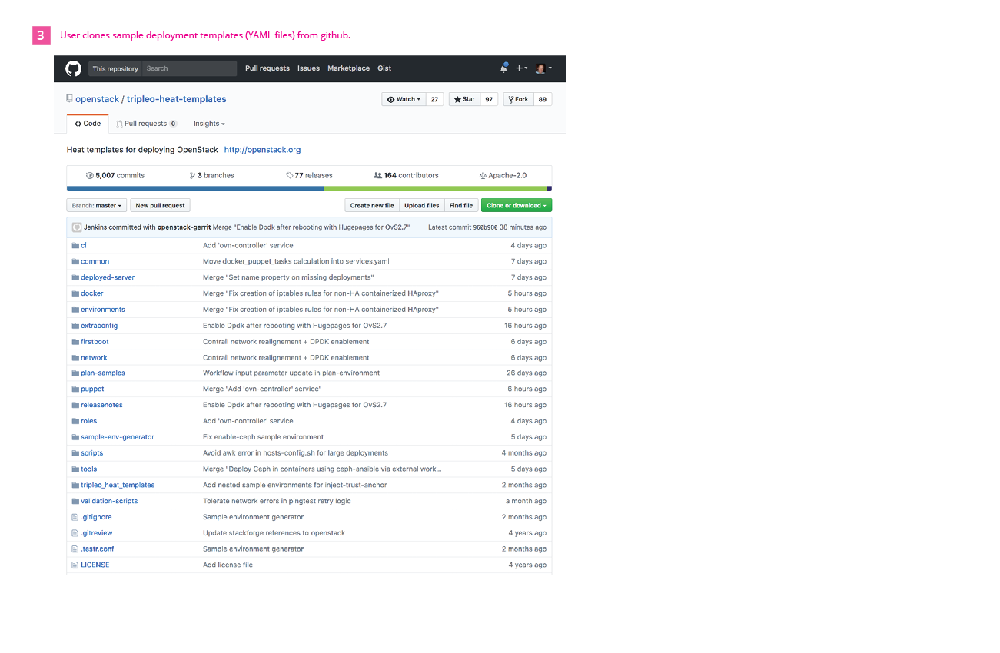
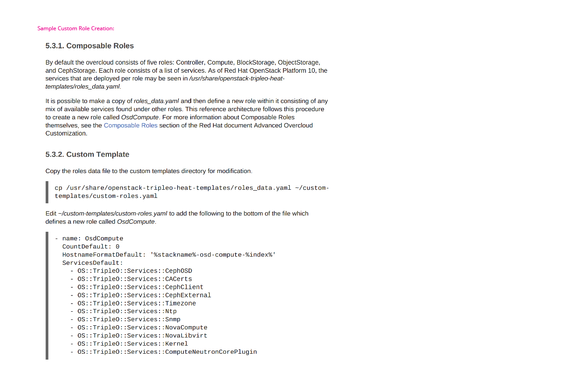
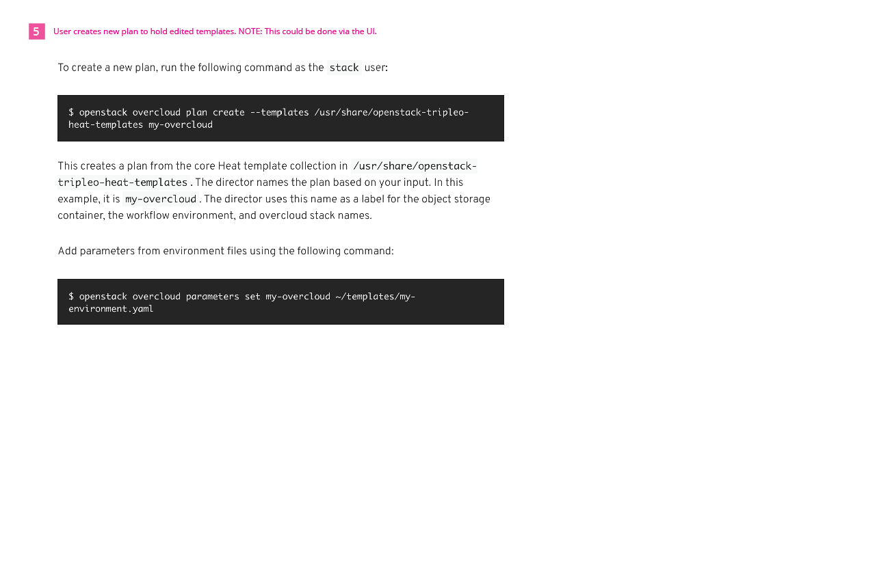
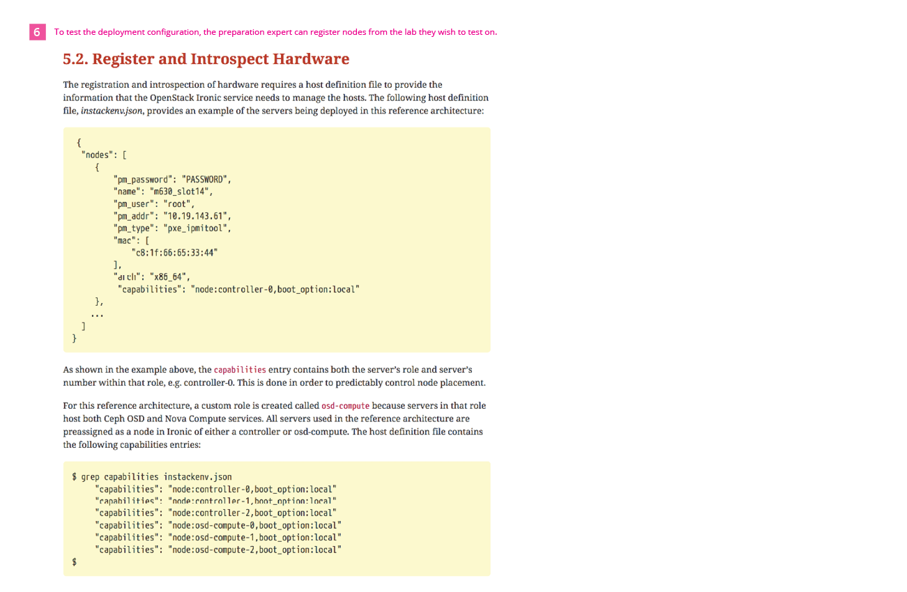
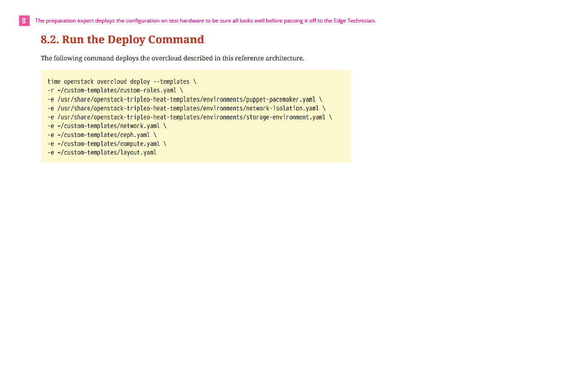

# Undercloud Install and Preparation by Preparation Expert
Before the edge technician (Jacques) can do his job of installing the OpenStack Overcloud at an edge site, the undercloud needs to be installed and some configuration work needs to take place. This is not part of Jacques role and is captured below as part of a workflow done by what we are calling the "Preparation Expert". Read more about this persona here:

Preparation Expert Persona (TBD)

## Identify and Prepare Hardware for Undercloud

- The Preparation Expert needs to identify and prepare the hardware they will be using to install the undercloud on. They will refer to guidance on what the specifications need to be for this hardware.

## Install Undercloud

- The preparation expert can install the undercloud in a number of different ways. One of these options is to clone and run the TripleO Quickstart project. Other options include using the RDO Quickstart or if a Red Hat customer, the guides provided with a Red Hat subscription.

## Clone Heat Templates

- The Preparation Expert clones the heat templates that are provided by the TripleO project so that they can make any edits needed for the configuration for their overcloud environment.

## Edit Heat Templates

- Any configuration updates that need to be made should be changed in the YAML files. This includes Network and Storage configuration changes along with creating or editing any custom roles that will be used.

## Register & Introspect Nodes

- At this point, if the user wants to test their configuration before sending it to the Edge Technician for use, they could register nodes and move forward with a test deployment.

## Assign Nodes to Roles

- By updating the node count for each role, the user is assigning these nodes to the specific roles before deployment.

## Deploy

- The user can run the deploy command at this point to test that the deployment configuration will work on their test hardware.

## Export Plan

- At any point, the user can export a deployment plan.
- This will support the use cases where one deployment plan might want to be used for multiple sites. The Edge Technician can simply import the deployment plan and then use it to deploy the overcloud at their site.
