# Undercloud Install and Preparation by Preparation Expert
Before the edge technician (Jacques) can do his job of installing the OpenStack Overcloud at an edge site, the undercloud needs to be installed and some configuration work needs to take place. This is not part of Jacques role and is captured below as part of a workflow done by what we are calling the "Preparation Expert". Read more about this persona here:

Preparation Expert Persona (TBD)

The preparation expert could use the UI to do all of these steps after prepping their undercloud hardware and installing the undercloud. Here is what that flow could look like in the UI...

## Login to the UI

- After logging in, the user would be dropped into the Plans card views. This would show any default plans that are available on a clean install.

## Create a new Plan
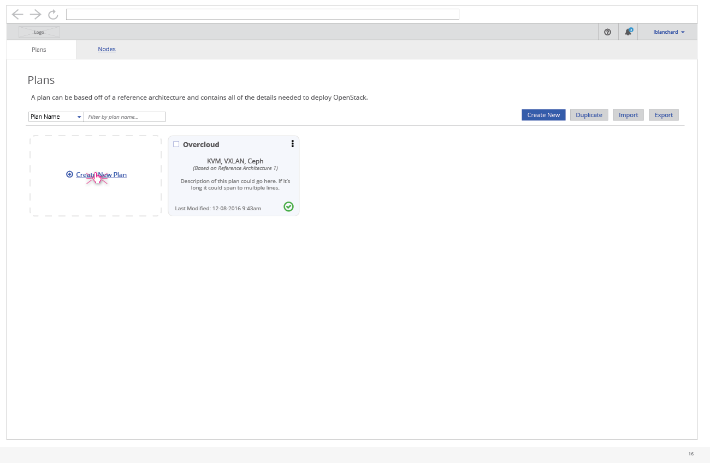
- At this point, the Preparation Expert would create a new plan so that they could define the specifics for what will be deployed at the Edge Site.

- On creation of a Plan, the user can choose high level configuration options.  

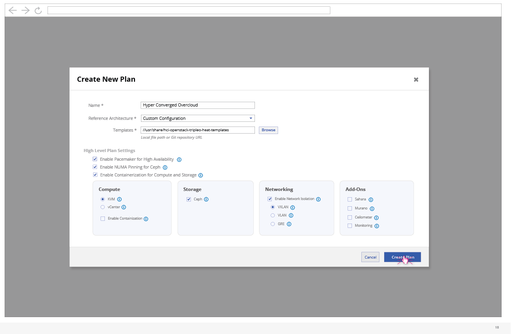
- Once the user has finalized the high level plan details, they can confirm the creation of the plan.

- After creating the plan, the user will see it listed in the card view. Clicking on the card will drill into the detailed workflow of that plan.

## Register Nodes
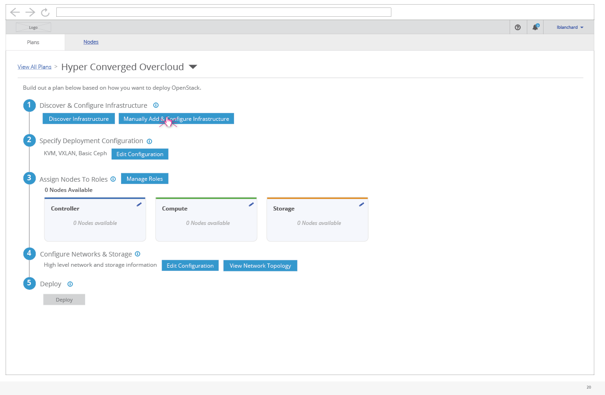
- As a first step to testing out this configuration, the user can begin the process of doing a test deployment by registering nodes.

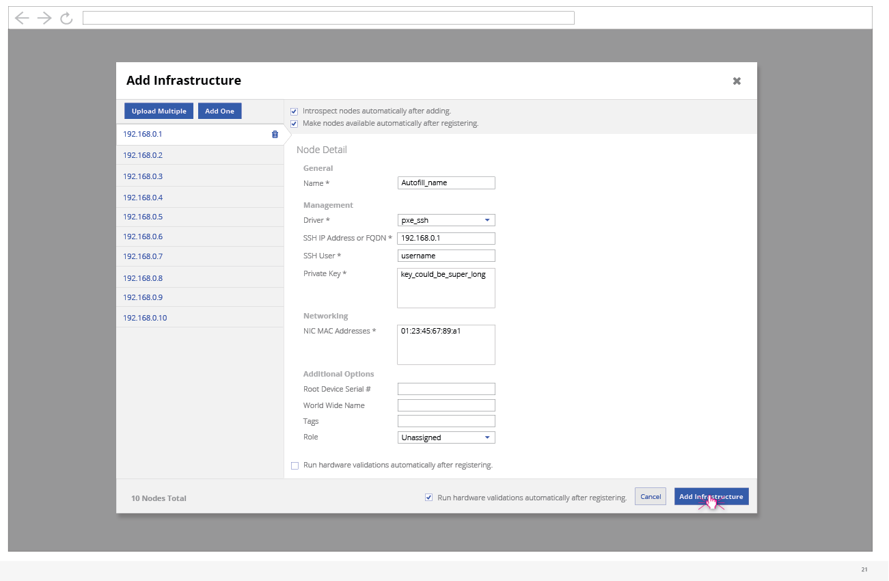

## Manage Roles and Assign Nodes to Roles

- Since this deployment will be an HCI deployment, the user is going to want to edit the roles that are used.

- At this point the user can deselect the Compute and Storage roles so that they are not used.

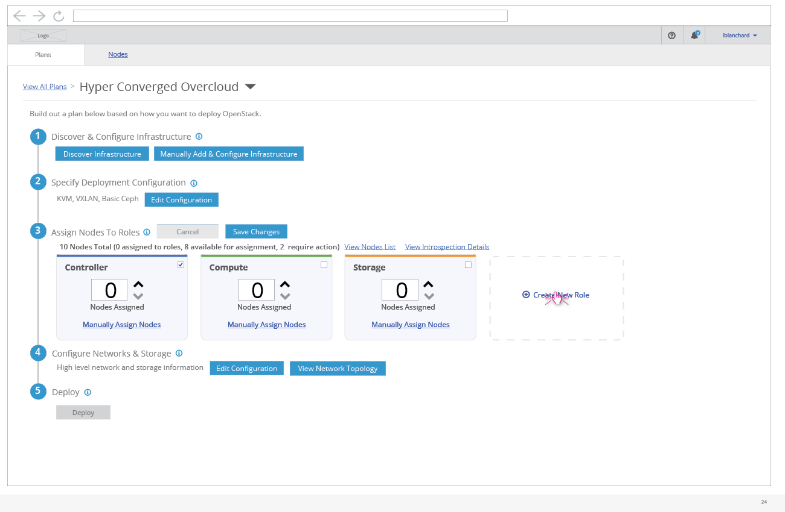
- Next, the user selects to crate a new role so they can specify one for OSD Compute which will be used in the HCI deployment.

- Roles can be given a name, description, and need to be assigned to a flavor.
- Services can be selected that will be used in this role.
- Based on the services selected, the parameters below will be built out.

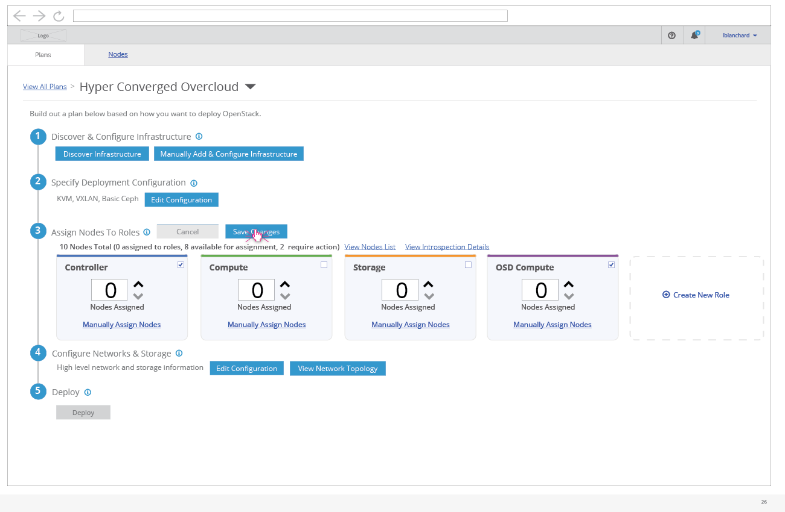
- After any changes needed have been made to the Roles, the user can Save the changes.

- At this point, the user would need to assign the registered nodes to the roles that they want them to play in the deployment.

## Edit Network and Storage Configuration

- If needed, the user could choose to edit the Network and Storage configuration for this plan.

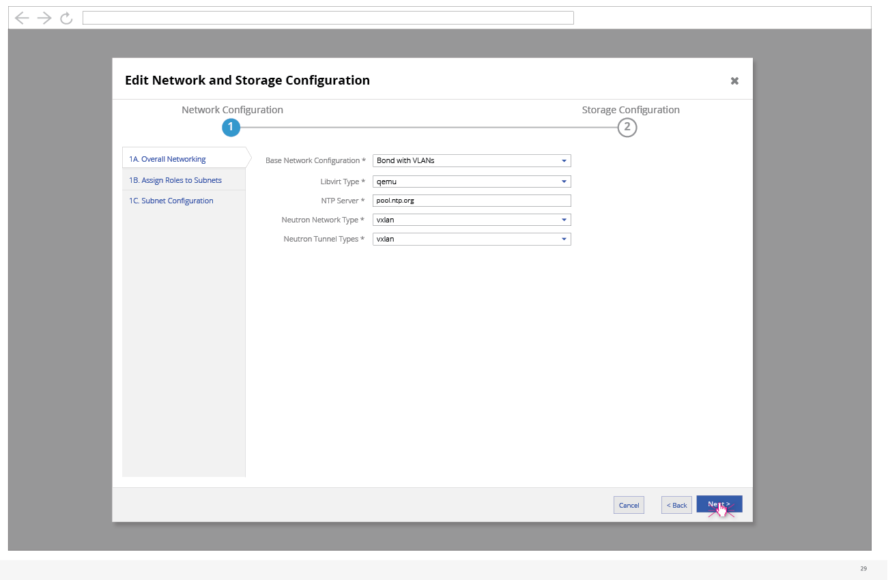
- The first step of this wizard would be the overall network configuration.

- The second step includes assigning roles to subnets.

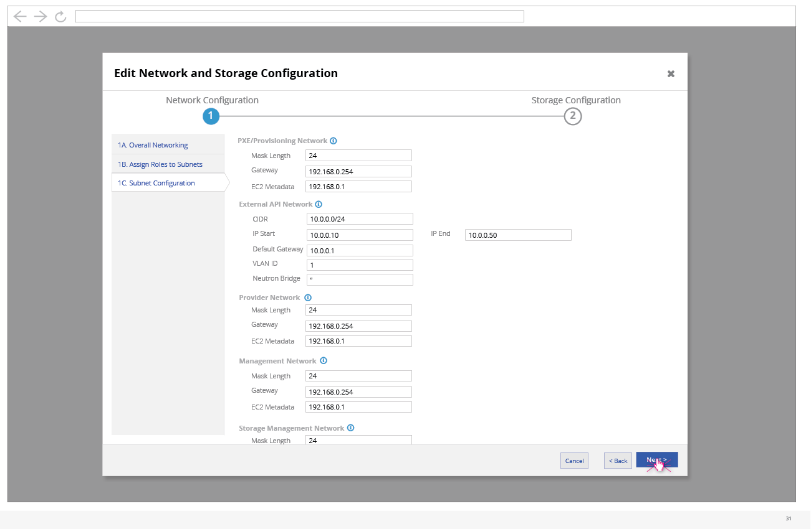
- The third network configuration step covers any changes that the user might want to make to the subnet configuration.

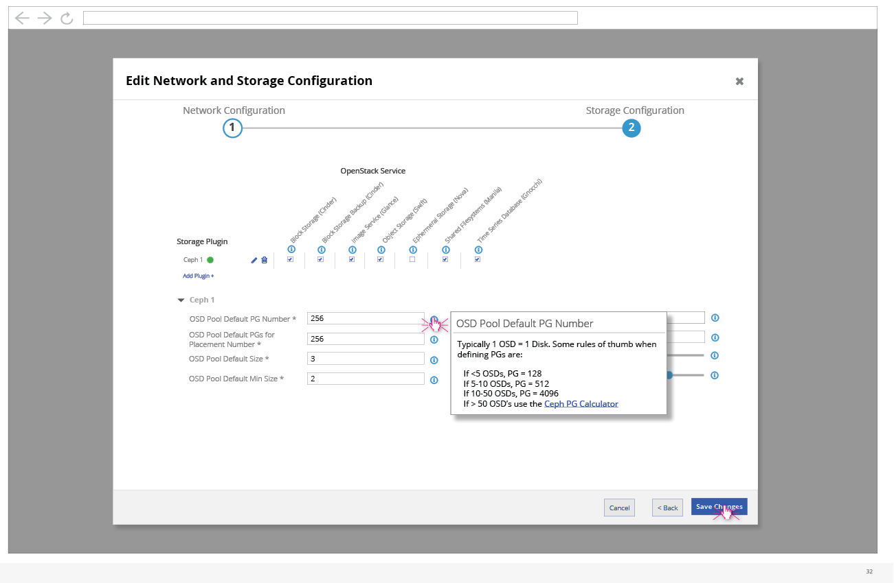
- Storage configuration changes can be made here and the user can save all of the configuration changes that have been made.

## Run Validations

- Validations may kick off after certain changes are made to the deployment configuration.

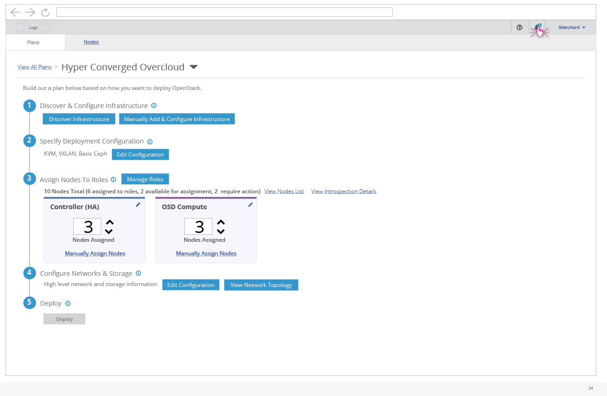
- The user can click to view the entire list of validations.

- For each validation, the high level status is listed along with a way for the user to drill into the details of the validation.

- The validation details will give the user a better idea as to what has happened if a validation failed.

## Kick off Overcloud Deployment
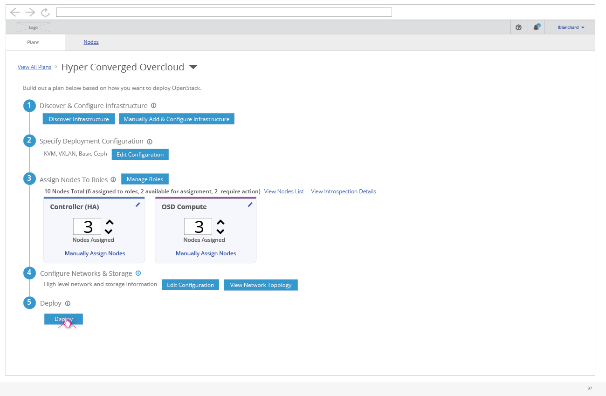
- Now the deployment is ready to kickoff.

- The user will get a confirmation modal before deployment officially starts.

- After a successful deployment, the user will have access to the overcloud.

## Export Plan for future use

- At any point, the user can export a deployment plan.
- This will support the use cases where one deployment plan might want to be used for multiple sites. The Edge Technician can simply import the deployment plan and then use it to deploy the overcloud at their site.
