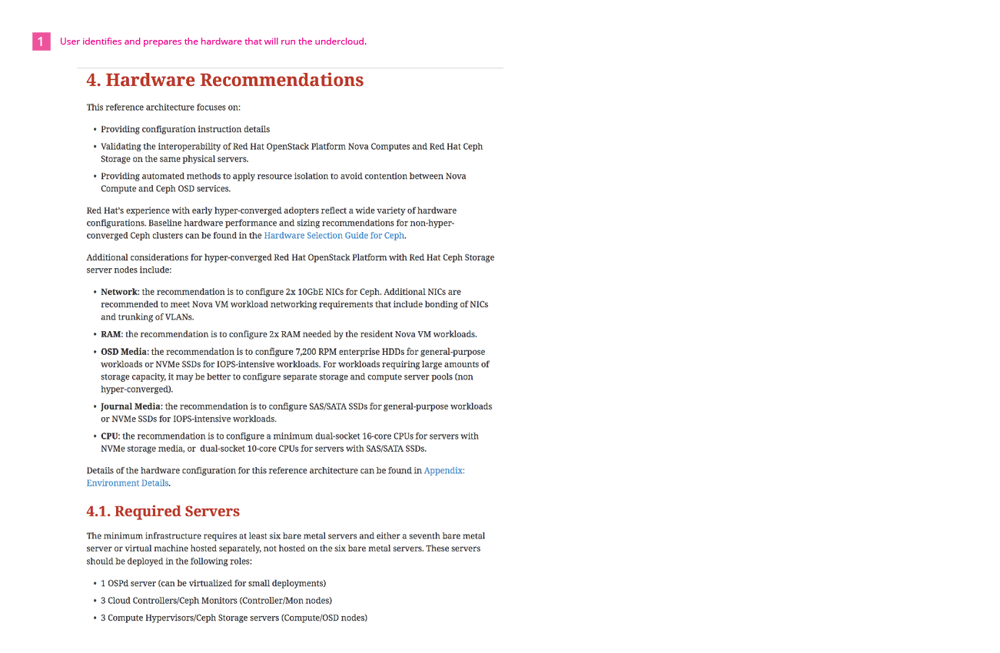
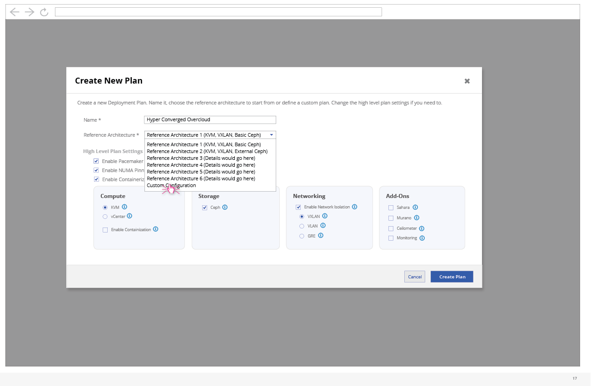
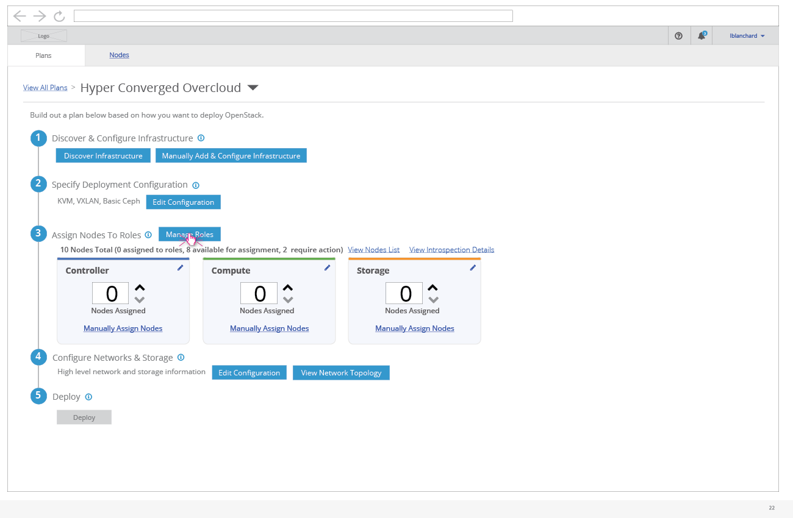

# Undercloud Install and Preparation by Preparation Expert
Before the edge technician (Jacques) can do his job of installing the OpenStack Overcloud at an edge site, the undercloud needs to be installed and some configuration work needs to take place. This is not part of Jacques role and is captured below as part of a workflow done by what we are calling the "Preparation Expert". Read more about this persona here:

Preparation Expert Persona (TBD)

## Identify and Prepare Hardware for Undercloud

- The Preparation Expert needs to identify and prepare the hardware they will be using to install the undercloud on. They will refer to guidance on what the specifications need to be for this hardware.

## Install Undercloud

- The preparation expert can install the undercloud in a number of different ways. One of these options is to clone and run the TripleO Quickstart project. Other options include using the RDO Quickstart or if a Red Hat customer, the guides provided with a Red Hat subscription.

## Clone Heat Templates

- The Preparation Expert clones the heat templates that are provided by the TripleO project so that they can make any edits needed for the configuration for their overcloud environment.

## Edit Heat Templates

- Any configuration updates that need to be made should be changed in the YAML files. This includes Network and Storage configuration changes along with creating or editing any custom roles that will be used.

## Register & Introspect Nodes

- At this point, if the user wants to test their configuration before sending it to the Edge Technician for use, they could register nodes and move forward with a test deployment.

## Assign Nodes to Roles

- By updating the node count for each role, the user is assigning these nodes to the specific roles before deployment.

## Deploy

- The user can run the deploy command at this point to test that the deployment configuration will work on their test hardware.

## Export Plan

- At any point, the user can export a deployment plan.
- This will support the use cases where one deployment plan might want to be used for multiple sites. The Edge Technician can simply import the deployment plan and then use it to deploy the overcloud at their site.

## How Would this Flow look in the UI?

The preparation expert could use the UI to do all of these steps after prepping their undercloud hardware and installing the undercloud. Here is what that flow could look like in the UI...

- After logging in, the user would be dropped into the Plans card views. This would show any default plans that are available on a clean install.

- At this point, the Preparation Expert would create a new plan so that they could define the specifics for what will be deployed at the Edge Site.

- On creation of a Plan, the user can choose high level configuration options.  

- Part of the overall configuration includes role selection and creation.
- Since this deployment will be an HCI deployment, the user is going to remove the default Compute and Storage roles and go ahead and create custom role for HCI.

- Creating a new role will pull up another window that allows the user to define that role.

- Roles can be given a name, description, and need to be assigned to a flavor.
- Services can be selected that will be used in this role.
- Based on the services selected, the parameters below will be built out.

- Once the user has finalized the high level plan details, they can confirm the creation of the plan.

- After creating the plan, the user will see it listed in the card view. Clicking on the card will drill into the detailed workflow of that plan.

- At this point, the user could choose to edit the Network and Storage configuration for this plan.

- The first step of this wizard would be the overall network configuration.

- The second step includes assigning roles to subnets.

- The third network configuration step covers any changes that the user might want to make to the subnet configuration.

- Storage configuration changes can be made here and the user can save all of the configuration changes that have been made.

- Validations may kick off after certain changes are made to the deployment configuration.

- The user can click to view the entire list of validations.

- For each validation, the high level status is listed along with a way for the user to drill into the details of the validation.

- The validation details will give the user a better idea as to what has happened if a validation failed.

- If the user wants to check that the configuration is working, they can begin the process of doing a test deployment by registering nodes.

- At this point, the user would need to assign the registered nodes to the roles that they want them to play in the deployment.

- Now the deployment is ready to kickoff.

- The user will get a confirmation modal before deployment officially starts.

- After a successful deployment, the user will have access to the overcloud.

- At any point, the user can export a deployment plan.
- This will support the use cases where one deployment plan might want to be used for multiple sites. The Edge Technician can simply import the deployment plan and then use it to deploy the overcloud at their site.
