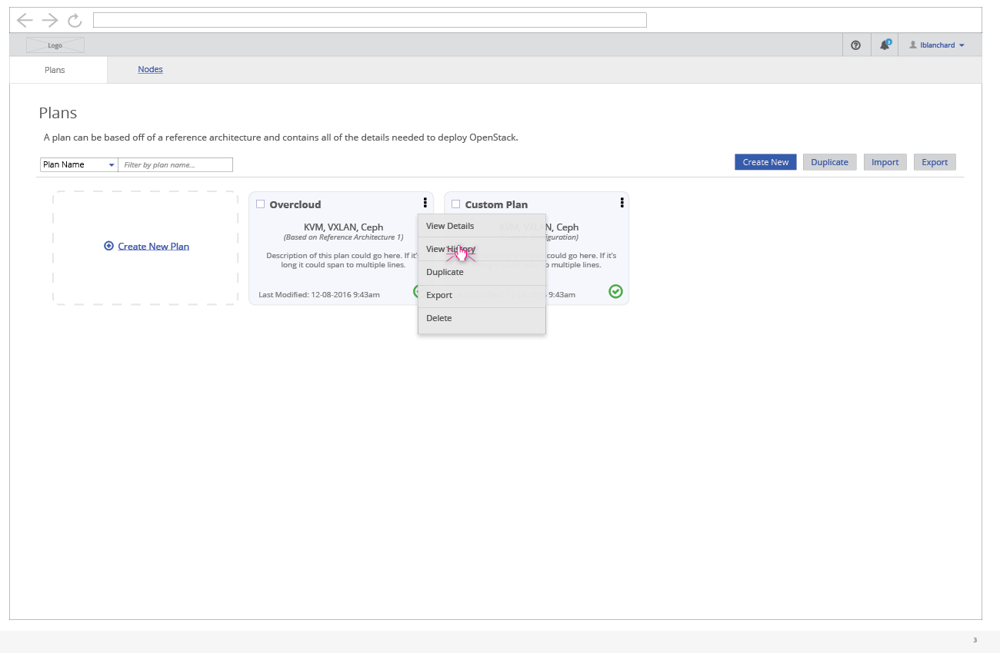
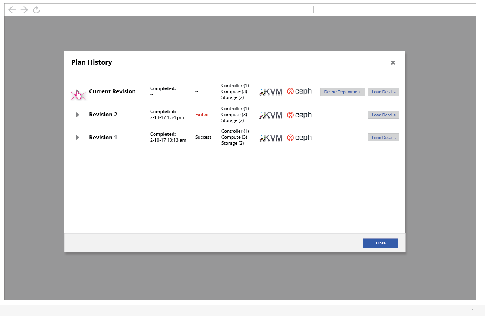
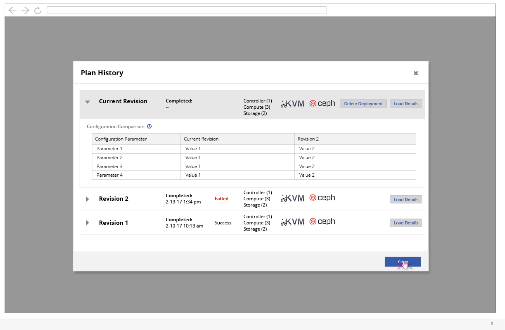

# View Plan History

- From the Plans card view, the user can click on the ellipsis to expose a menu of options. From this menu, the user can click to view the "Plan History".

- The Plan History modal will show any revisions that have been created by the user. A new revision is created any time the user attempts a deployment using that plan. The configuration is stored along with the outcome of the deployment. The user can load the details of this revision if they wish. This would allow them to rerun the deployment with this specific configuration.
- Another option the user has from this view is to delete any currently active deployments. Note: This isn't surfaced at a higher level since this is a somewhat rare action and is very destructive.

- The user can expand each plan in the list view in order to see configuration details/difference from previous revisions.
