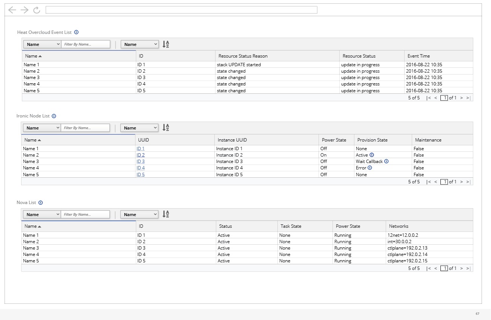
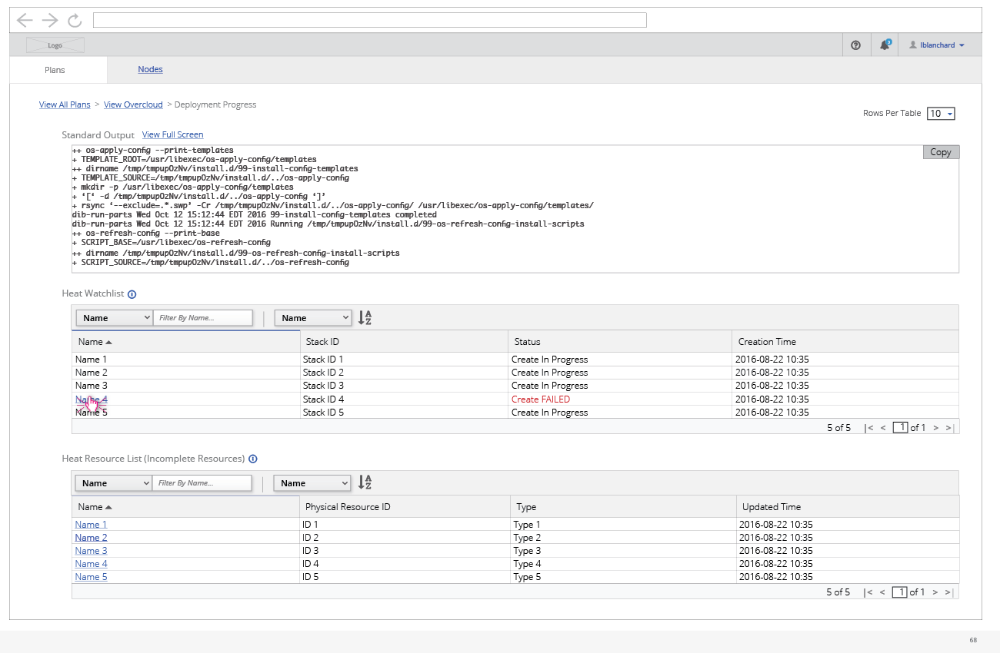
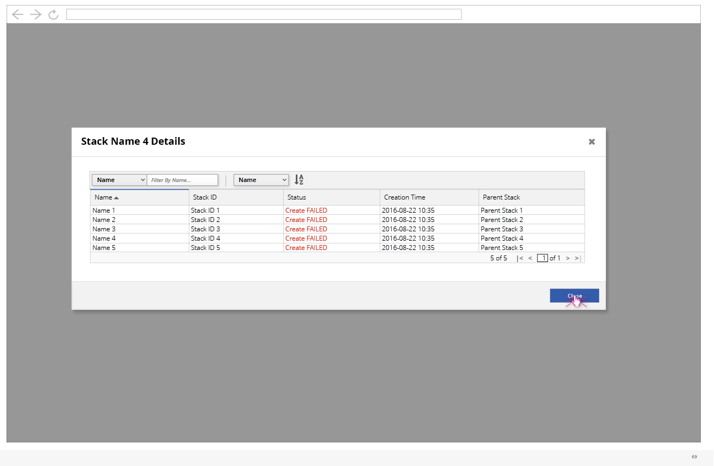
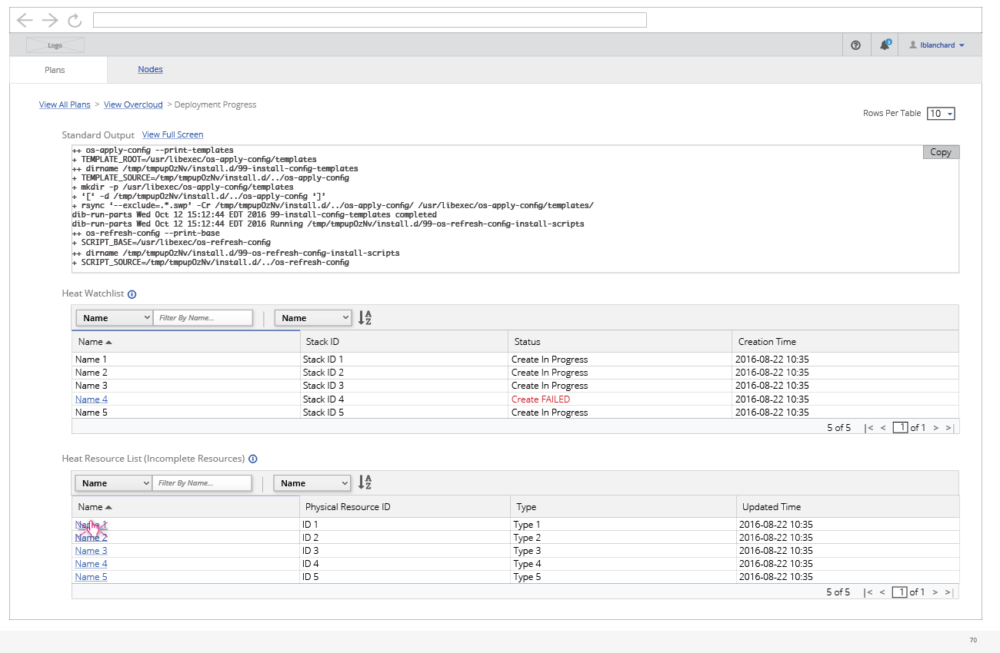
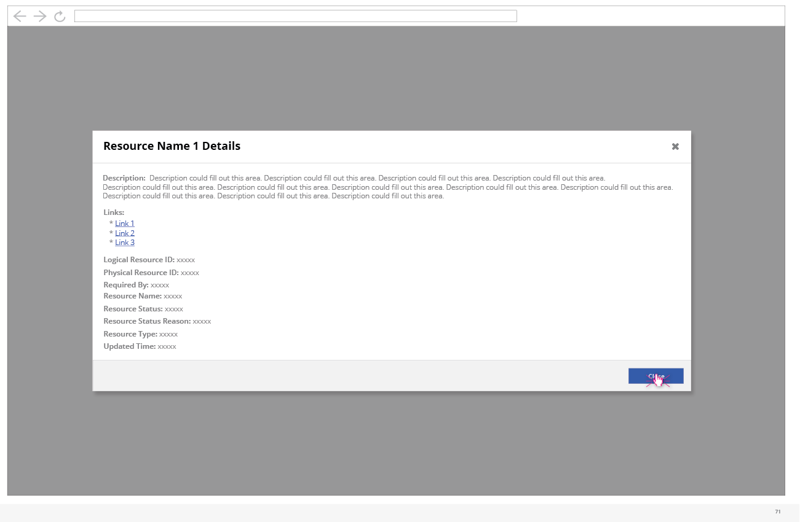
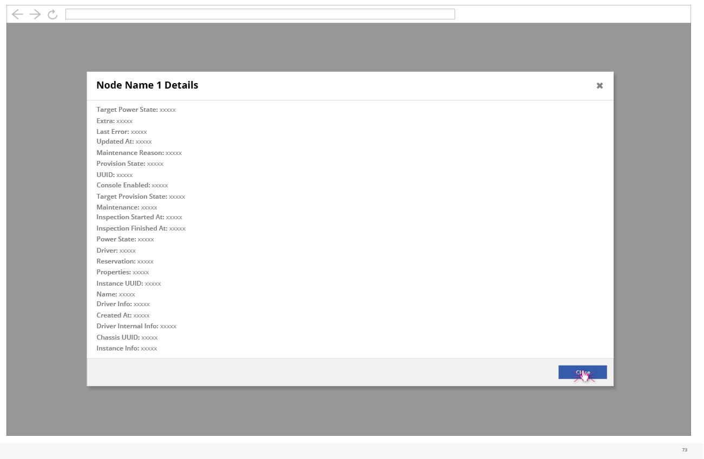

# Monitor a Deployment in Progress

- While a deployment is running, the user can choose to view the detailed progress.

- The first part of the deployment in progress details includes the standard output. The user has the option to copy this as well.
- A few tables of data can be seen on the first page as well. This includes the output of heat watchlist and output of heat resource list filtered on incomplete resources.

- After the user scrolls the page a bit, they will be able to see a few additional tables of data including the output of heat overcloud event list, ironic node list, and nova list.

- A number of the items in these tables allow for the user to click on the item to get more details. The user can click on the name of the stack in the heat watchlist to view more details about that stack.

- The user can also click on a resource name to view more details of the resource.

- The user can also click on any of the node IDs to view details about that node.

