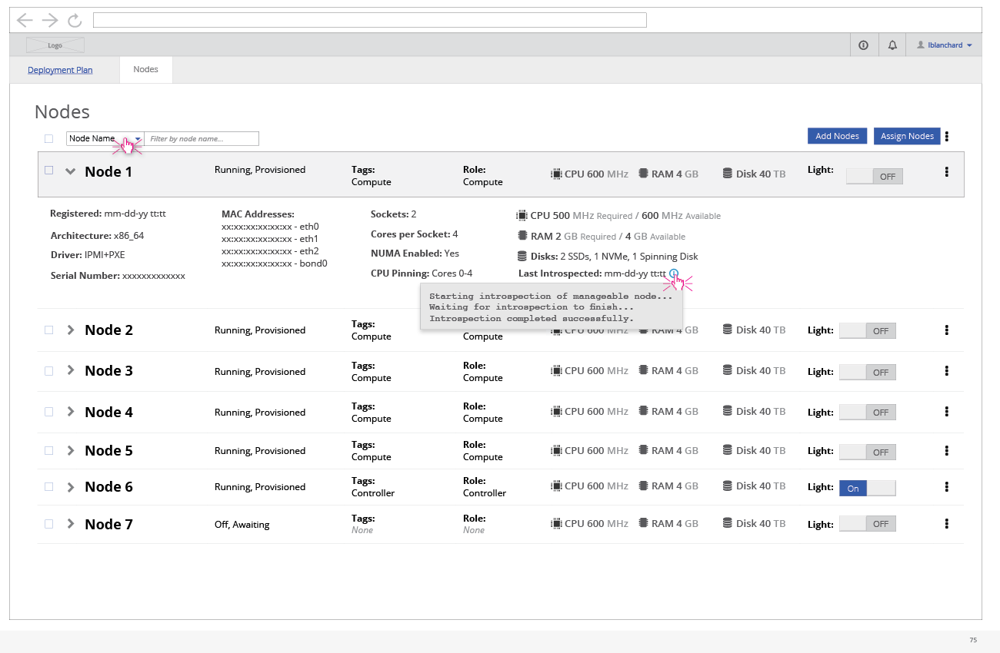
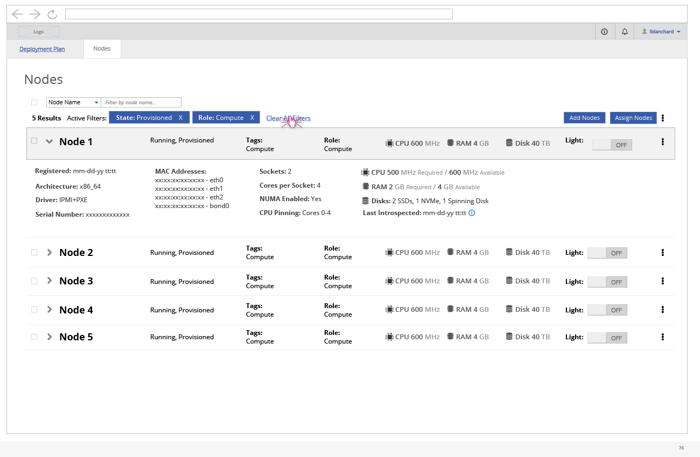

# View the Nodes List
The second main section of the UI is a list of all Nodes that have been registered.

- The user can view the details of all of the nodes in a list.
- They have the option to filter the list by a number of columns.
- From this view the user can also register a new node, assign nodes to roles, tag nodes, and delete nodes.

- If filters are applied, the user will have the option to delete each filter individually or clear all of the filters at once.
