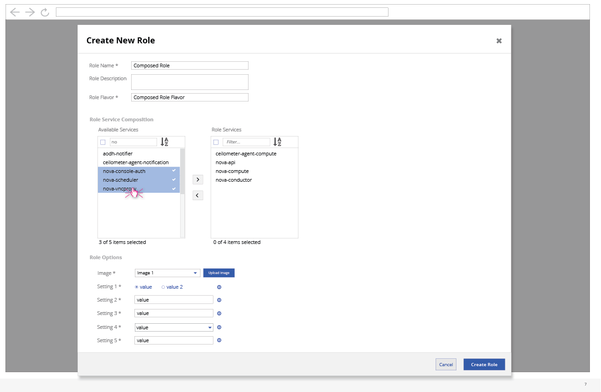

# Create New Role (Shuttle Selection)

- After choosing to create a new role from the overall settings panel, the user can give the new role a name, description, flavor, and then use the shuttle selection to choose which services will be included in the role.
- Based on the services that are selected, the parameters list will be built dynamically below.

