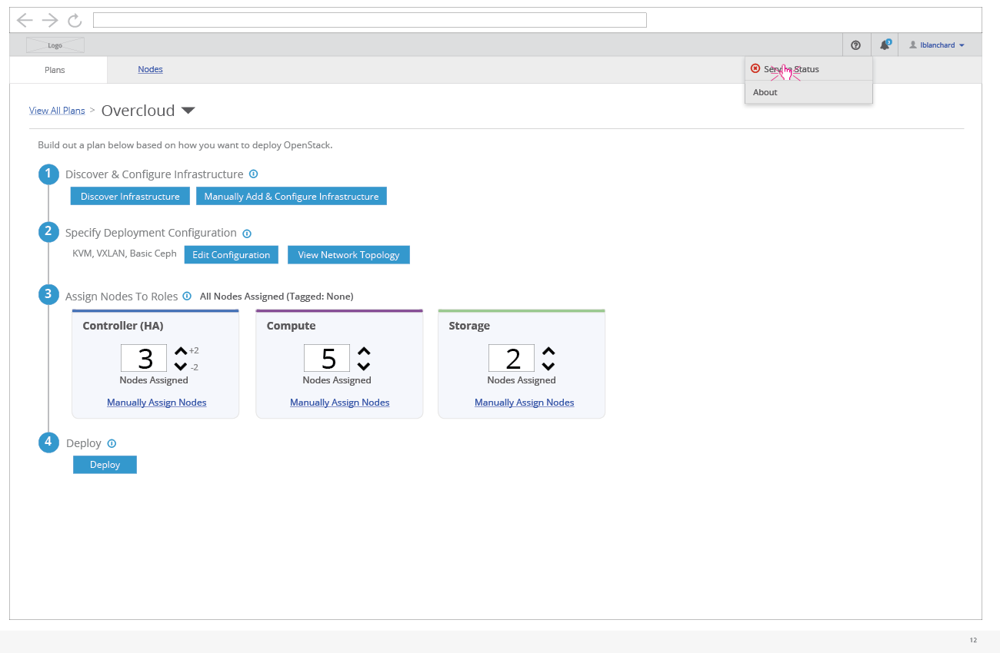

# View Service Status

- In the enterprise navigation bar, the user has the option to select "Service Status" from the help menu.

- The most severe status icon will be shown next to the "Service Status" menu.
- Selecting the "Service Status" menu item will present the user with a modal showing the overall status for each OpenStack service.

- A service can have one of three statuses. A green check mark means everything is good. A yellow warning icon represents a potential issue/warning that the user should be aware of. A red error icon represents an issue that should be addressed by the user.
- There could be links within the messages that a user could click on to navigate somewhere outside of the application.
