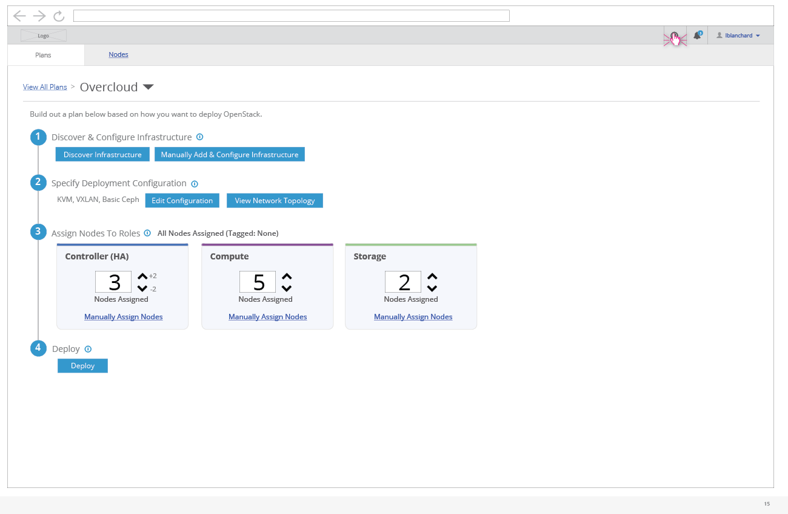
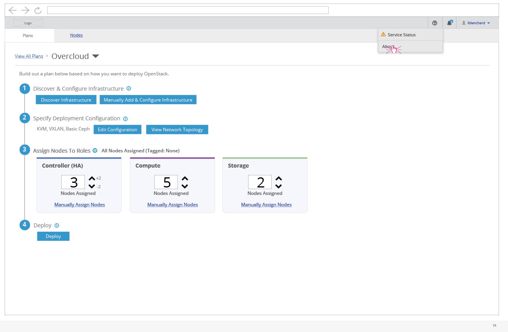
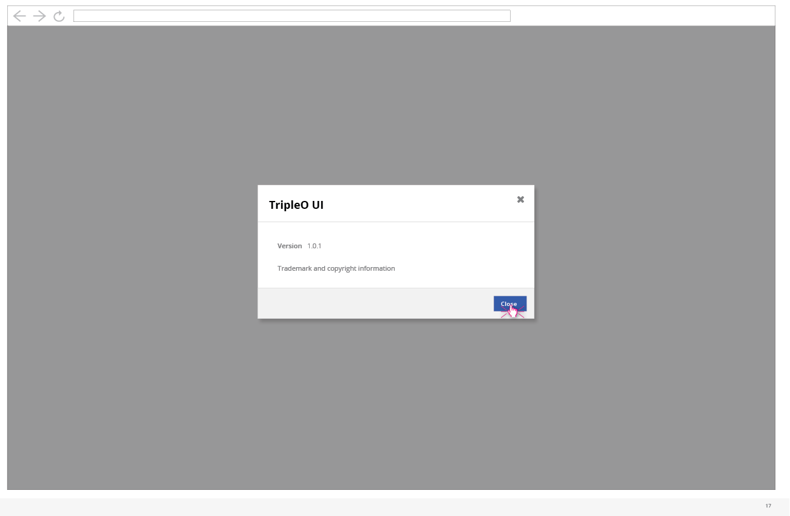

# View About Information

- In the enterprise navigation bar, the user has the option to select "About" from the help menu.

- Selecting the "About" menu item will present the user with a modal showing the about information for this instance of the TripleO UI.

- The about menu includes the version along with any trademark/copyright information for the application.
