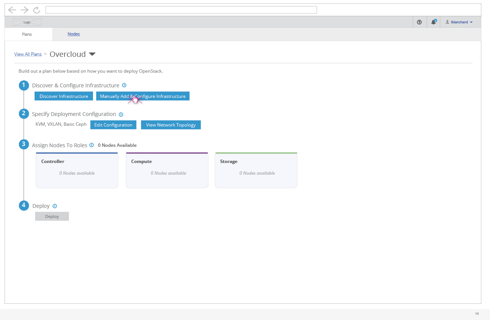
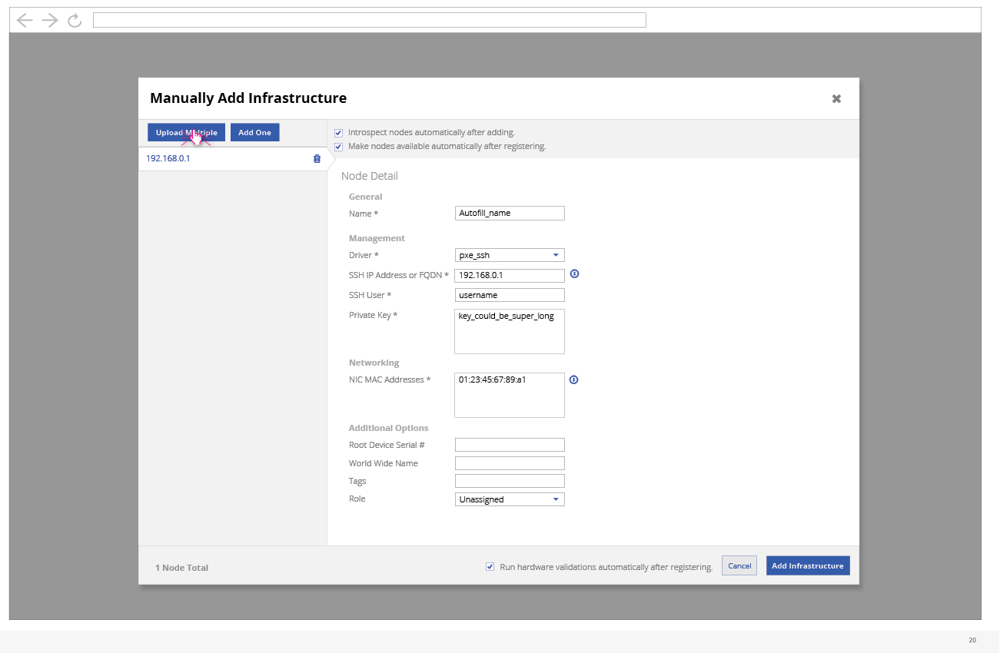
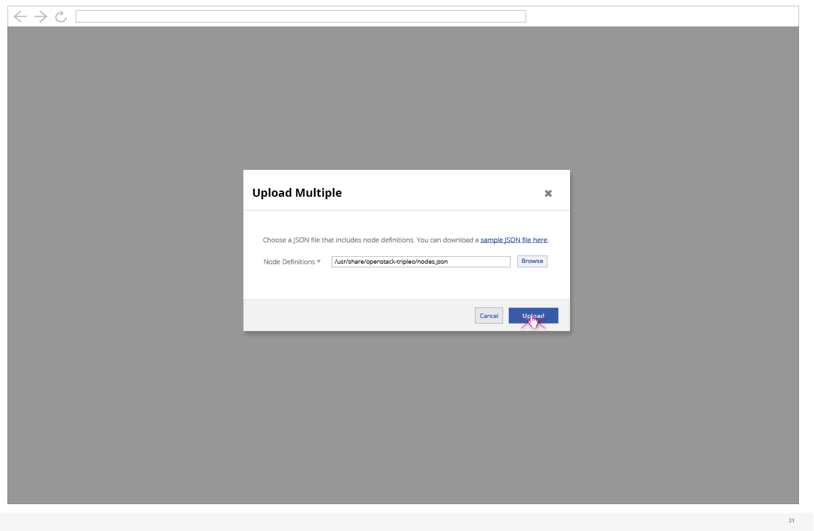
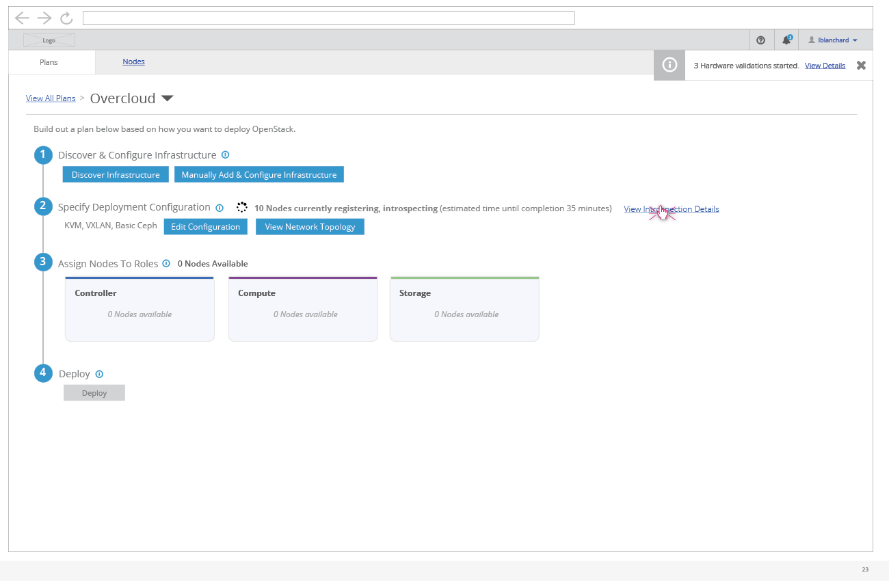
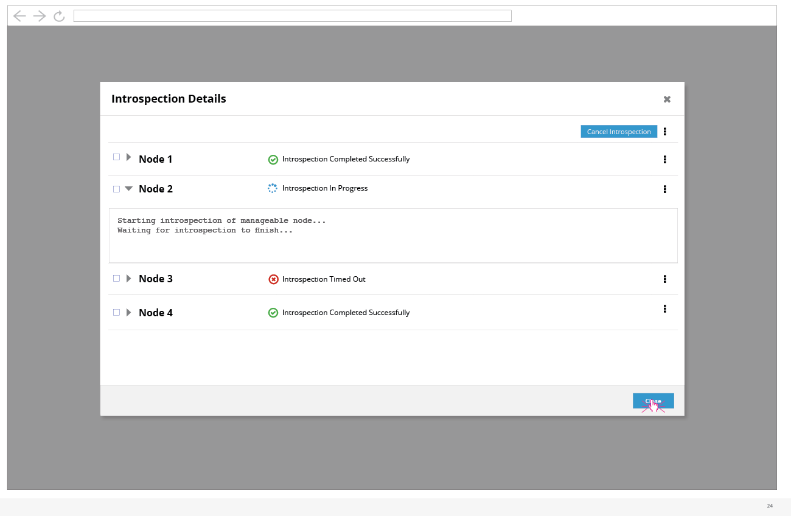

# Manually Add and Configure Infrastructure

- The user has the option to manually add and configure their infrastructure if they choose not to use the discovery feature.

## Upload Multiple

- Clicking the "Upload Multiple" button will present the user with a modal where they can point to the appropriate instackenv.json file.

- After pointing to a supported JSON file, the user can click "Upload" to be taken to the Add Infrastructure modal which will show any nodes and their relevant details read in from the JSON file.

## Add One Node at a Time
- The user does have the option of manually adding one node at a time by clicking the "Add One" button and then manually entering each nodes data in the right hand panel.

# View Introspection Details

- After clicking the button to "Add Infrastructure" the user will be taken back to the deployment details page. Here, they will be able to see a spinner and an overall status on the registering and introspecting process that the nodes are going through. From here, the user can choose to "View Introspection Details".

- This modal will show the user the high level introspection status for each node that's being registered. This includes whether it's completed successfully, it's in progress, or it timed out. The user can expand each row of the list view to see the recent output from the logs.
- From this view the user can select any of the nodes and cancel the introspection process.
