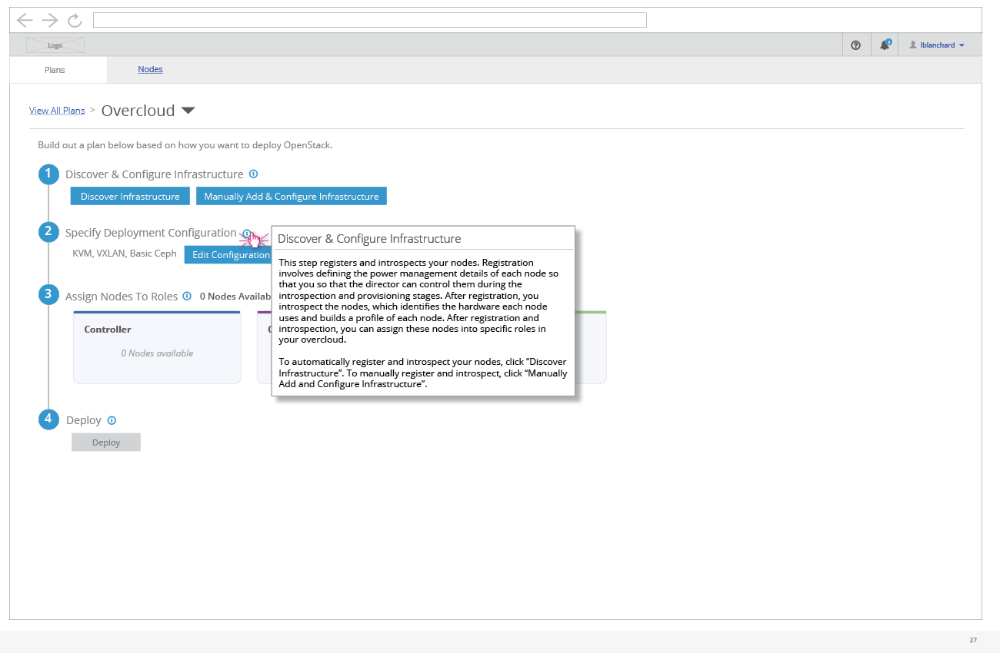

# Information Hover Over

- For each step in the deployment details workflow, the user can hover over the informational icon to get more details about that step.
- Text for the steps are as follows:
  1. This step registers and introspects your nodes. Registration involves defining the power management details of each node while introspection identifies the hardware profile for each node. After you have defined hardware, you can assign these nodes into specific roles in your overcloud.
  2. This step allows you edit specific settings for the overcloud's network, storage, and other certified plugins. Use this step to define your network isolation configuration and your backend storage settings.
  3. This step assigns and removes nodes from roles in your overcloud. Use the arrows to assign or unassign nodes to each role. Click "Assign Nodes" for a particular role to open the dialog to manually assign nodes.
  4. This step performs the deployment of the overcloud. Once the deployment begins, a report of the progress is shown. When the deployment completes, the overcloud login details become available. Click "Deploy" to start the deployment.
