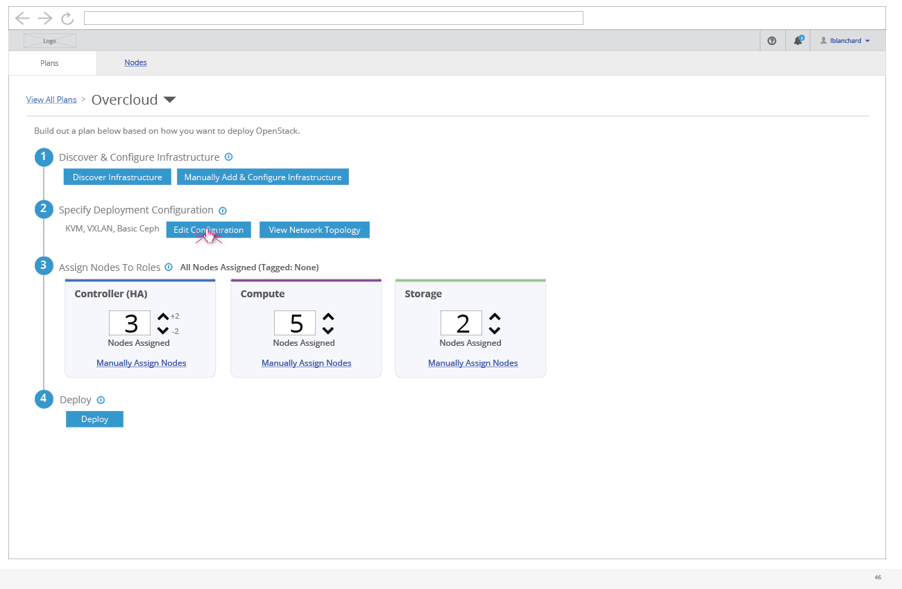
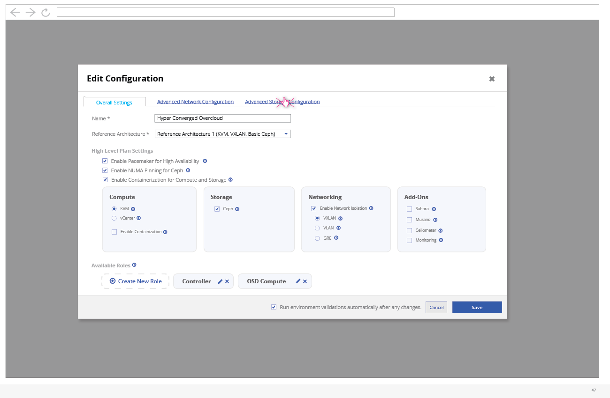
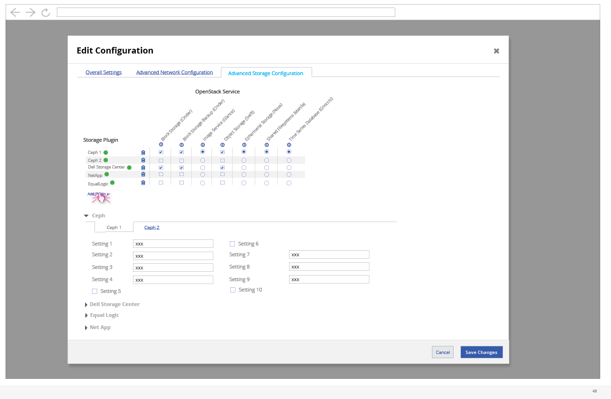

# Advanced Storage Configuration

- An advanced user (or preparation expert) might use the UI to setup advanced Storage configuration. To access the configuration, they can click on the "Edit Configuration" button on the deployment workflow.

## Subnet Configuration

- Once the edit configuration modal is shown, the user needs to click on the "Advanced Storage Configuration" tab.

- 
