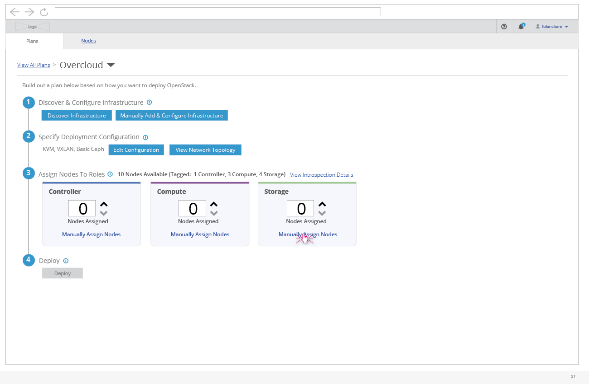
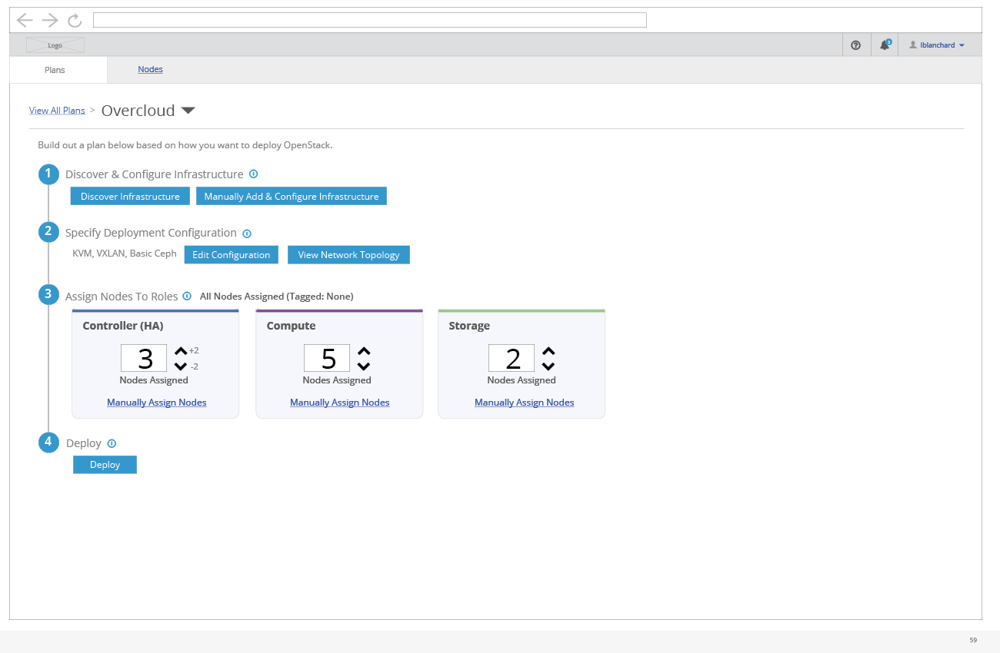

# Manually Assign Nodes
Typically a user will use the auto-assign arrows to assign nodes to roles, but in some cases the user will want to choose exactly which node gets assigned to which roles.

- Clicking the "Manually Assign Nodes" link will present the user with a list of nodes they can choose from to assign.

- From this modal, the user can select a number of nodes and choose to tag or assign these nodes to a role.
- After either tagging or assigning, the user needs to click the "Save" button to confirm these changes.

- After any changes have been confirmed, the deployment details page will be updated to reflect it.
