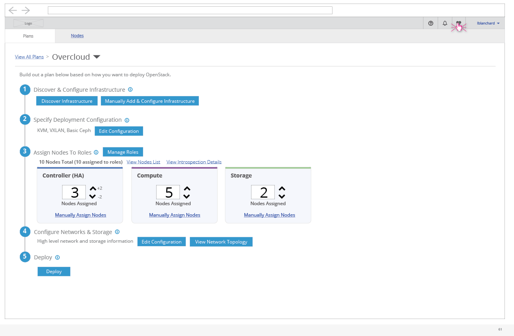
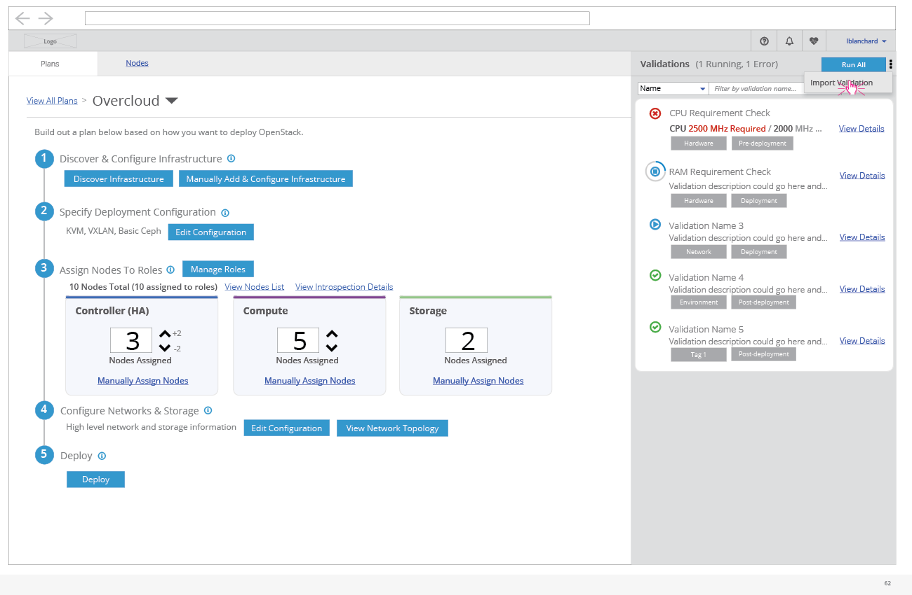
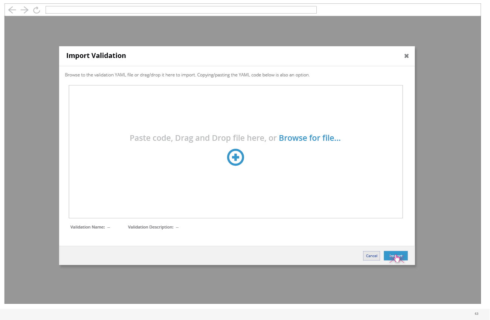

# Import Validations

- At any point while using the UI, the user can access the validations from the enterprise navigation.

- One of the options in the validation panel is to import a validation. This allows users to write and run their own validations.

- From the import validation modal the user can either browse to the validation file, paste the code into the input box, or drag and drop the file in the modal to upload it.
- After upload, the new validation will be added to the list of validations that are available to run.
