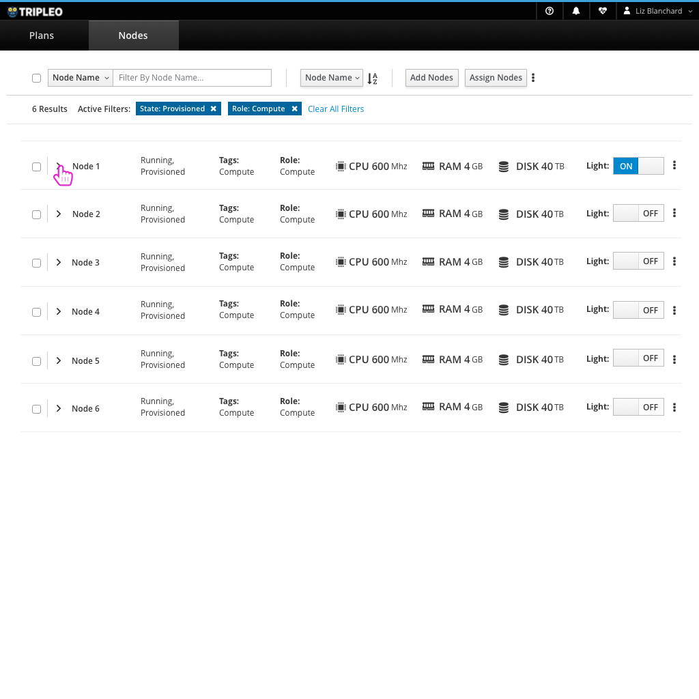
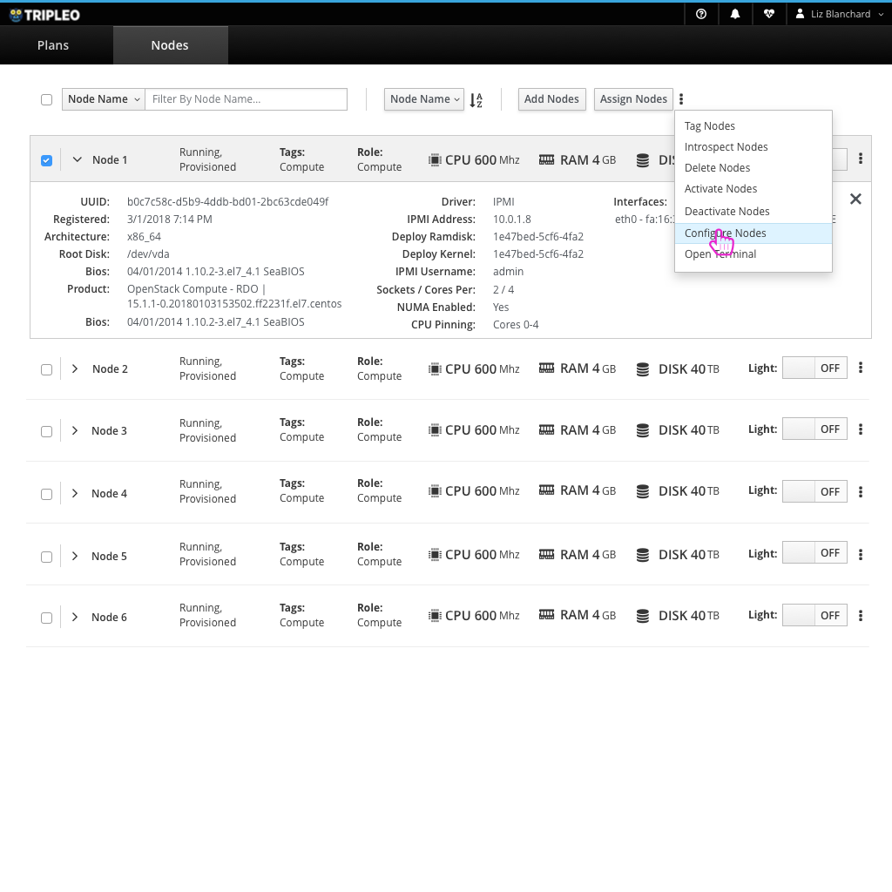
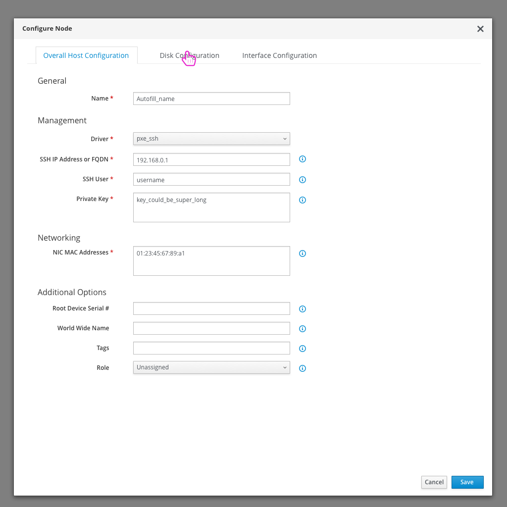
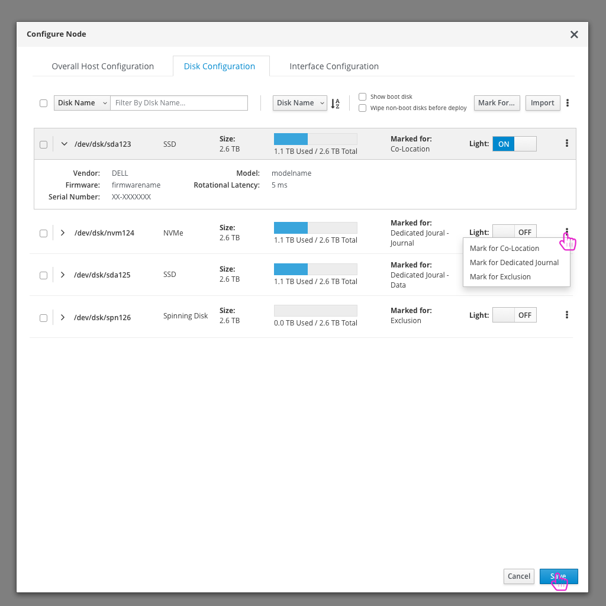
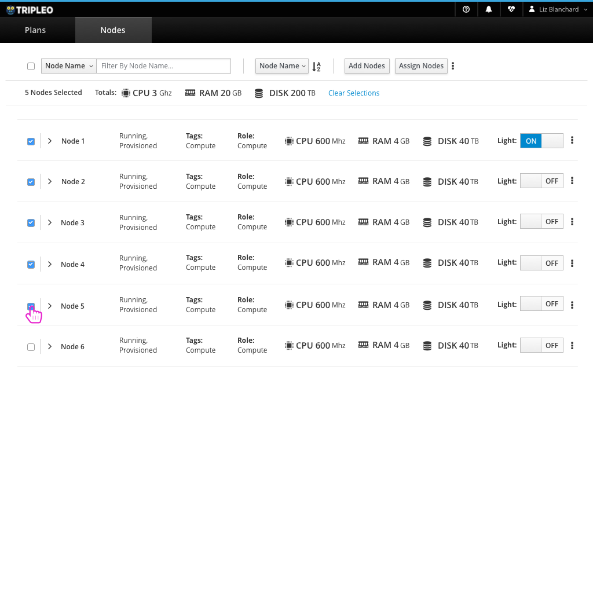

# View the Nodes List
The second main section of the UI is a list of all Nodes that have been registered.

- The user can view the details of all of the nodes in a list.
- They have the option to filter the list by a number of columns.
- From this view the user can also register a new node, assign nodes to roles, tag nodes, and delete nodes.
- If filters are applied, the user will have the option to delete each filter individually or clear all of the filters at once.

- Expanding the Node in the list shows a number of additional details about that Node.
- For each node, the user can perform a number of actions. They can Tag, Introspect, Delete, Activate, Deactivate, or Configure the Nodes.

- The Node Configuration modal includes high level configuration, Disk configuration, and Interface configuration.

- The Disk Configuration tab allows the user to view the disks along with disk details and perform a number of actions on each disk.

- One feature of the Nodes List is to bubble up the metrics for the nodes that are selected in the list. This allows an easy way for the user to see how much CPU Power, RAM, or DISK a set of nodes has.
