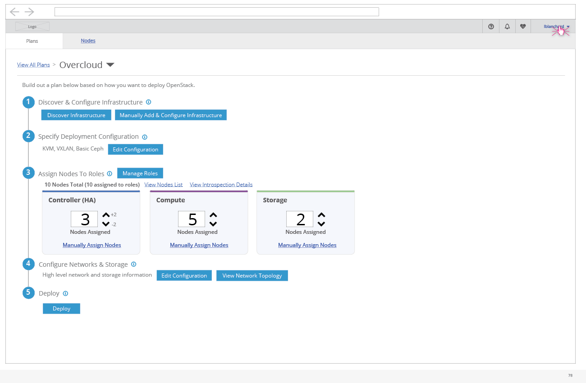

# Localization

- The user has the option to switch the language that they view the UI in. They can access this toggle from the user menu in the enterprise navigation.

- The current supported languages in the TripleO UI are English, English (British), and Japanese.
