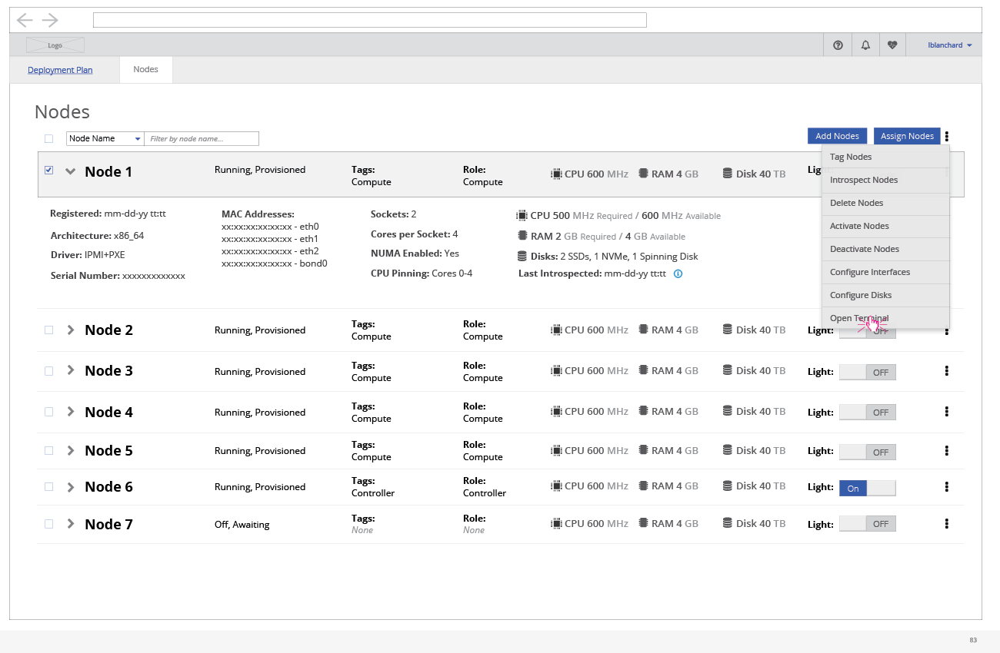

# Access Node Terminal

- In certain cases, the user will want to access the terminal of a specific node. By selecting the node and choose "Open Terminal", a new window or tab will open with the terminal view.
