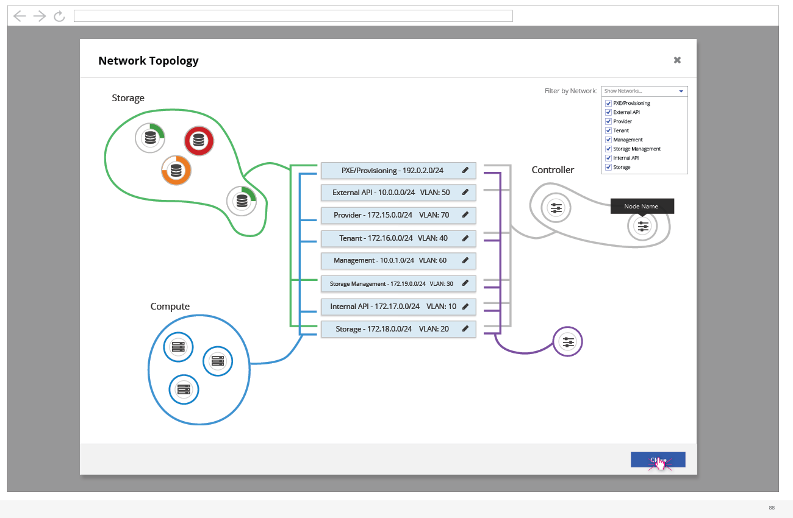

# Alternate Network Topology (Nodes)

- This is an alternate network topology design which is a visual representation of the nodes, their roles, along with which subnets each node is configured for.
- The user can see the high level subnet information as well.
- If the user were to choose to edit this subnet information, they would be presented with a quick modal with a few parameters on top of this screen.
- One additional feature in this modal is that the user can filter down the number of networks being shown to reduce the clutter in this view. The user can unselect any networks they want to hide from view.
- The user can hover over each node to get more data.
