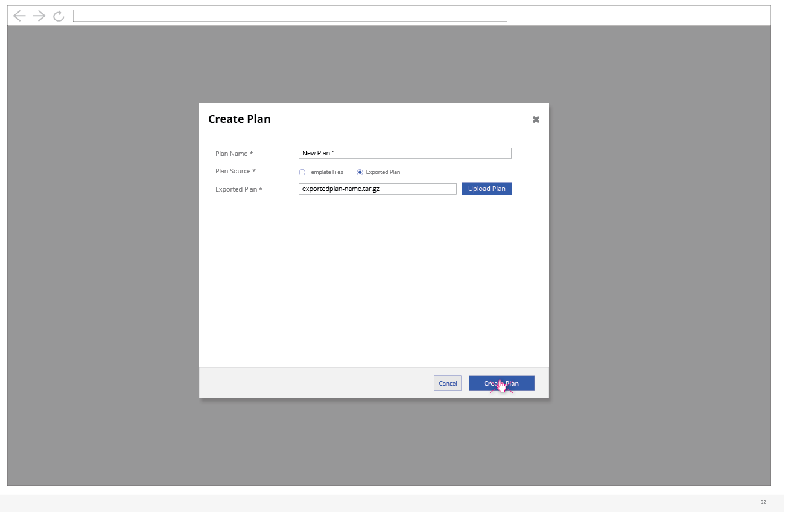

# Update Deployment Plan

- Whether a user is updating or creating a new plan, they will be able to give the plan a name and then choose whether this plan will be based on template files or a previously exported plan. If they choose template files, they will be able to upload files from there. The options include uploading a new file set (which would clear any currently uploaded files) or add additional files (on top of any files already uploaded). Another feature will be that the user can delete a file shown in the list.

- Clicking the "Create Plan" button would kick off the creation action.

- If the user chooses to create/update a plan based on a previously exported plan, they will be presented with a field to select where the Exported plan file lives.
