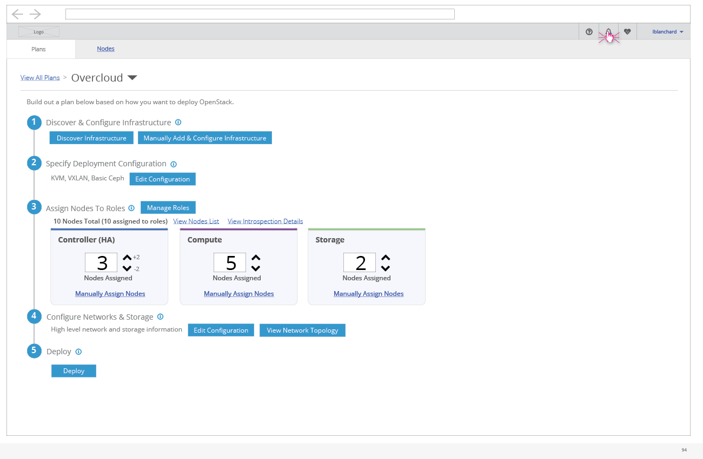
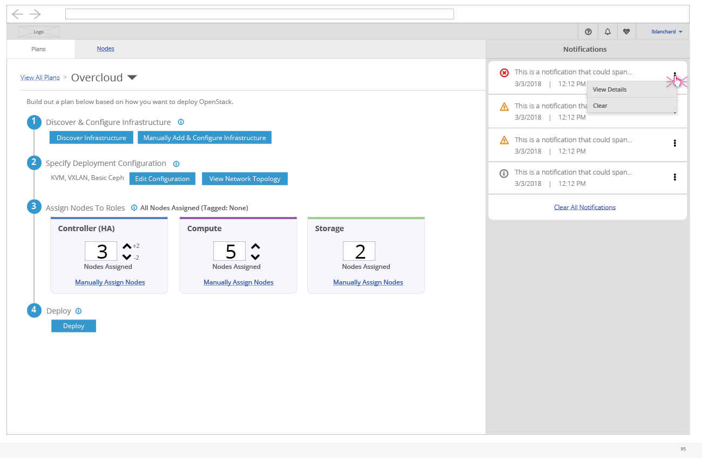

# Notifications

- A notifications section will live under the bell icon and include any messages that have occurred while using the UI that the user might want to be back to view.

- Each notification will take a line in the list and include a severity, short message, and date/time stamp. The user will have the option to view more details and clear each notification. Also, the user can clear all notifications from the list at once using the link at the bottom of the drawer.
