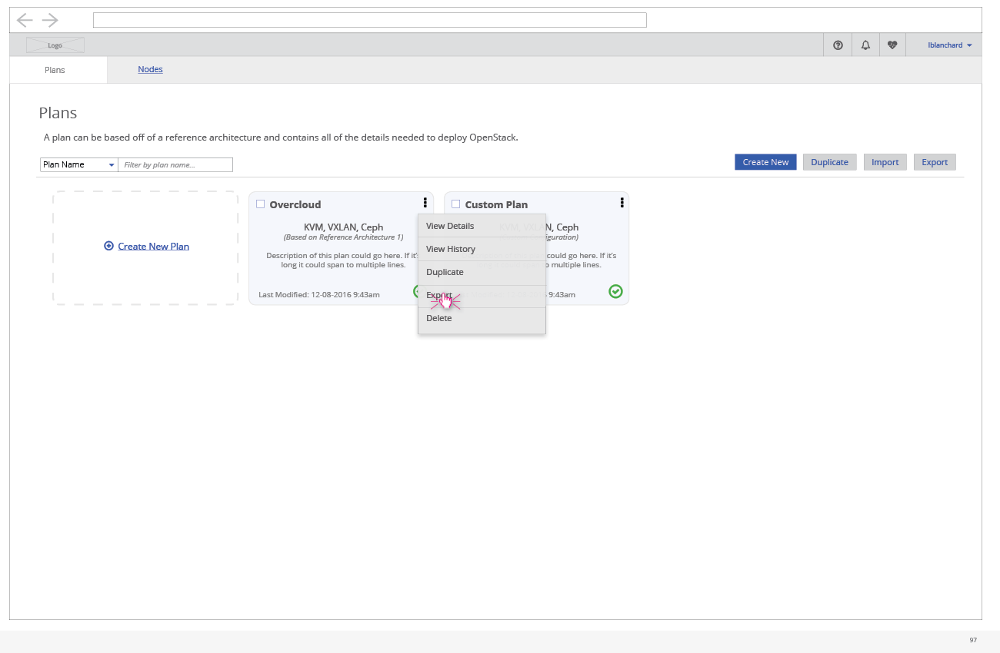
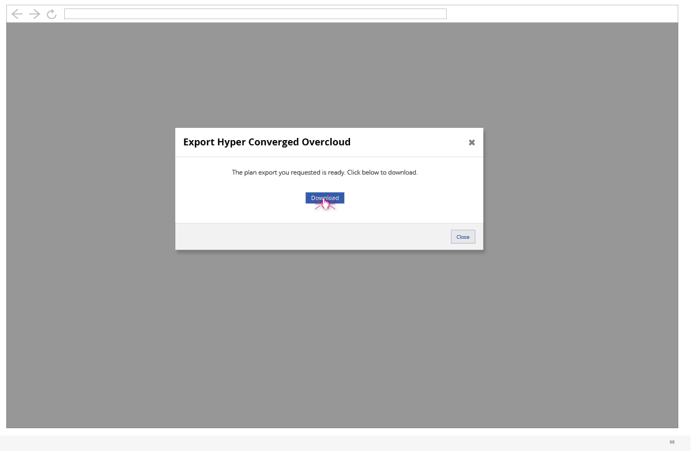

# Export Plan

- From the kebab menu, one of the options that the user can take on each plan is to Export the plan.

- After a process runs, the plan export will become available for download. Clicking the Download button will download the exported plan file to the user's system. Clicking Close will exit out of the modal without downloading.
