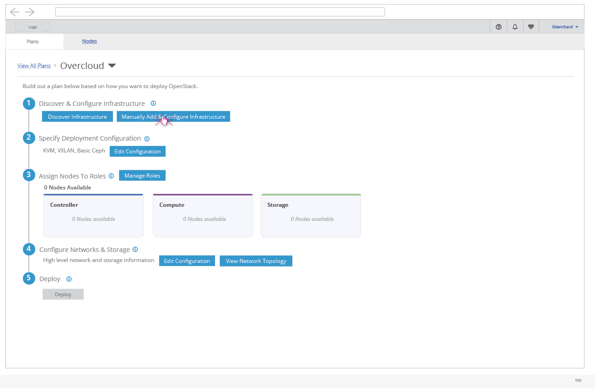

# Register a Large Number of Nodes

- The option to manually register nodes allows the user to select to upload from a JSON file.

- Clicking the "Upload Multiple" option will present the user with a way to browse to the JSON file they'd like to upload.

- Uploading the file will then show the user the progress if it take long enough to show.

- If there are a large number of nodes, the progress bar will be seen for long enough to see the percentage of nodes that are done being read from the JSON file.

- After the JSON file is read in, there could be a large enough number of nodes that requires a scroll bar on the left side list of nodes. This is important so that if the user scrolls this list of nodes and selects one towards the bottom of the list they don't lose the ability to view the details pane for the selected node on the right.
