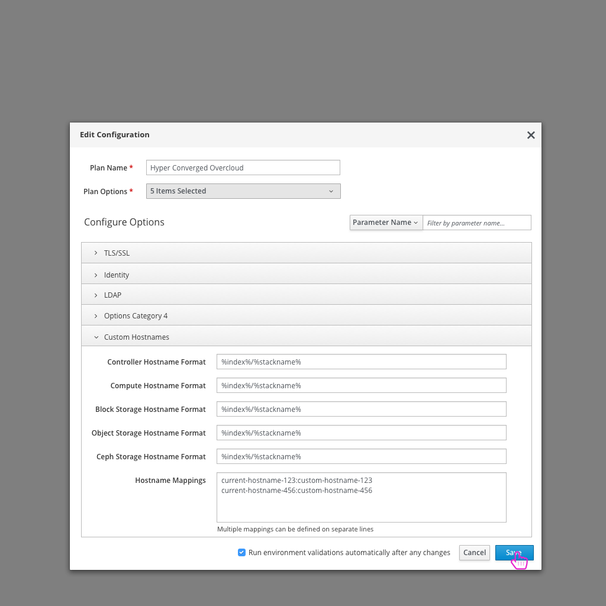

# Custom Hostnames

- In some scenarios, the user might want to customize a number of hostnames that will be used in their deployment. Editing the configuration will allow the user to have access to an option to turn this on.

- Selecting "Custom Hostnames" from the dropdown will expose a set of parameters for the user.

- At this point the user can configure mappings of current hostnames to custom hostnames.
