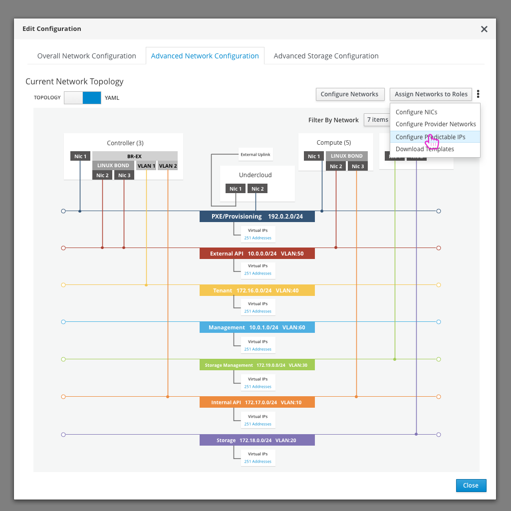

# Predictable IPs

- One option from the network topology, would be to define the predictable IPs per role.

- Each role will be shown as a tab and the user can add or delete predictable IPs, define the IP Address and choose which network it is for.
