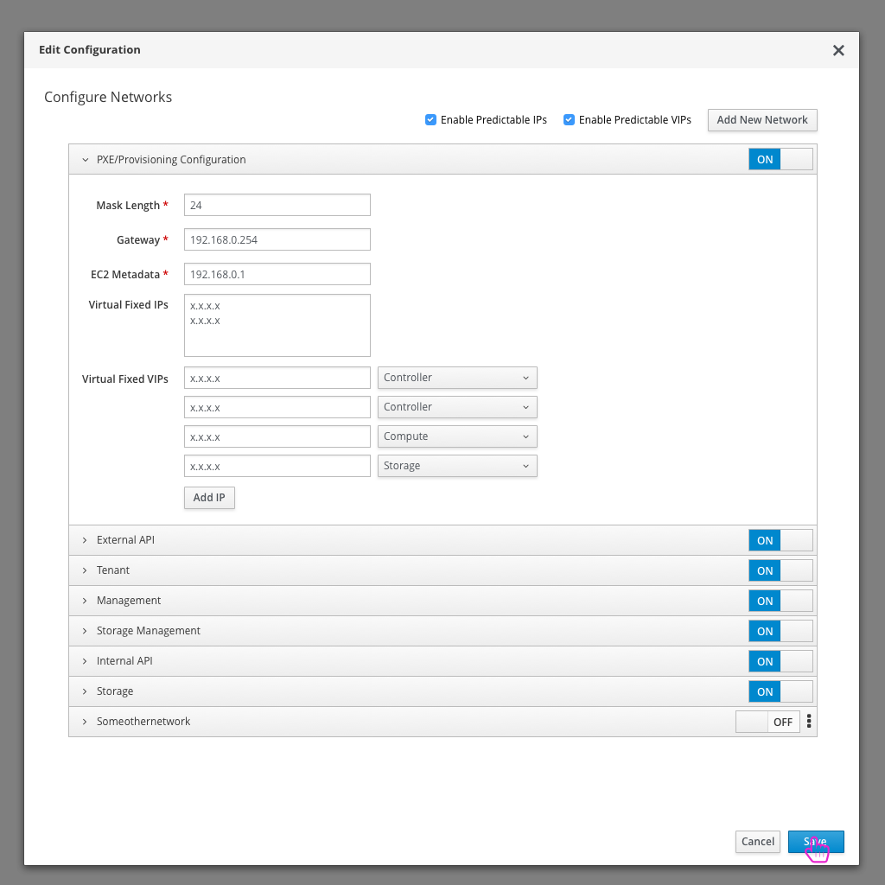

# Predictable VIPs

- If the user wants to configure the predictable VIPs for their deployment, they need to drill into the network configuration.

- The high level network configuration will be presented first, drilling into the advanced configuration is the next step for the user. NOTE: Predictable VIPs won't be available for configuration if the user has selected to use an external load balancer.

- Clicking on the option to "Configure Networks" will present the user with a list of networks.

- One option for each network will be to define the "Virtual Fixed IP Addresses". The user can add or remove these as they need to.
