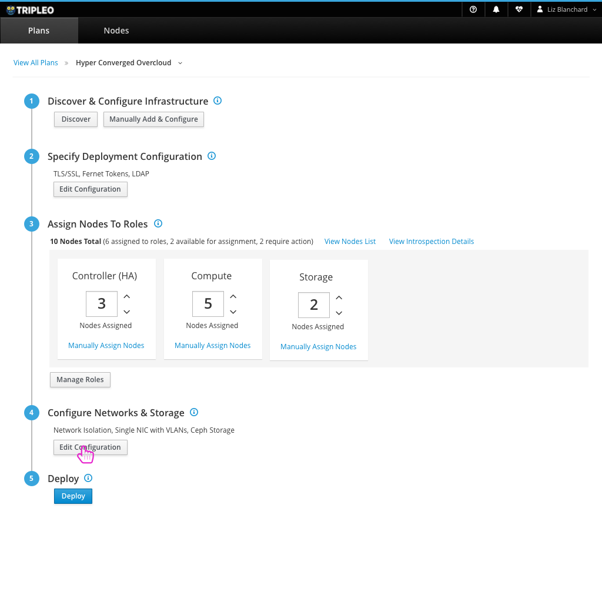

# Network Plugins

- If the user wants to configure the network plugins that are used in their deployment, they can choose the "Edit Configuration" in step 4.

- The high level network configuration will be presented to the user. At this level, the user can define which network plugins are being used. By default, no plugins are selected. The user can drop down the Enable Network Plugins dropdown to choose which they'd like to enable.

- Selecting any plugins from the list would then present the user with parameters available for that plugin.
- If this list grows very large we should consider adding a type ahead search to make it easy for the user to find which plugins they'd like to enable.

- Any accordion menu would hold the plugins that have been selected along with any parameters that the user can edit for those plugins.

- The user has the option to add a custom plugin. This allows them to upload a YAML configuration file and configure the plugin themselves. This also applies to storage plugins.

- After giving the plugin a Name and uploading the YAML Configuration file, the user can Add the Plugin and view it in the Plugin list.
