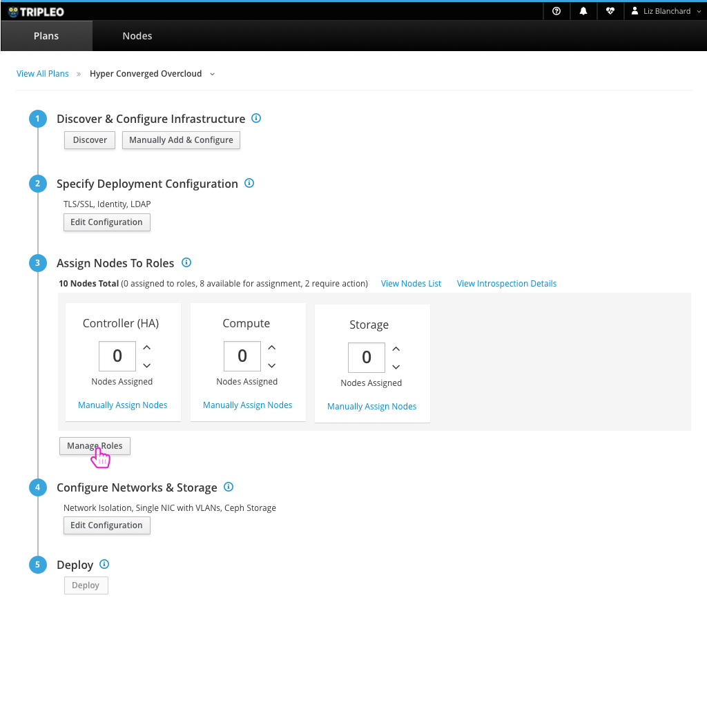
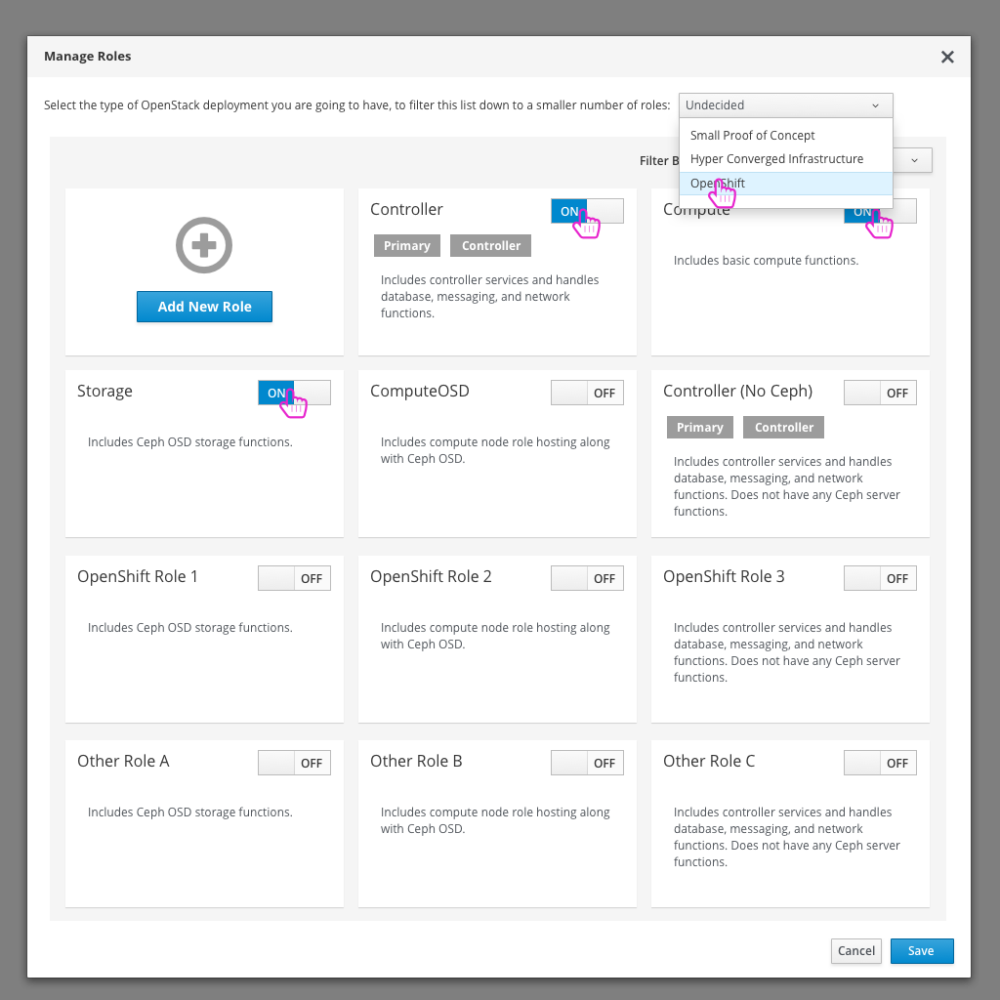
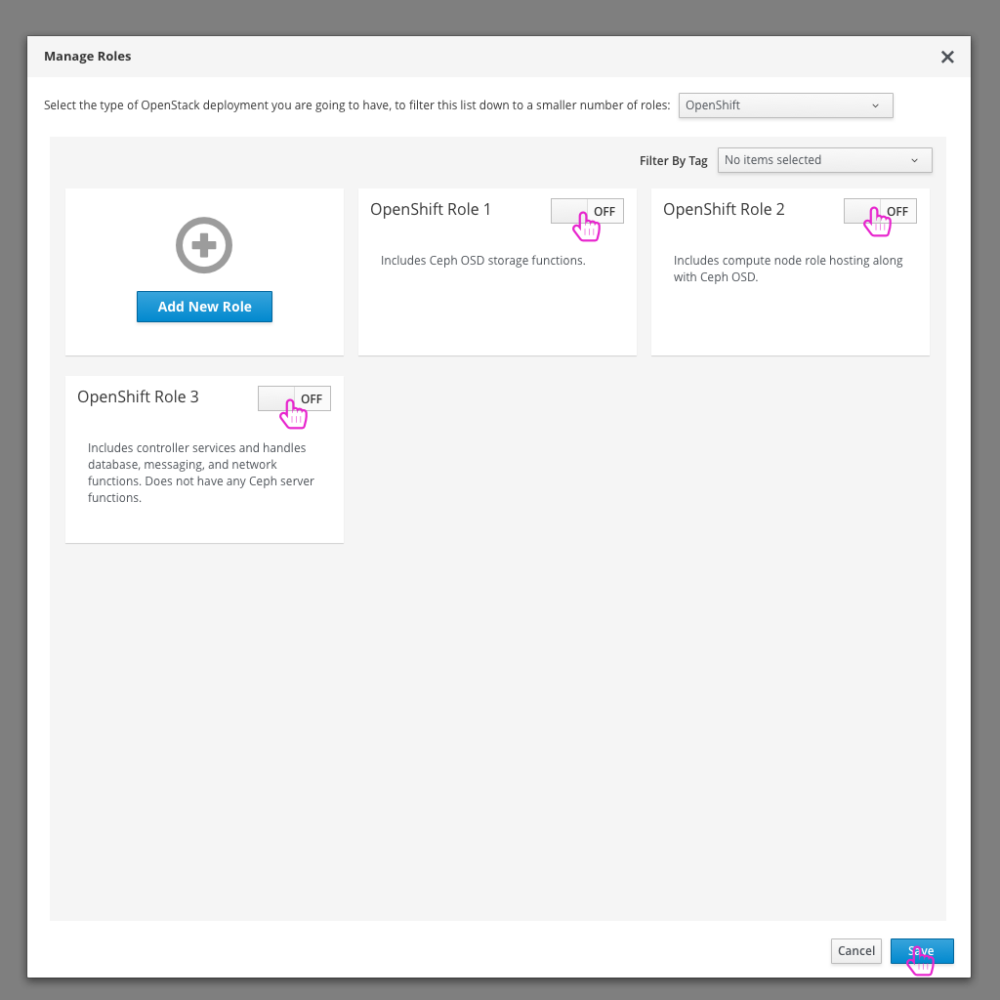
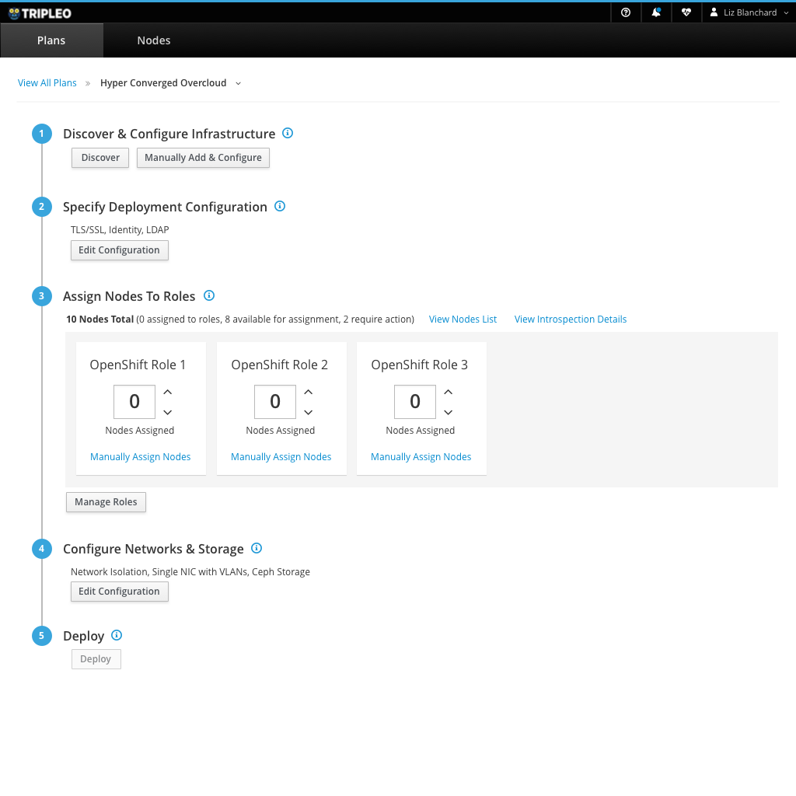

# Role Suggestion

- To change the roles that are being used to this deployment, the user can select to "Manage Roles".

- An addition that would be nice for the user is the option to choose what they would like to do with their deployment. Based on this selection, we could suggest a set of roles for them.

- Filtering down the list will help the user choose the necessary roles based on the type of deployment they would like to run.

- The newly selected roles will be reflected on the deployment plan page.
