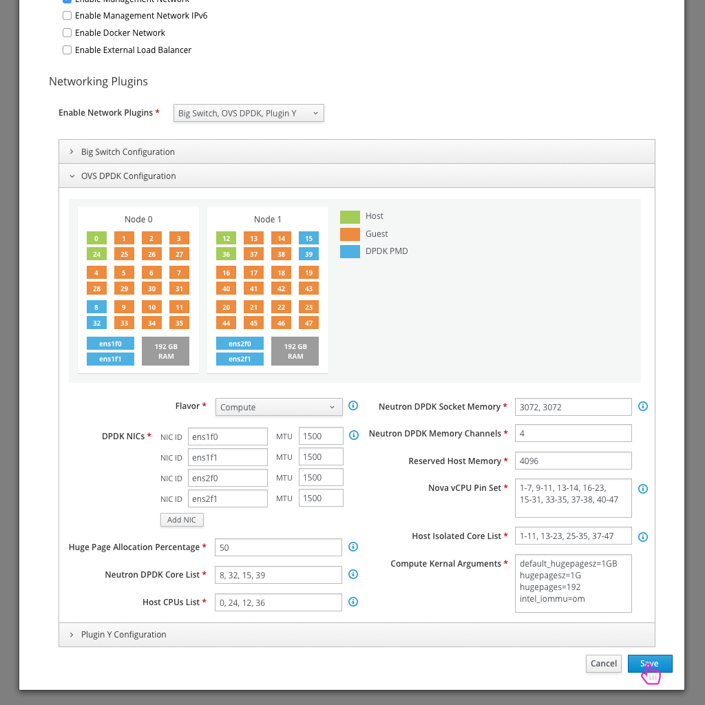

# Configure OVS DPDK Network Plugin

- The first step to configuring any network plugins is to open the Network Configuration.

- By default, there aren't any network plugins selected, but the user can drop down the list of plugins and choose which they'd like to enable.

- One option would be for the user to select the OVS DPDK plugin.

- After enabling this plugin, there will be a number of parameters available that the user can define. This plugin makes use of derived parameters. Details can be read and a good example can be seen here:
https://github.com/redhat-nfvpe/python-tripleo-derive-params/tree/master/dpdk-derive-params
