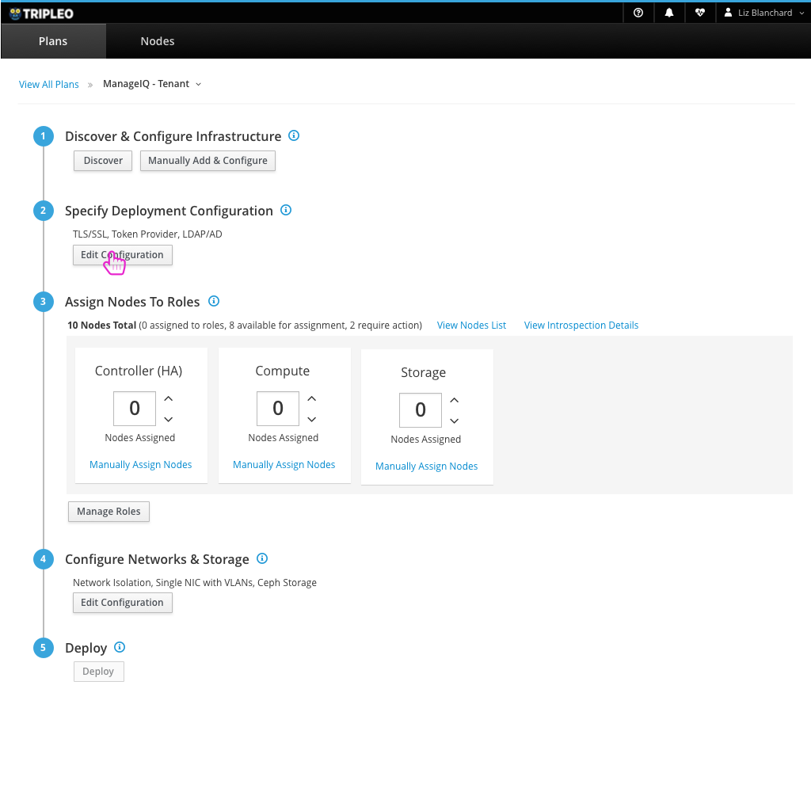
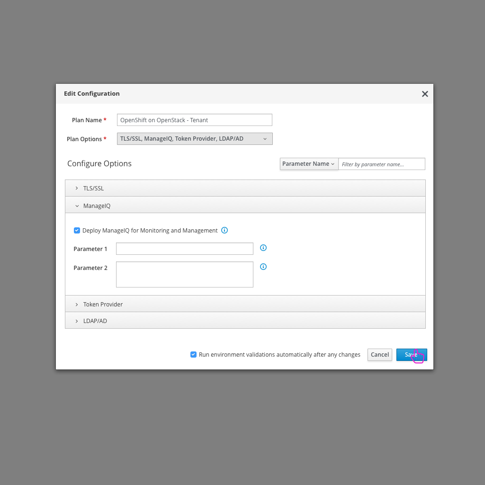
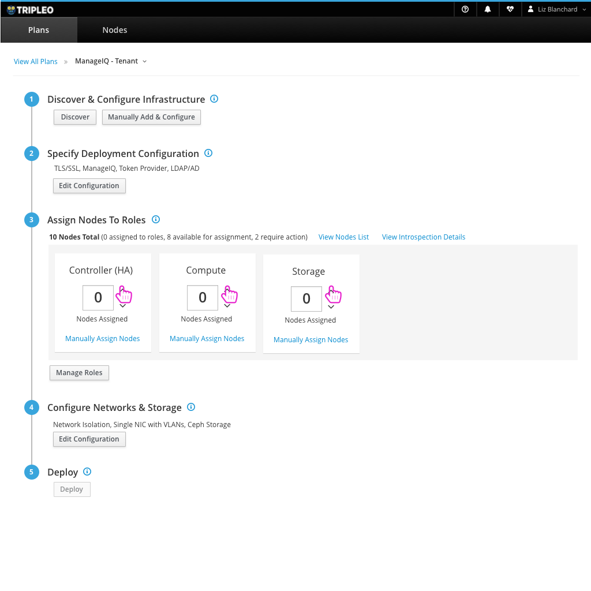
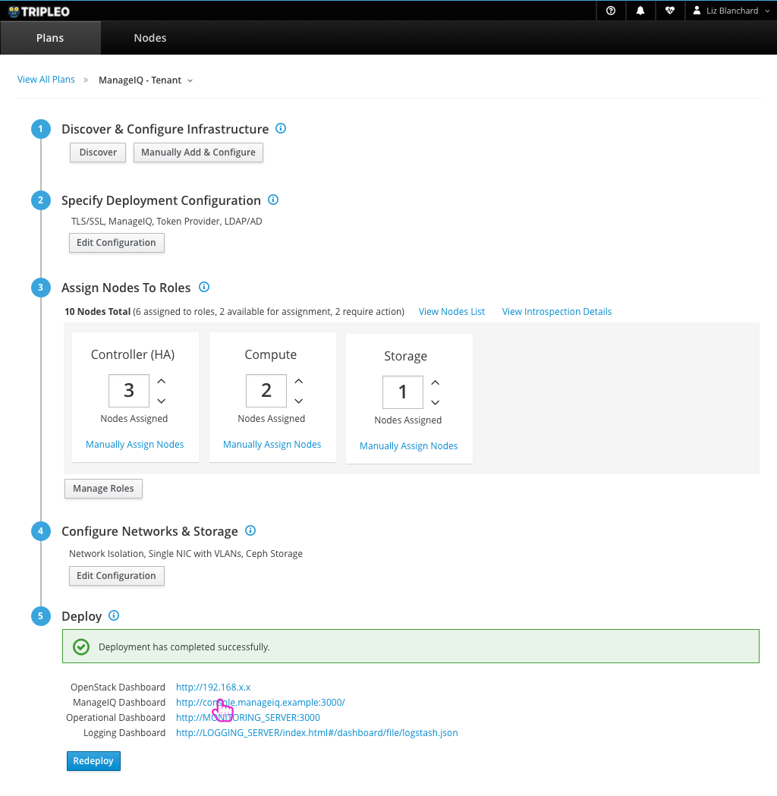
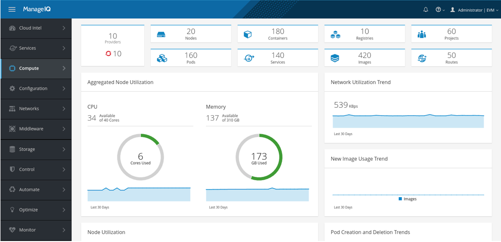

# Deploying ManageIQ on OpenStack
There are a number of applications that a user might want to run on top of OpenStack. Giving the user the option to choose a set of these applications during the deployment process would help get them started. Here is an example of the user selecting to run ManageIQ as an application on top of OpenStack.

## Configure deployment to include ManageIQ

- The user can choose to edit the configuration where they will have to option to turn on running ManageIQ as an application.

## Choose and configure ManageIQ

- After selecting ManageIQ from the dropdown, the user will have additional configuration options for ManageIQ.

## Assign Nodes to Roles

- Just as they would in any other deployment, the user needs to assign which nodes they would like to play which roles in their OpenStack deployment.

## Successful Deployment gives access to ManageIQ Dashboard

- After a successful deployment, the user will have access to the ManageIQ Dashboard as well as the usual OpenStack resources.

## ManageIQ Dashboard

- From here, the user can access the ManageIQ dashboard to take care of day 2 monitoring and management of their resources.
