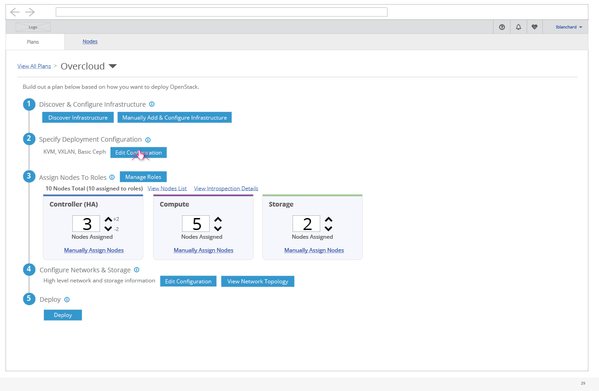
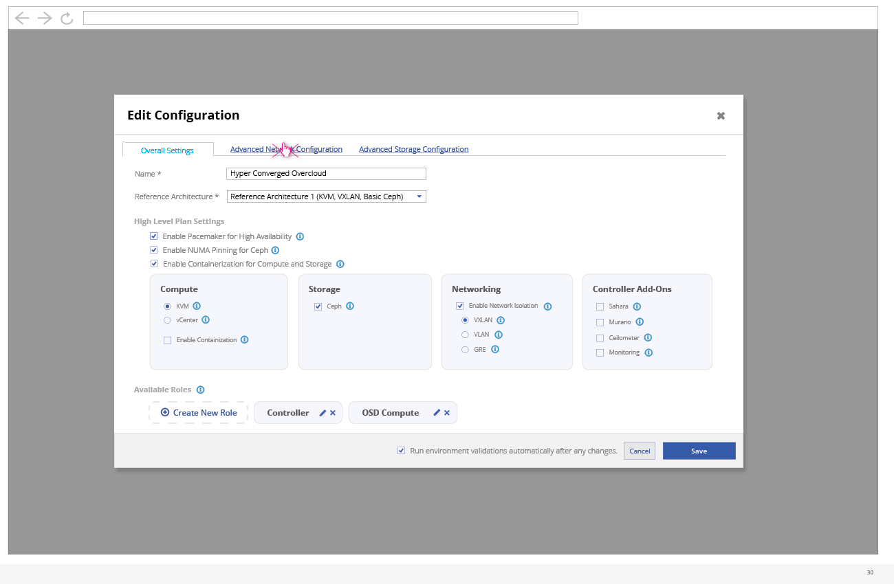
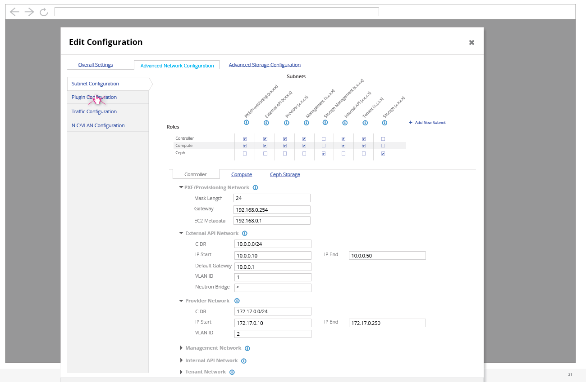
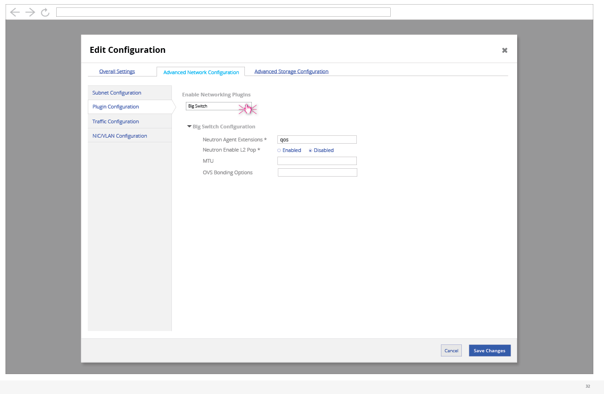
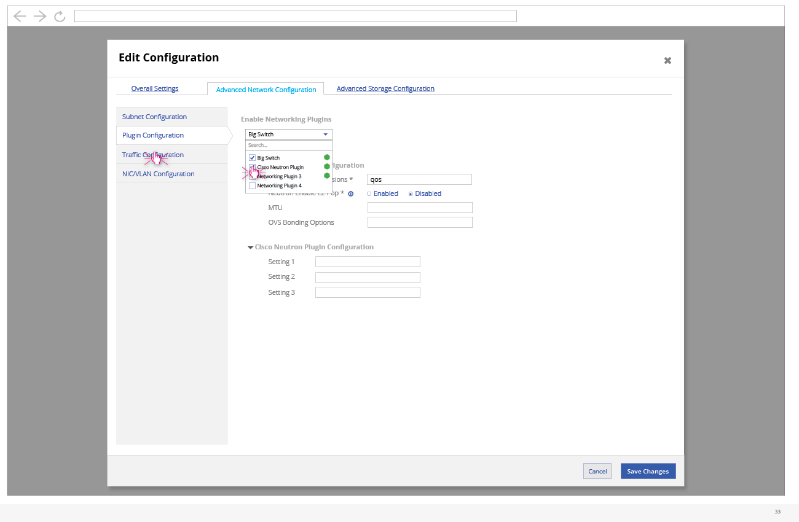
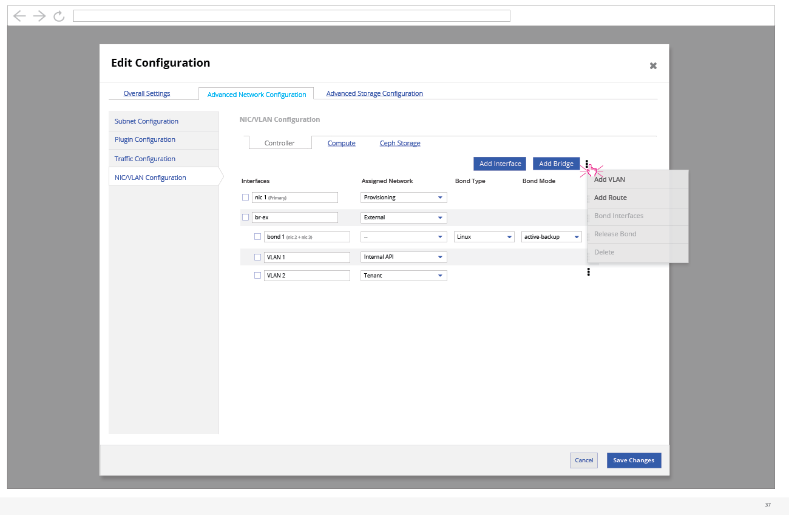
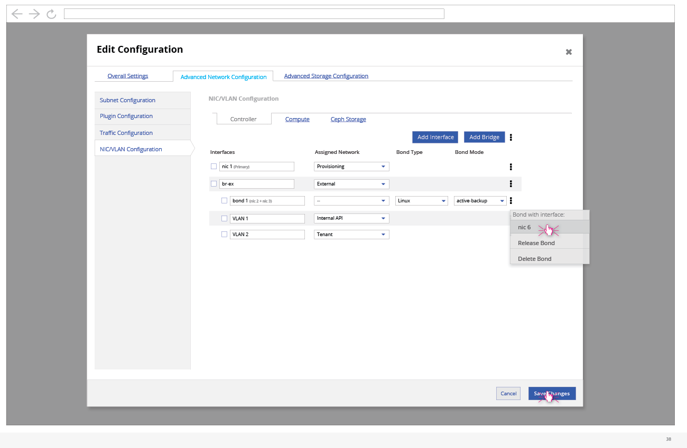
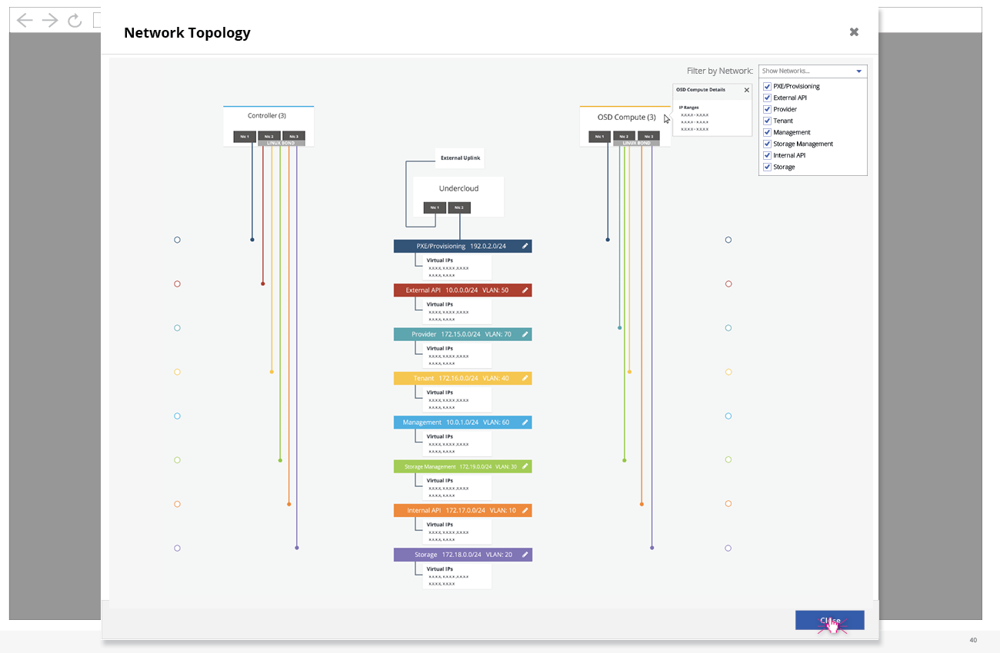

# Advanced Network Configuration and Network Topology

- An advanced user (or preparation expert) might use the UI to setup advanced Networking configuration. To access the configuration, they can click on the "Edit Configuration" button on the deployment workflow.

## Subnet Configuration

- Once the edit configuration modal is shown, the user needs to click on the "Advanced Network Configuration" tab.

- The advanced network configuration has four main sections. The first is where the user can specify the subnet configuration for this deployment. The matrix at the top allows the user to define which roles will be able to access which subnets, while the bottom section allows the user to configure the subnets for each specific role.
- The subnet parameters will not show up under the role tab if it's not selected to be used by that role in the matrix.

## Network Plugin Configuration

- The second section allows the user to edit the plugin configuration for this deployment. Here, they can enable or disable any plugins as well as configure the plugins that have been enabled.

- The plugin dropdown allows the user to enable or disable plugins.
- Any plugins that are enables are added to the list below along with any parameters that can be configured.

## Traffic Configuration

- The traffic configuration section allows the user to configure which services will run on which subnets.

- Since there are a number of services, this list can be expanded to show all services if needed.
- The user can also choose to add a subnet here if they wish.

## NIC/VLAN Configuration

- In the NIC/VLAN configuration section, the user can specify what the network interfaces are for the nodes assigned to each role.
- This includes configuration for NICs, bridges, bonds, VLANs, and routes.

- The inline dropdown allows the user to create, release, and delete bonds.

## Viewing the Network Topology

- At any point, the user can choose to check out the network topology to see how the overcloud network is configured.

- The network topology is a visual representation of the roles, their NIC configuration, along with which subnets each NIC is configured for.
- The user can see the high level subnet information as well.
- If the user were to choose to edit this subnet information, they would be presented with a quick modal with a few parameters on top of this screen.
- One additional feature in this modal is that the user can filter down the number of networks being shown to reduce the clutter in this view. The user can unselect any networks they want to hide from view.

## Specific Node Network Configuration

- The user has the option to configure a few network parameters specifically for each node.
- By clicking on the Nodes section of the UI, they are presented with a list of all nodes that have been registered.

- Within the nodes list view, the user can select a number of nodes and then select the Configure Interfaces option from the actions dropdown.

- This modal allows the user to configure the NICs, bonds, and VLANs for just these specified nodes.

