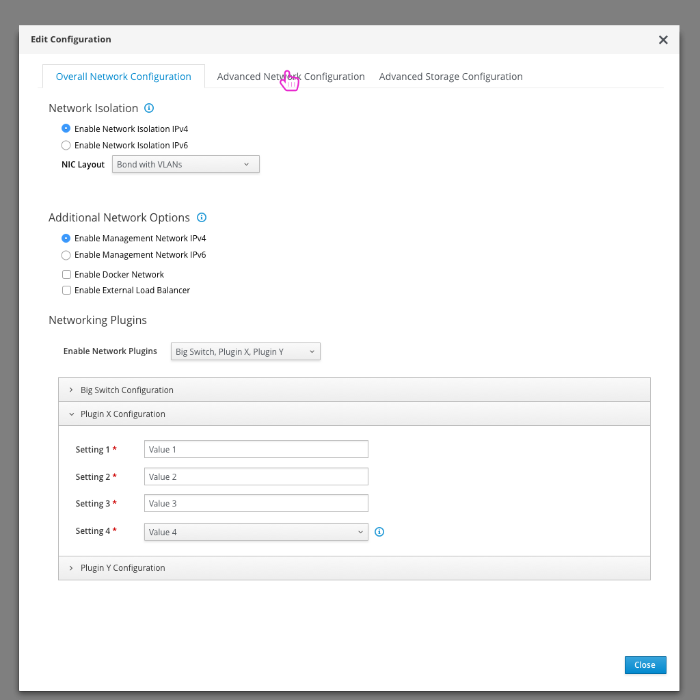

# Advanced Network Configuration and Network Topology

- An advanced user (or preparation expert) might use the UI to setup advanced Networking configuration. To access the configuration, they can click on the "Edit Configuration" button on the deployment workflow.

## Network Topology

- Once the user has clicked on the Edit Configuration button, they will see the current Network Topology as a base view. They will have a number of actions they could perform from here that are in buttons at the top of the modal.
- The network topology is a visual representation of the roles, their NIC configuration, along with which subnets each NIC is configured for.
- The user can see the high level subnet information as well.

## Configure Subnets

- The subnet configuration will slide over the topology view. It will allows users to edit the configuration of the base networks, enable or disable the networks, and add/delete their own networks.
- After making any updates, clicking save will return the user back to the network topology view.

## Assign Subnets to Roles
- Clicking the "Assign Subnets to Roles" button will present the user with another modal.

- This matrix allows the user to define which roles will be able to access which subnets.
- After making any updates, clicking save will return the user back to the network topology view.

<!---
## Traffic Configuration

- The traffic configuration section allows the user to configure which services will run on which subnets.

- Since there are a number of services, this list can be expanded to show all services if needed.
- The user can also choose to add a subnet here if they wish.

-->

## Configure NICs
- The kebab will present the user with a number of additional options. One is to "Configure NICs".

- Clicking on the "Configure NICs" button gives the user the option to define a network profile that will be used for the nodes assigned to each role. The role can be selected at the top of the modal.
- The user will be able to create and configure NICs, bridges, bonds, VLANs, and routes.
- After making any updates, clicking save will return the user back to the network topology view.

## Configure Plugins
- Another option in the kebab is to "Configure Plugins".

- The plugin dropdown allows the user to enable or disable plugins.
- Any plugins that are enabled are added to the accordion below along with any parameters that can be configured.

## Toggle YAML view
- One option that the user has is to toggle the view from the visual topology to the YAML view.

## Configure Provider Networks
- An additional option is to configure the provider networks.
- Provider networks will be created after a successful deployment, so they are a bit different from all other networks that are being configured here.

## Download Templates
- Note that there is an additional option in the kebab menu to allow the user to download the templates from this view.

<!---
- One additional feature in this modal is that the user can filter down the number of networks being shown to reduce the clutter in this view. The user can unselect any networks they want to hide from view.

## Specific Node Network Configuration

- The user has the option to configure a few network parameters specifically for each node.
- By clicking on the Nodes section of the UI, they are presented with a list of all nodes that have been registered.

- Within the nodes list view, the user can select a number of nodes and then select the Configure Interfaces option from the actions dropdown.

- This modal allows the user to configure the NICs, bonds, and VLANs for just these specified nodes.

-->
