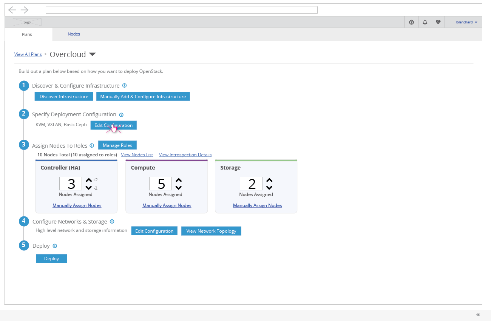
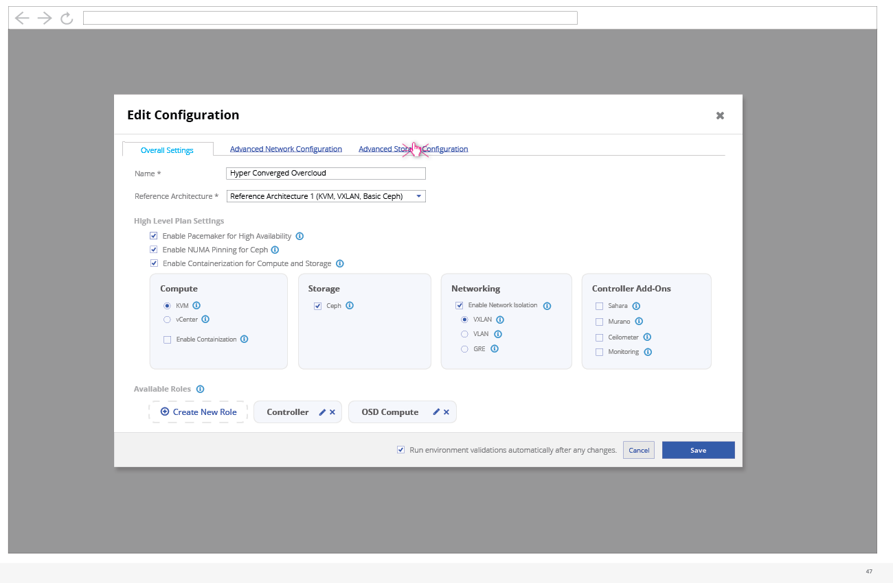
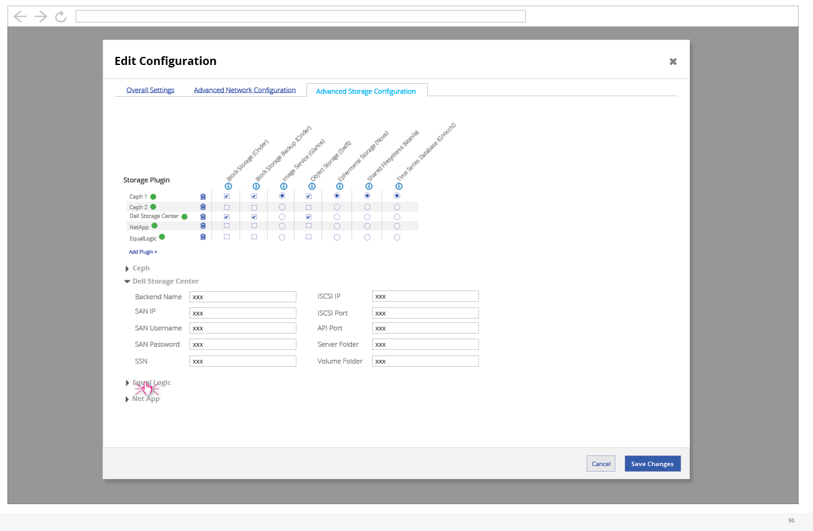
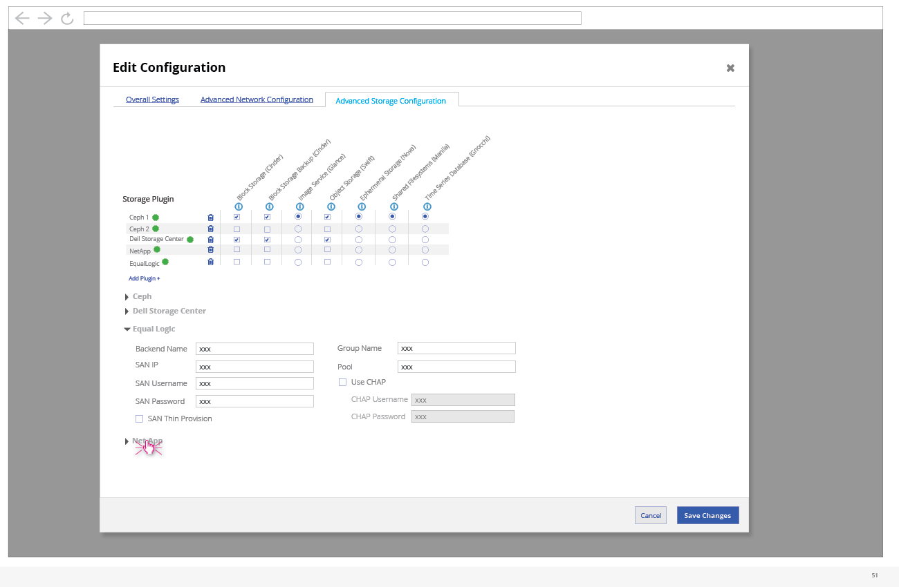
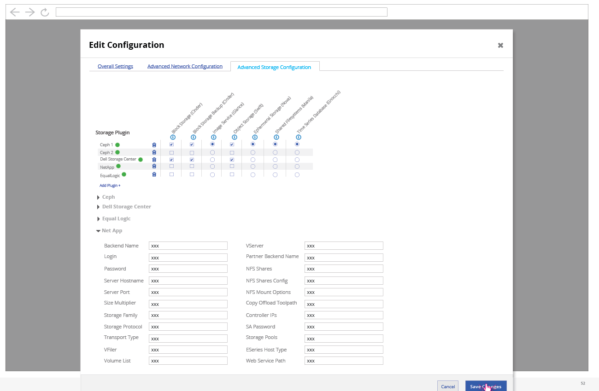
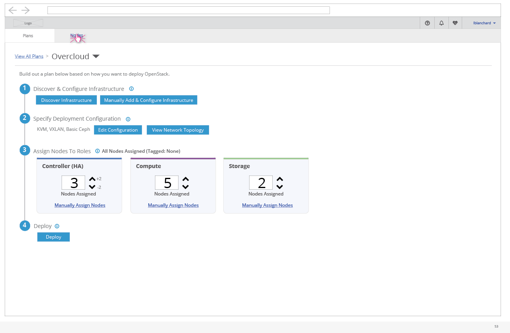
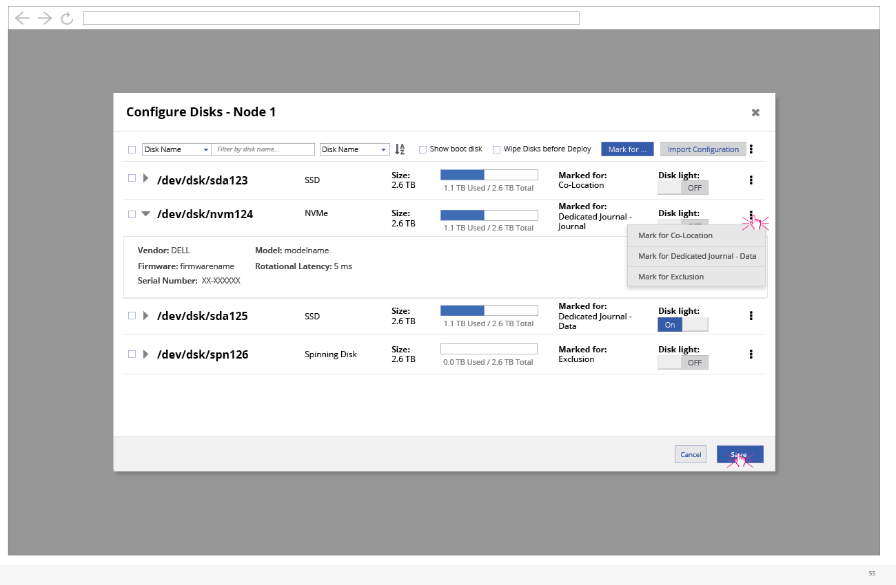

# Advanced Storage Configuration

- An advanced user (or preparation expert) might use the UI to setup advanced Storage configuration. To access the configuration, they can click on the "Edit Configuration" button on the deployment workflow.

- Once the edit configuration modal is shown, the user needs to click on the "Advanced Storage Configuration" tab.

- At this point, the user can define while plugins are used by which openstack storage services.
- The user can also add new plugins.

- Any plugins that the user wishes to configure for this deployment can be selected from the list.
- If this list grows to be long, the user can search the list to reduce the number of options.

- For each plugin that has been selected above, the user can define parameters below.

- Each plugin will have a section of parameters that can be expanded.

- The user can navigate to the Nodes List view to configure the disks for specific nodes.

- On expansion, a number of storage details can be seen.
- The user can select a number of nodes a choose to "Configure Disks" from the actions kebab.

- Within the Configure Disks modal, the user can see details about the disks for the nodes.
- The user can also configure what the disk will be used for.
