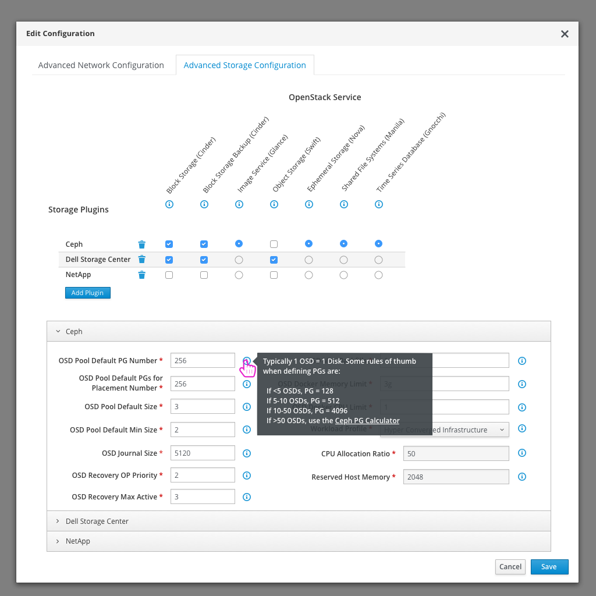
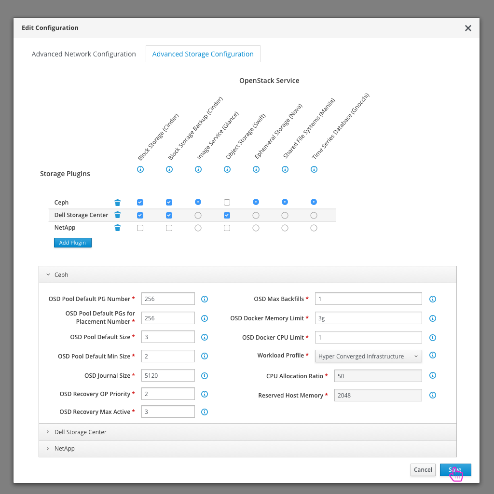
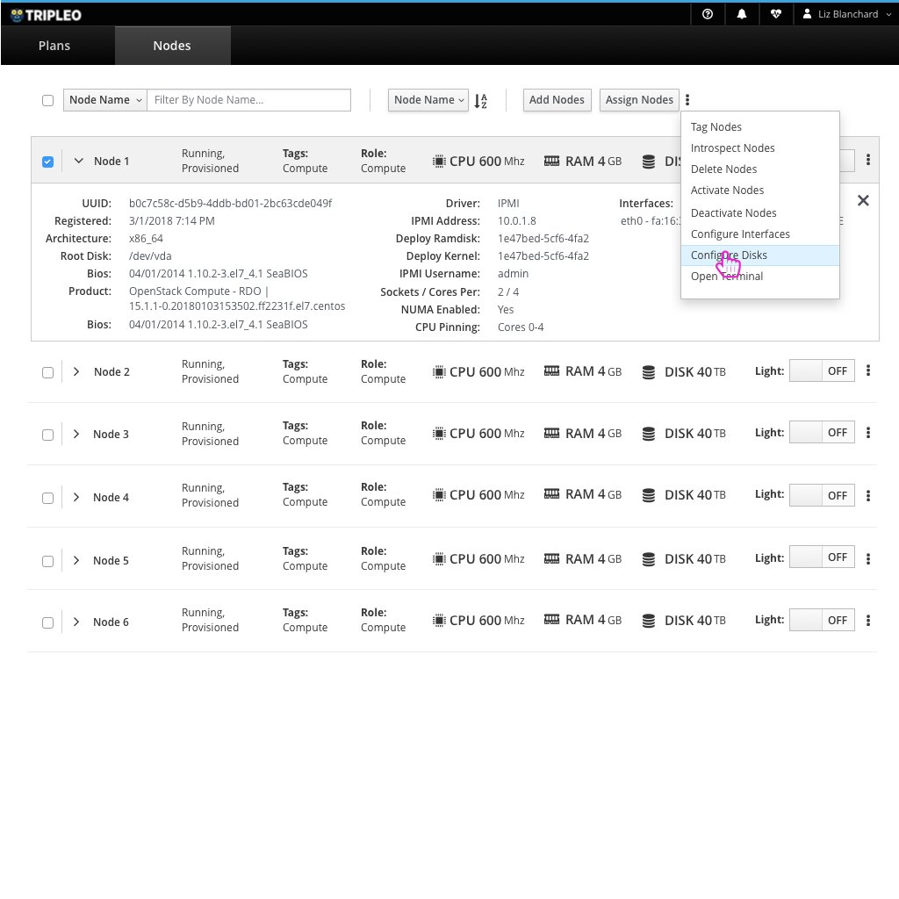

# HCI Deployment Workflow including Advanced Storage Configuration
This workflow will show the steps that a user will take if they want to deploy a hyper-converged environment.

- The user first logs into the TripleO UI.

- Since there is only one plan, by default the user is taken to the plan details page.
- The first step is to register nodes that will be used in the deployment.

- The user can manually add nodes or upload a JSON file if they want to add in bulk.

- The user will see the status of the nodes registering.
- In some cases, a number of validations will run as well. If so, the user will see a toast notification with details.

- Since the user wants to deploy a hyper converged environment, they will need to edit the roles used.

- The toggles can be used to turn roles off and on.
- At this point the user would turn off the typical Compute and Storage roles and turn on the ComputeOSD role where they are combined.

- After making changes, the user can save the configuration.

- The user can assign the number of nodes they need to play each role at this point.

- Now, the user can dig into the advanced storage configuration if they need to make any changes.

- The second tab in the edit configuration modal holds the advanced storage configuration.

- Within this section, the user can define which storage plugins are used along with which OpenStack Storage services use them.
- Each plugin that is chosen may have some editable parameters that come along with it. These will be shown in an accordion below.
- Certain parameters may have inline help information text that will be shown in a tooltip.

- After making any changes, the user can save their edits.

- If the user wants to view or edit storage details about specific nodes, they can access them from the nodes list.

- Nodes can be expanded to view more node details.
- One option for each node is to configure disks.

- Disk details can be viewed and edited for each node in the nodes list.

- Once the details of the deployment look good, the user can click the "Deploy" button to kick off the deployment process.

- The user will get a confirmation window before going forward with the deployment.
- Note: If any validations haven't completed, or have failed, the user will see a warning message within this confirmation modal.

- After kicking off the deployment, the user won't be able to make any configuration changes.
- A progress bar will show how far the deployment has gone alone with what step it is currently on.
- The user will have the option to cancel the deployment at this point if they want.

- After a successful deployment, the user is given the details on how to access the deployed overcloud.
