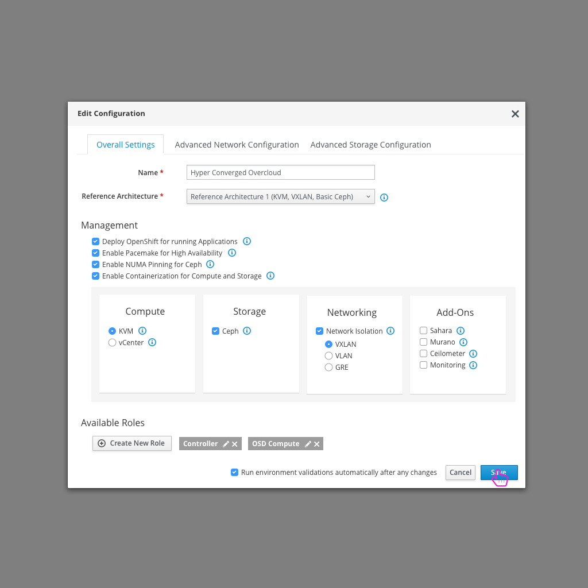
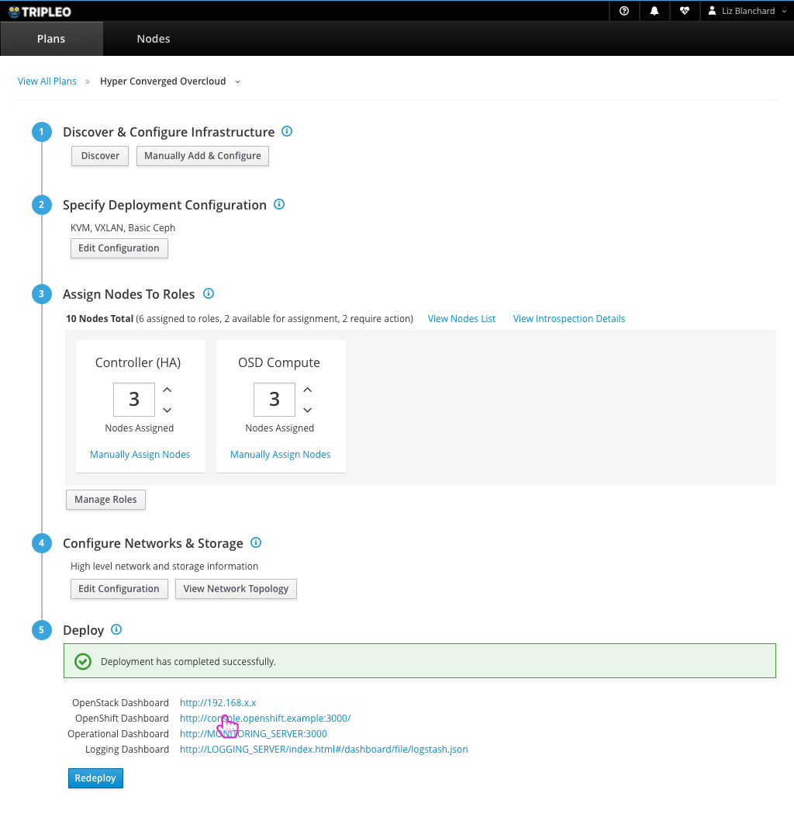

# OpenShift on OpenStack - OpenShift as a Tenant
One way that users will want to run OpenShift on OpenStack is by using the infrastructure that OpenStack provides and making OpenShift run as a tenant.

## Typical OpenStack Deployment, including OpenShift option
The user would follow the typical OpenStack deployment in this instance, but there would be an additional option to make it clear that they want to run OpenShift as a tenant.

[Typical OpenStack Deployment Workflow](https://lizsurette.github.io/OpenStack-Design/tripleo-ui/1-deployment-workflow-for-edge-technician/)

## Enable OpenShift in Deployment Configuration

- Ideally, users would not have to configure or install OpenShift via Ansible separately as they have to today. This would be installed during the OpenStack installation/deployment. It would be a default selection in the high level configuration to enable OpenShift for Application Creation.

## Successful Deployment gives access to OpenShift Dashboard

- After a successful deploy, the user can access the OpenShift Dashboard directly. This assumes that the OpenStack Deployment makes sure that all of the steps that are needed to allow OpenShift to be available to the user are done during deployment (not forcing the user to do this work manually through configuring and running Ansible scripts).

## OpenShift Dashboard

- The user can continue with their OpenShift workflows now that they have access to this dashboard.
