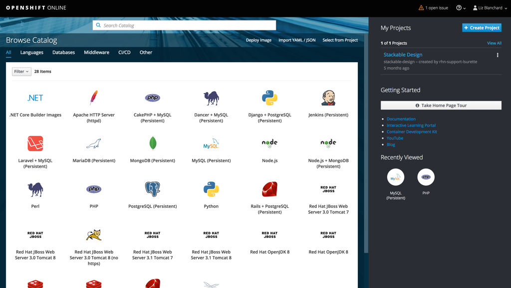

# OpenShift on OpenStack - OpenShift as a Tenant
One way that users will want to run OpenShift on OpenStack is by using the infrastructure that OpenStack provides and making OpenShift run as a tenant.

## Typical OpenStack Deployment, including OpenShift option
The user would follow the typical OpenStack deployment in this instance, but there would be an additional option to make it clear that they want to run OpenShift as a tenant.

## Edit configuration

- Clicking "Edit Configuration" on step 2 of the workflow will allow the user to enable and disable along with configure certain deployment options.

## Enable OpenShift in Deployment Configuration

- One option would be to enable OpenShift. Ideally, users would not have to configure or install OpenShift via Ansible separately as they have to today. This would be installed during the OpenStack installation/deployment.

## Assign Nodes to Roles

- Just as they would in any other deployment, the user needs to assign which nodes they would like to play which roles in their OpenStack deployment.

## Successful Deployment gives access to OpenShift Dashboard

- After a successful deploy, the user can access the OpenShift Dashboard directly. This assumes that the OpenStack Deployment makes sure that all of the steps that are needed to allow OpenShift to be available to the user are done during deployment (not forcing the user to do this work manually through configuring and running Ansible scripts).

## OpenShift Dashboard

- The user can continue with their OpenShift workflows now that they have access to this dashboard.
