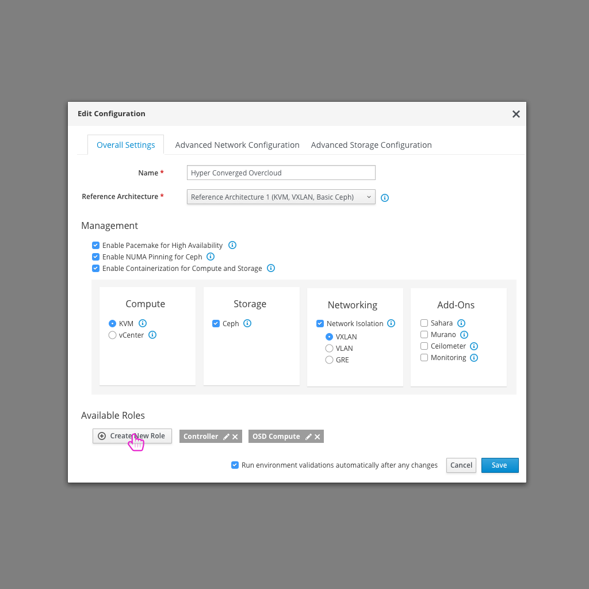
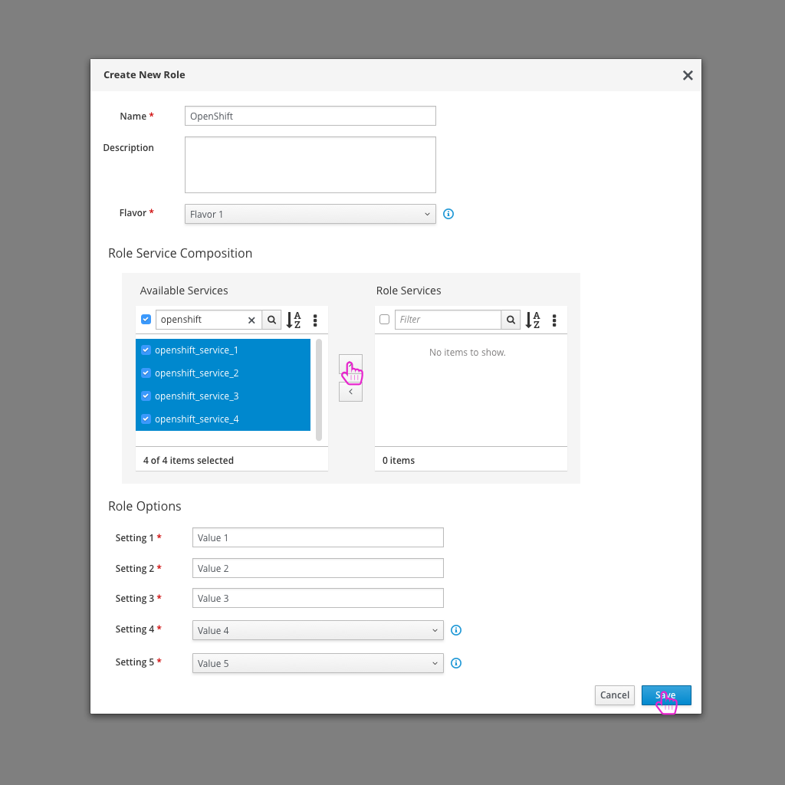
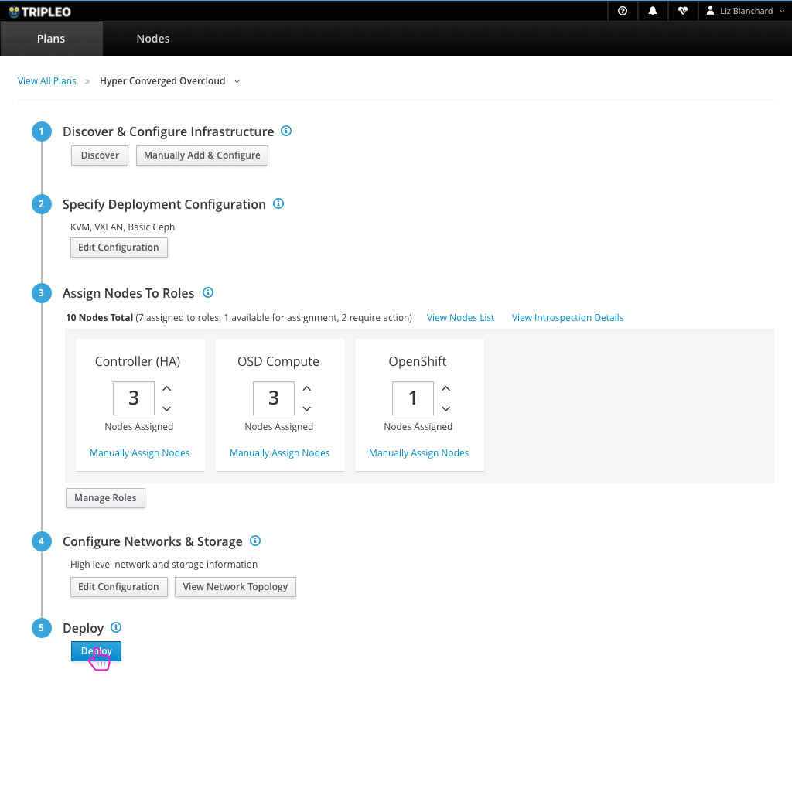
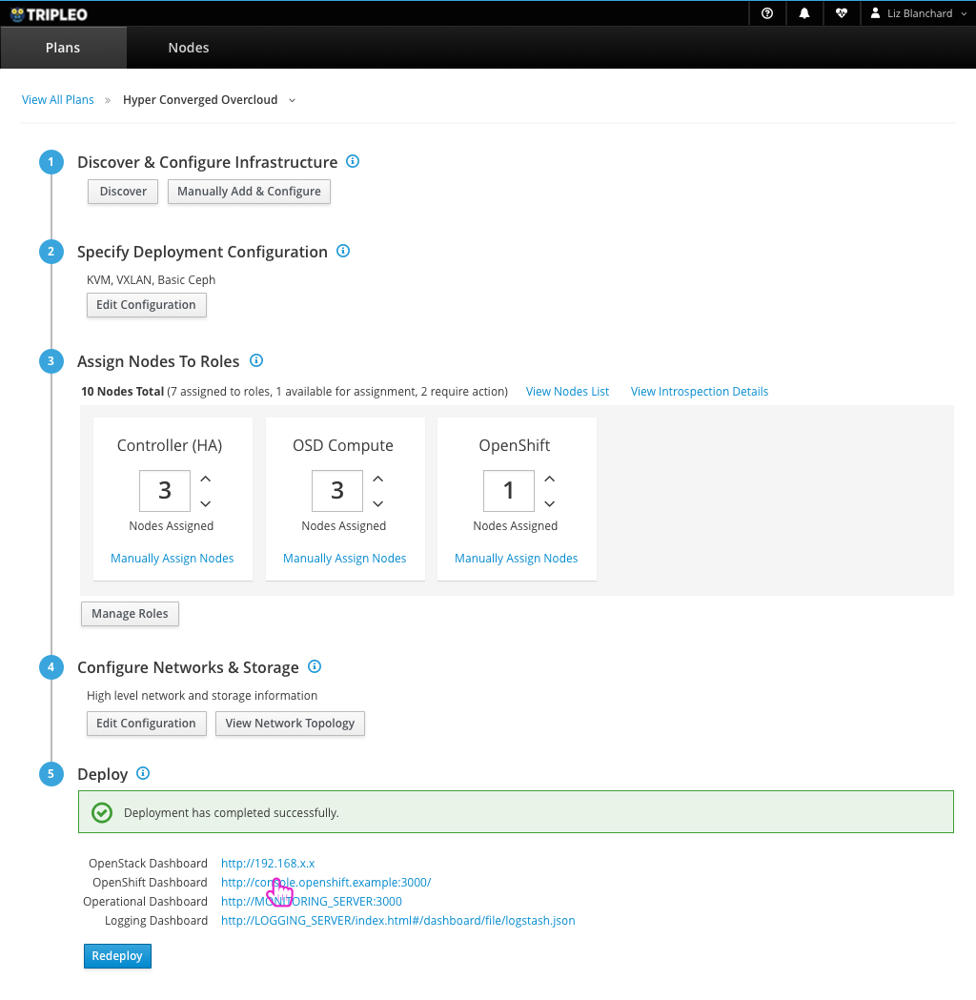
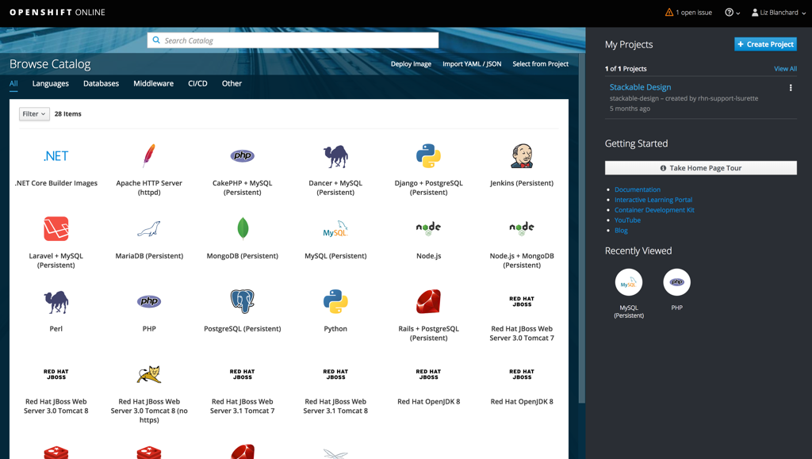

# OpenShift on OpenStack - Use custom role and run on Bare-Metal
Another way that users will want to run OpenShift on OpenStack is by defining a custom role and assigning bare-metal nodes to that role to use to run OpenShift.

## Create New Role

- The first step in this method to running OpenShift is to create a new role that will hold the parameters for the OpenShift node configuration.

## Create New Role Modal

- The user can add any OpenShift specific services to this role and define any of the parameter values necessary for this role.

## Deploys

- After assigning nodes to the appropriate roles (including OpenShift) the user can deploy OpenStack.

## Successful Deployment gives access to OpenShift Dashboard

- After a successful deployment, the user will have access to the OpenShift Dashboard as well as the usual OpenStack resources.

## OpenShift Dashboard

- From here, the user can access the OpenShift dashboard to take care of any application creation tasks they wish to do on OpenShift.
