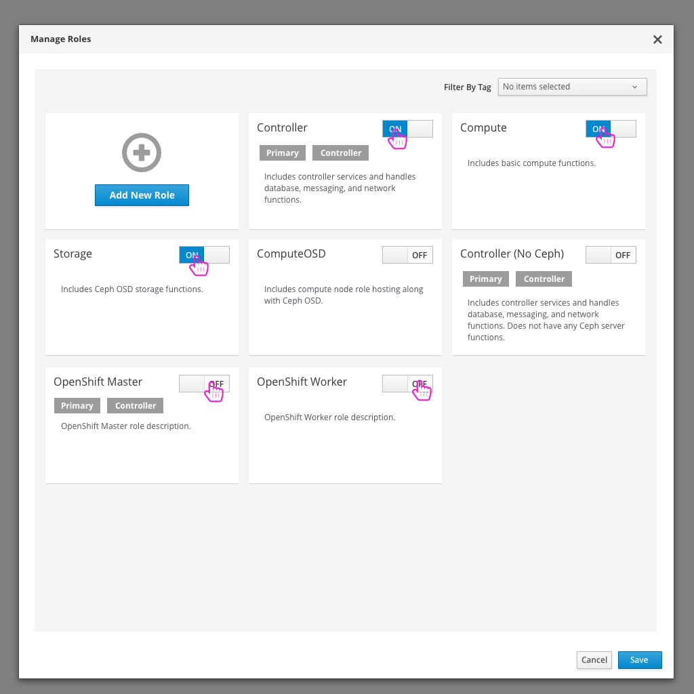

# OpenShift on OpenStack - Use custom roles and run on Bare-Metal
Another way that users will want to run OpenShift on OpenStack is by using custom roles and assigning bare-metal nodes to those roles to use to run OpenShift.

## Edit Configuration

- The first step whether the user is planning to run OpenShift as a Tenant or use Bare Metal to run OpenShift is to enable OpenShift in the configuration modal. This will give the user access to any OpenShift configuration they might want to edit.

## Edit Configuration Modal

- Enabling OpenShift will give the user access to OpenShift configuration.

## Manage Roles

- Since the user is planning on deploying OpenShift on bare metal, they need to enable certain custom roles that they'd like to use in this deployment.

## Manage Roles Modal

- Here the user will disable any roles that won't be used and enable the OpenShift roles needed.

## Manage Roles Modal

- Saving these customizations will update the available roles that a user can assign nodes to on the main deployment workflow page.

## Assign Nodes to Roles

- Just as they would in any other deployment, the user needs to assign which nodes they would like to play which roles in their OpenStack deployment.

## Deploy

- The user can now deploy their OpenStack environment.

## Successful Deployment gives access to OpenShift Dashboard

- After a successful deployment, the user will have access to the OpenShift Dashboard as well as the usual OpenStack resources.

## OpenShift Dashboard

- From here, the user can access the OpenShift dashboard to take care of any application creation tasks they wish to do on OpenShift.
