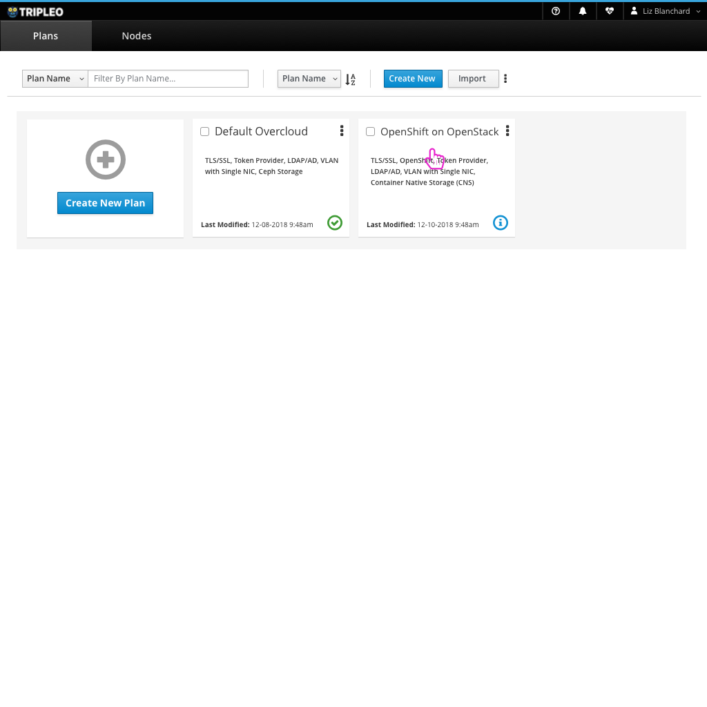
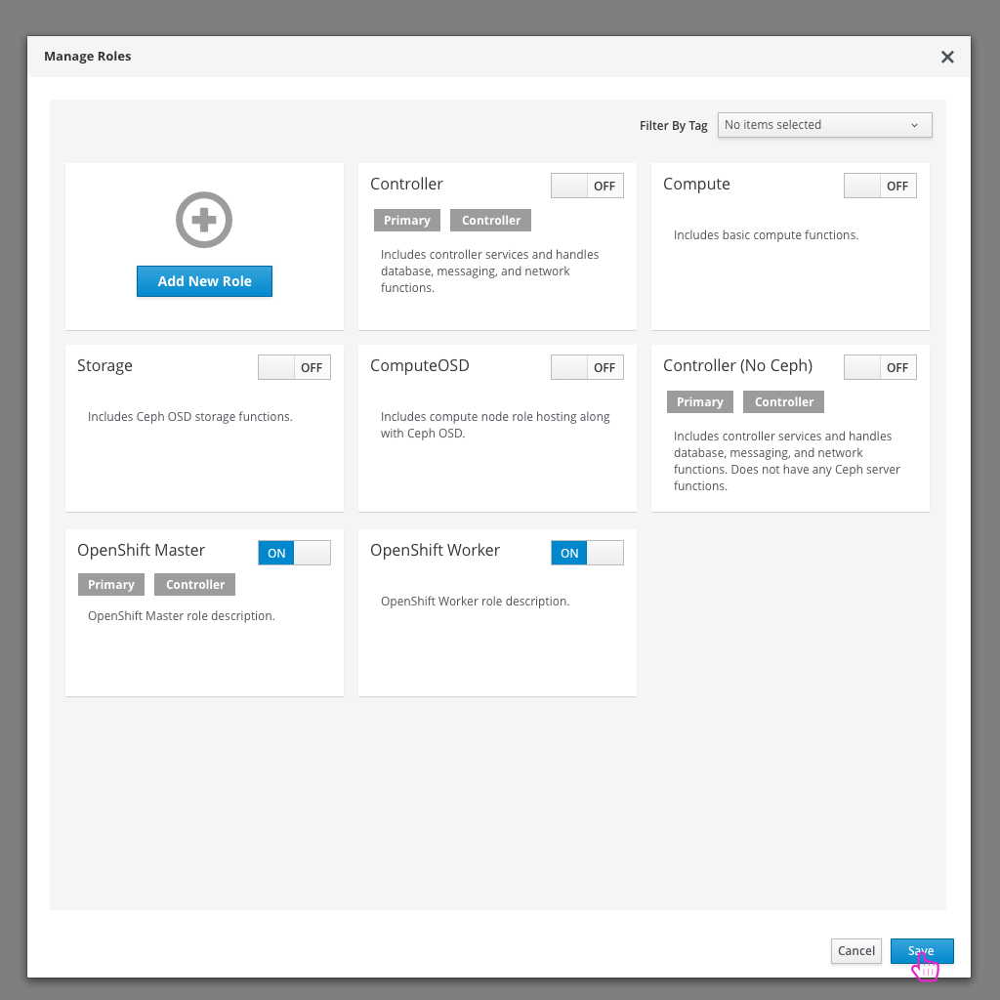
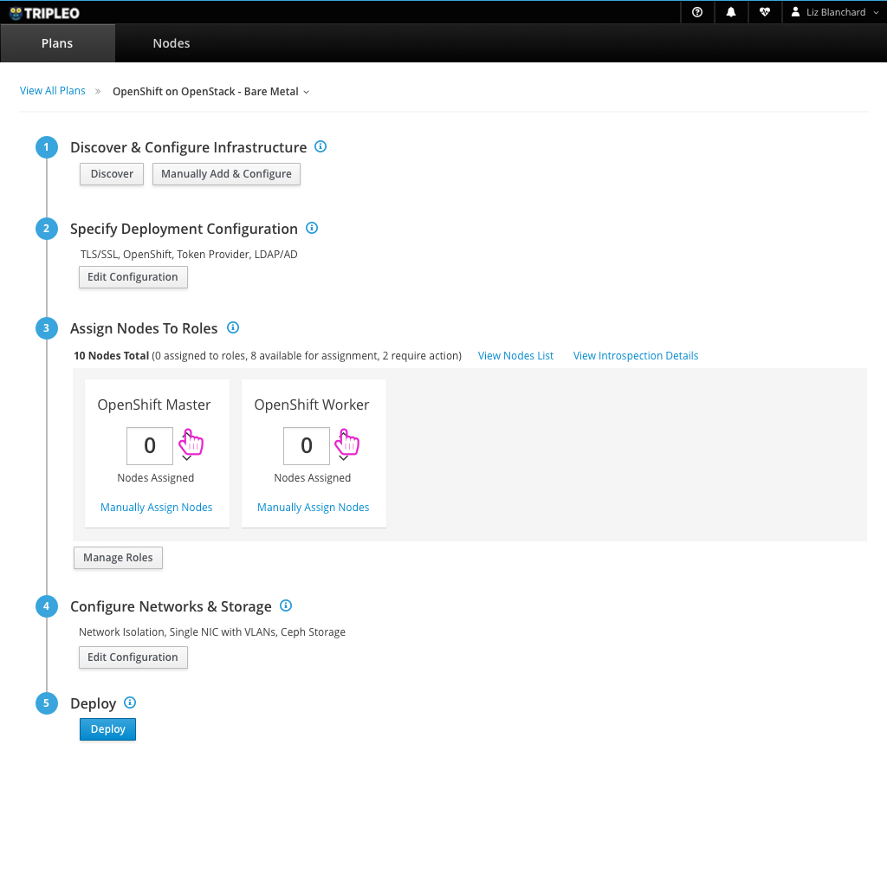

# OpenShift on OpenStack - Use custom roles and run on Bare-Metal
Another way that users will want to run OpenShift on OpenStack is by using custom roles and assigning bare-metal nodes to those roles to use to run OpenShift.

# Using a Predefined Deployment Plan
One idea to make this very easy for the user is to provide a default "OpenShift on OpenStack" deployment plan for the user.

## Login

- First the user would need to log in to the TripleO UI.

## Choose Deployment Plan

- After logging in, the user will be able to see the list of deployment plans they can use. One of these would be the "OpenShift on OpenStack" plan.

## Add Infrastructure

- As a first step to deploying OpenShift on OpenStack, the user needs to register the nodes that will be used.

## Assign Nodes to Roles

- Just as they would in any other deployment, the user needs to assign which nodes they would like to play which roles in their OpenStack deployment.

## Deploy

- The user can now deploy their OpenStack environment.

## Successful Deployment gives access to OpenShift Dashboard

- After a successful deployment, the user will have access to the OpenShift Dashboard as well as the usual OpenStack resources.

## OpenShift Dashboard

- From here, the user can access the OpenShift dashboard to take care of any application creation tasks they wish to do on OpenShift.

# Editing an existing Deployment Plan
If the user wants to start from an existing plan, they can make changes necessary to edit the configuration and choose the roles needed to deploy OpenShift on OpenStack.

## Edit Configuration

- Assuming the user has already registered nodes, the next step is to be sure that OpenShift is enabled in the configuration modal. This will give the user access to any OpenShift configuration they might want to edit.

## Edit Configuration Modal

- Enabling OpenShift will give the user access to OpenShift configuration.

## Manage Roles

- Since the user is planning on deploying OpenShift on bare metal, they need to enable certain custom roles that they'd like to use in this deployment.

## Manage Roles Modal

- Here the user will disable any roles that won't be used and enable the OpenShift roles needed.

## Save Role Changes

- Saving these customizations will update the available roles that a user can assign nodes to on the main deployment workflow page.

## Assign Nodes to Roles

- Just as they would in any other deployment, the user needs to assign which nodes they would like to play which roles in their OpenStack deployment.

## Edit Storage configuration

- For OpenShift on OpenStack, the user will need to be sure that Container Native Storage is chosen and configured.

## Deploy

- The user can now deploy their OpenStack environment.

## Successful Deployment gives access to OpenShift Dashboard

- After a successful deployment, the user will have access to the OpenShift Dashboard as well as the usual OpenStack resources.

## OpenShift Dashboard

- From here, the user can access the OpenShift dashboard to take care of any application creation tasks they wish to do on OpenShift.
