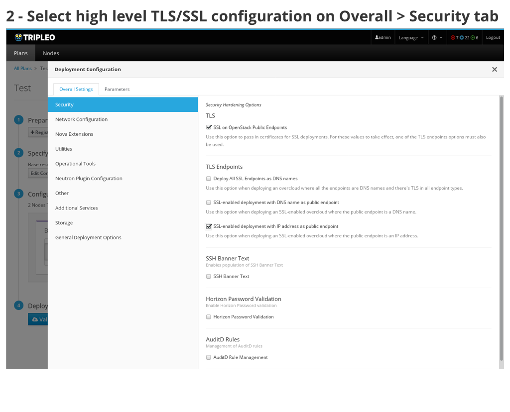
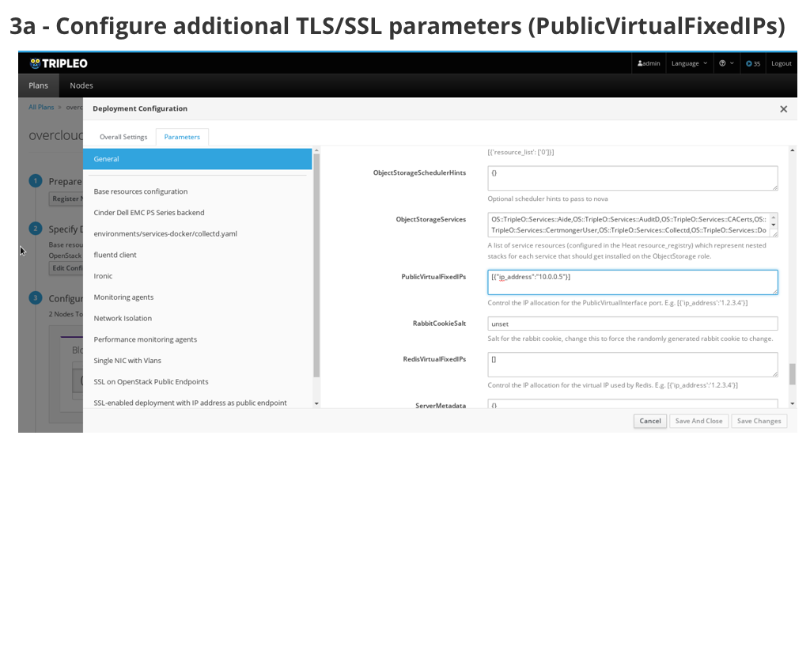
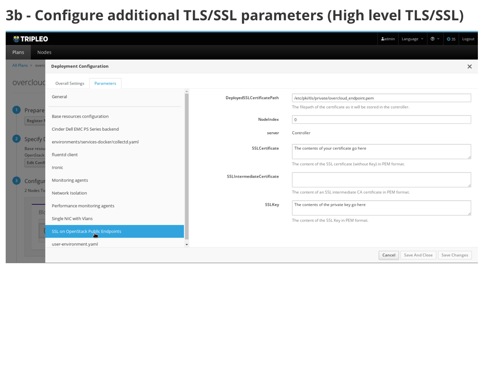
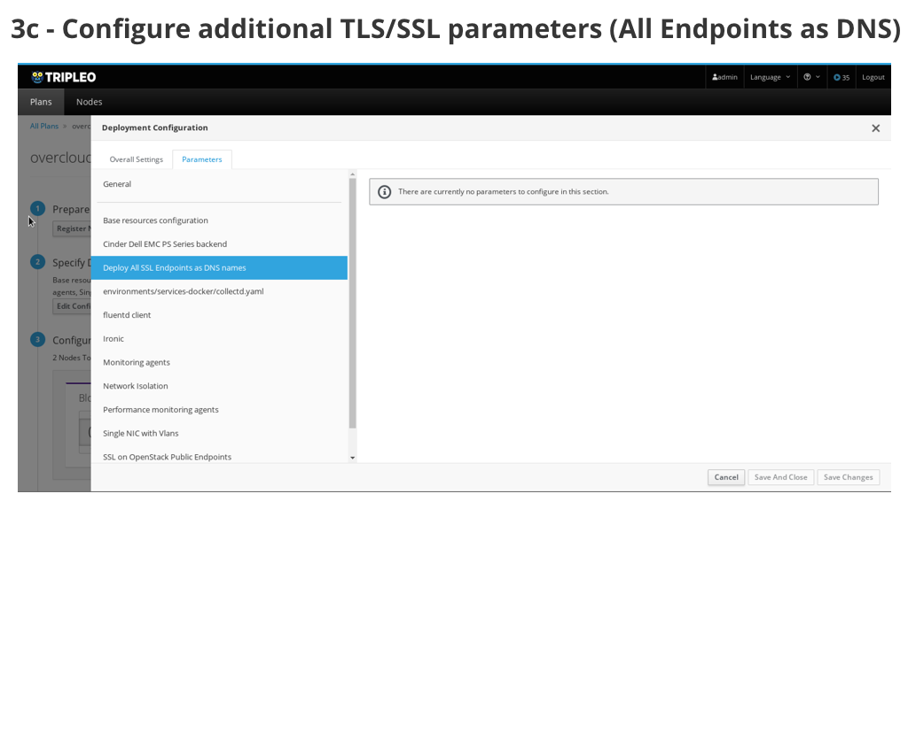
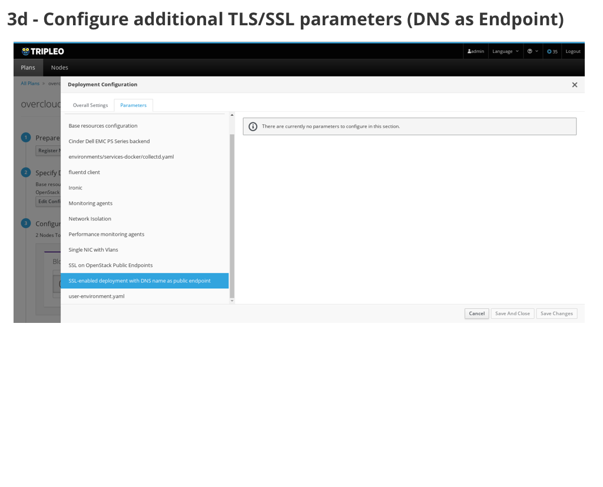
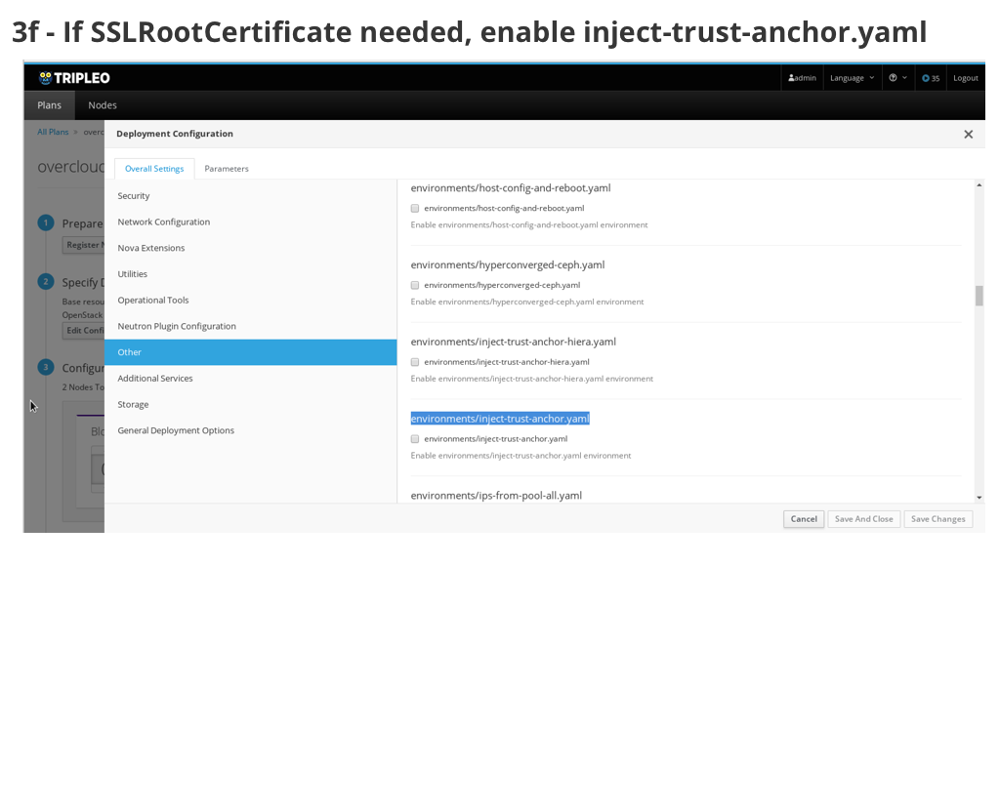
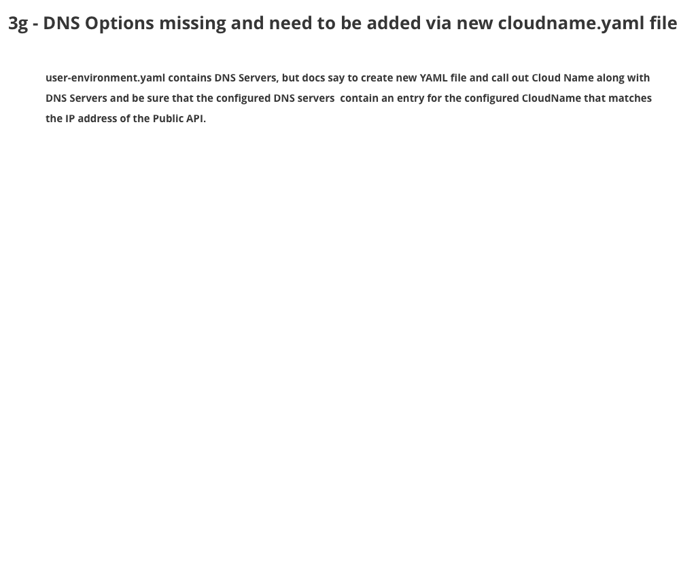
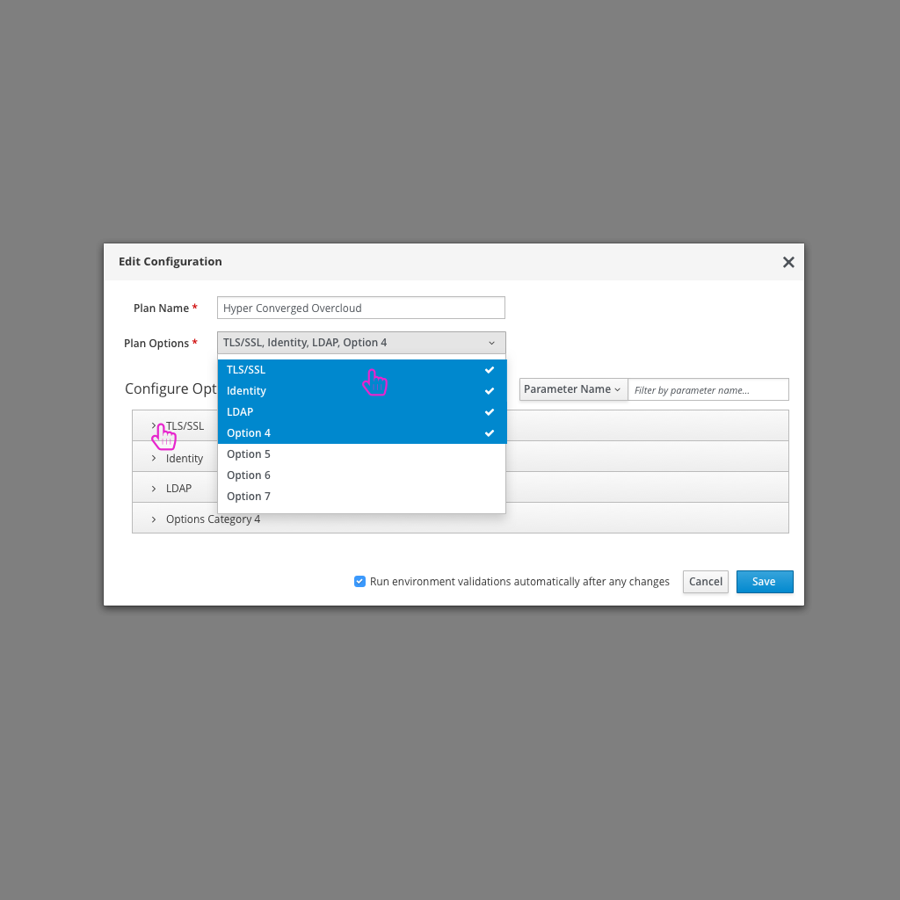
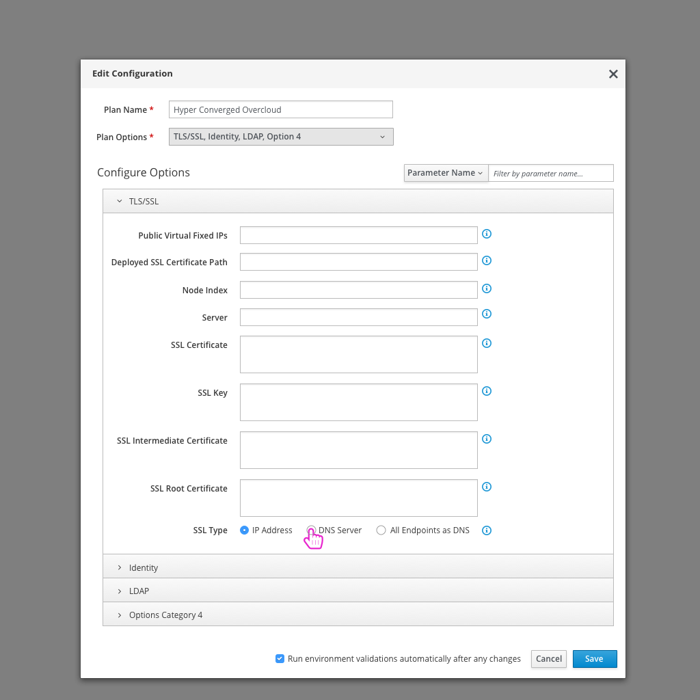
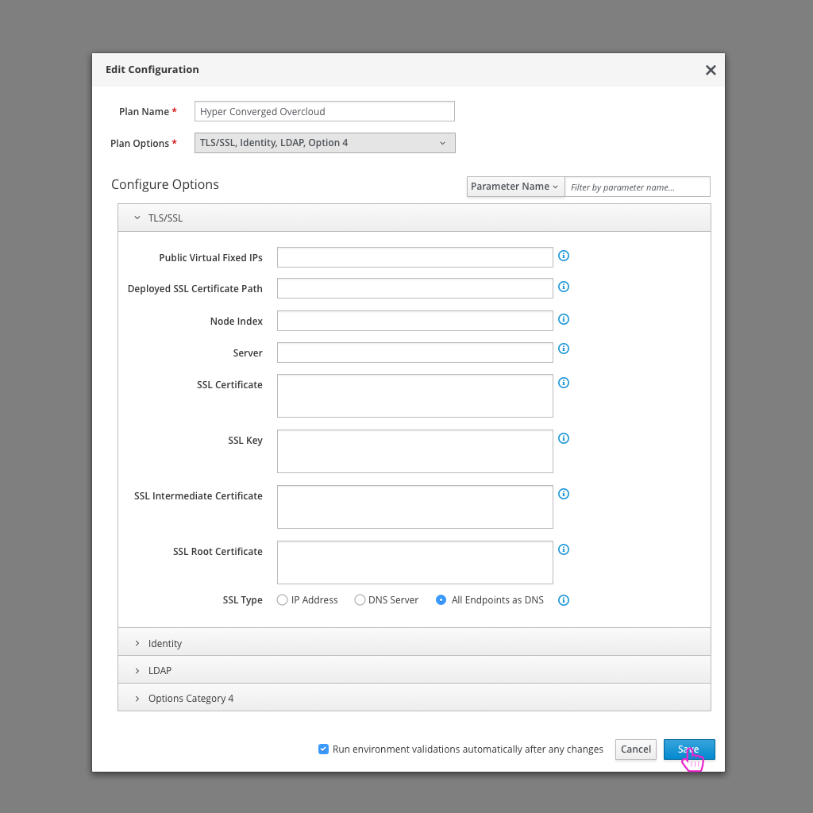

# Setup SSL
A very common configuration change to make for an OpenStack Deployment is to enable SSL.

## Today's flow in TripleO UI - Queens
Today in the TripleO UI, the user needs to enable TLS/SSL at a high level before being able to define advanced parameters. After selecting to enable TLS/SSL, the user will have access to a set of parameters application to TLS/SSL and also be able to specify which specific type of TLS/SSL they'd like to configure for this deployment.

### Usability Notes/Questions:
* Enabling SSL/TLS at a high level should then present the user with the additional 3 options for SSL/TLS types.
* Today the 3 SSL/TLS options are presented to the user as check boxes, but only one can be enabled at a time. They should really be radio buttons.
* Parameter that is needed, "PublicVirtualFixedIPs" is located in the General section and no where else. It's the one outlier parameter needed in this configuration and should really live with the others.
* The parameter "SSL Certificate" can be found in a number of places including the Base Resources Configuration, user-environment.yaml, along with the SSL on OpenStack Public Endpoints (when enabled) sections. How will the user know which place to edit this parameter and have it stick? There is a similar situation with "DeployedSSLCertificatePath".
* Each SSL/TLS option includes a section of parameters in the left hand navigation, but they are all blank and offer no parameters. Do these really need to be listed at all?
  1. https://github.com/openstack/tripleo-heat-templates/blob/master/environments/tls-everywhere-endpoints-dns.yaml
  2. https://github.com/openstack/tripleo-heat-templates/blob/master/environments/tls-endpoints-public-dns.yaml
  3. https://github.com/openstack/tripleo-heat-templates/blob/master/environments/tls-endpoints-public-ip.yaml
* There is a missing set of parameters that needs to be added by the user if they want to DNS. Instructions include creating a new cloudname.yaml file and adding "Cloud Name" and "DNS Servers" as parameters. The configured DNS servers must contain an entry for the configured Cloud Name that matches the IP address of the Public API.

## An Ideal Flow

- After logging in, the user clicks on the "Edit Configuration" button.

- The user is presented with a high level configuration page where they can enable TLS and SSL on OpenStack Public Endpoints.

- Flipping over to the advanced configuration tab, the user can quickly see TLS/SSL as one of the accordion categories and click to expand. All applicable parameters for TLS/SSL will be listed in this section below for the user to configure. This includes one option to choose the type of SSL access. Selecting the "DNS Endpoint" option gives the user a few additional options.

