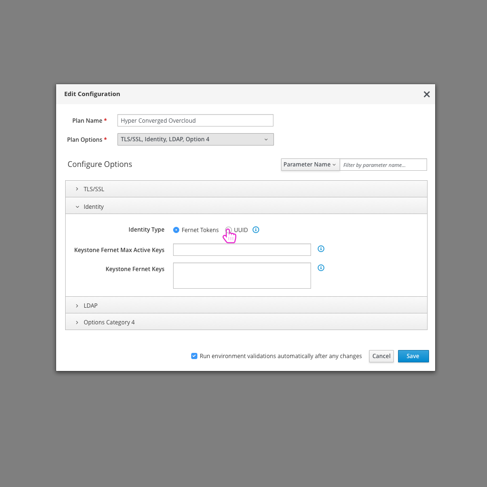

# Enable Fernet Tokens
Another common configuration change to make for an OpenStack Deployment is to enable Fernet Tokens.

## Today's flow in TripleO UI - Queens
Today in the TripleO UI, the user needs to enable Fernet tokens by navigating to the parameters section and clicking through a number of subsections to find all of the applicable fields.

### Usability Notes/Questions:
* Fernet tokens will be used by default as on Queens, so it won't be a big configuration change that needs to be made moving forward. The user would still need to toggle this off if they don't want to use Fernet tokens.
* Simply grouping these parameters into one file/group would be helpful.
* Grouping this would also allow the user to turn this feature on/off easily.

## An Ideal Flow

- After logging in, the user clicks on the "Edit Configuration" button.

- From there, the user can select "Fernet Tokens" from the list of Plan options.

- At this point, there would be a section for Fernet Tokens where the user would be able to see all of the Fernet Token parameters in one clear section rather than having to navigate to a number of different areas.
