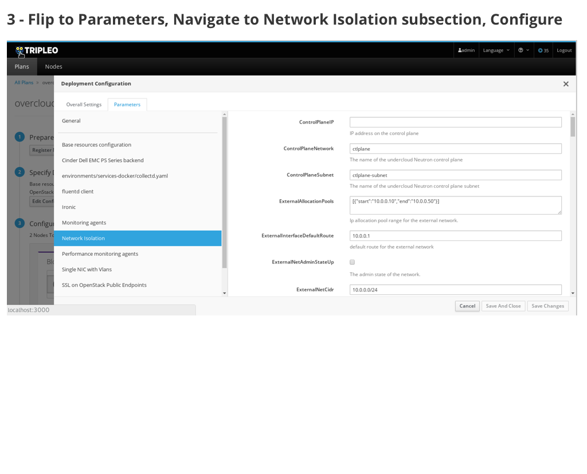
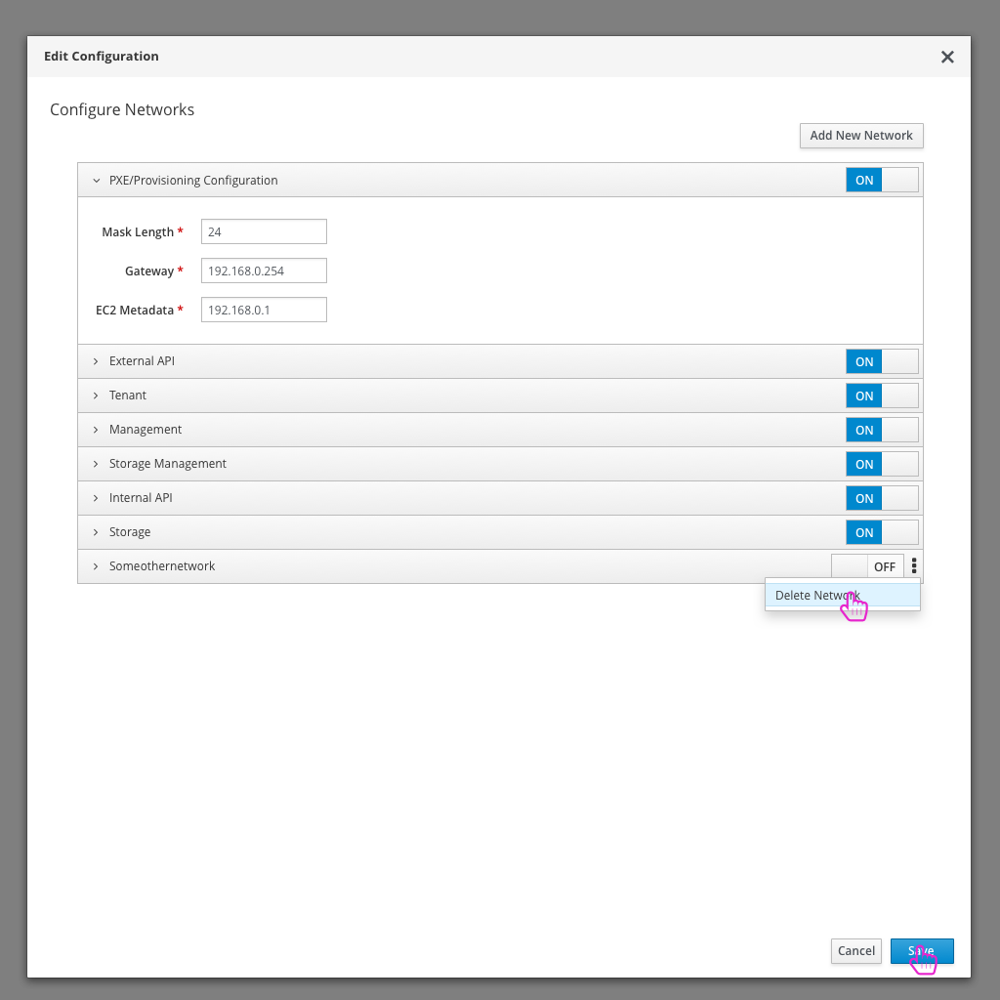
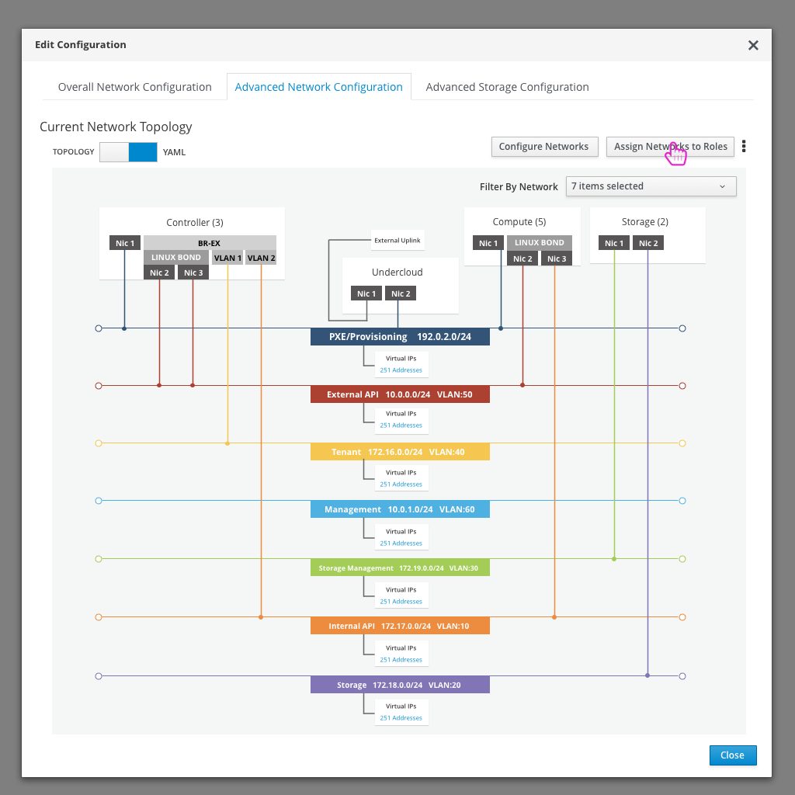
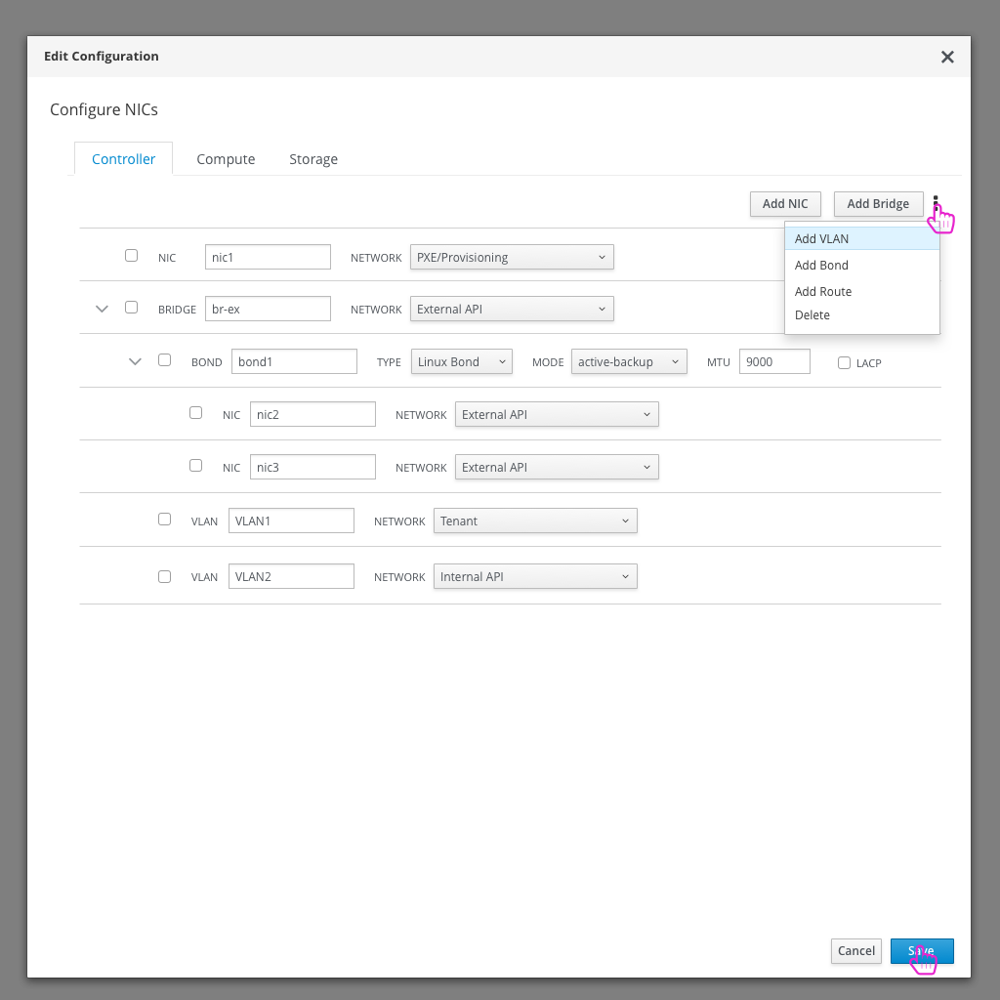
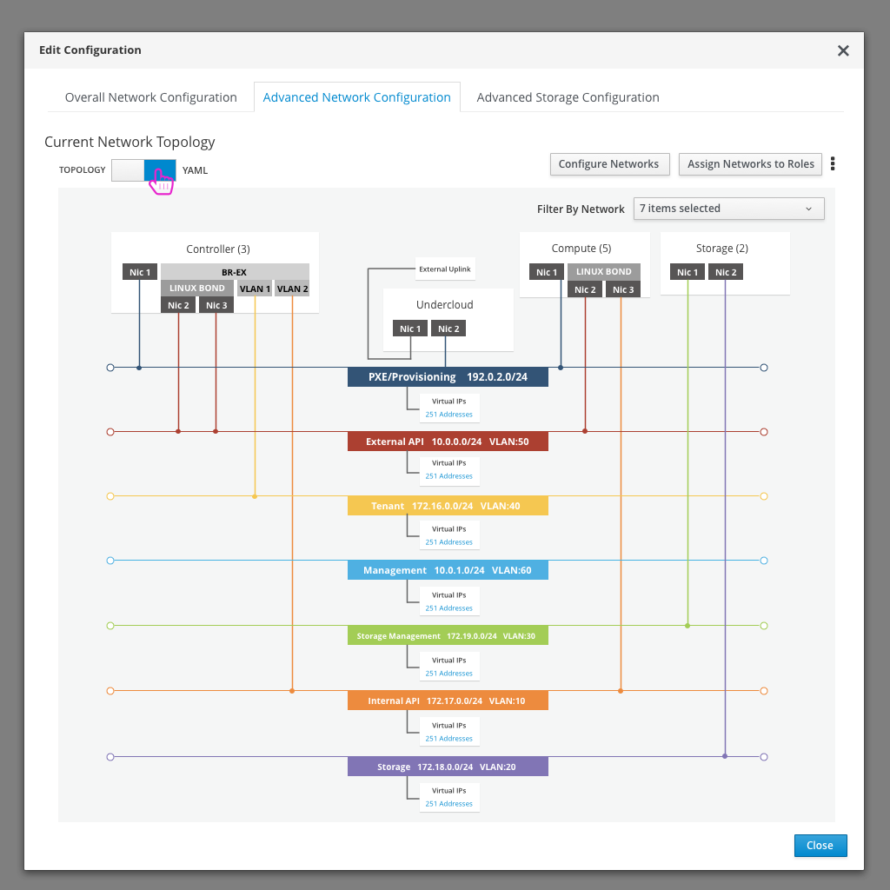
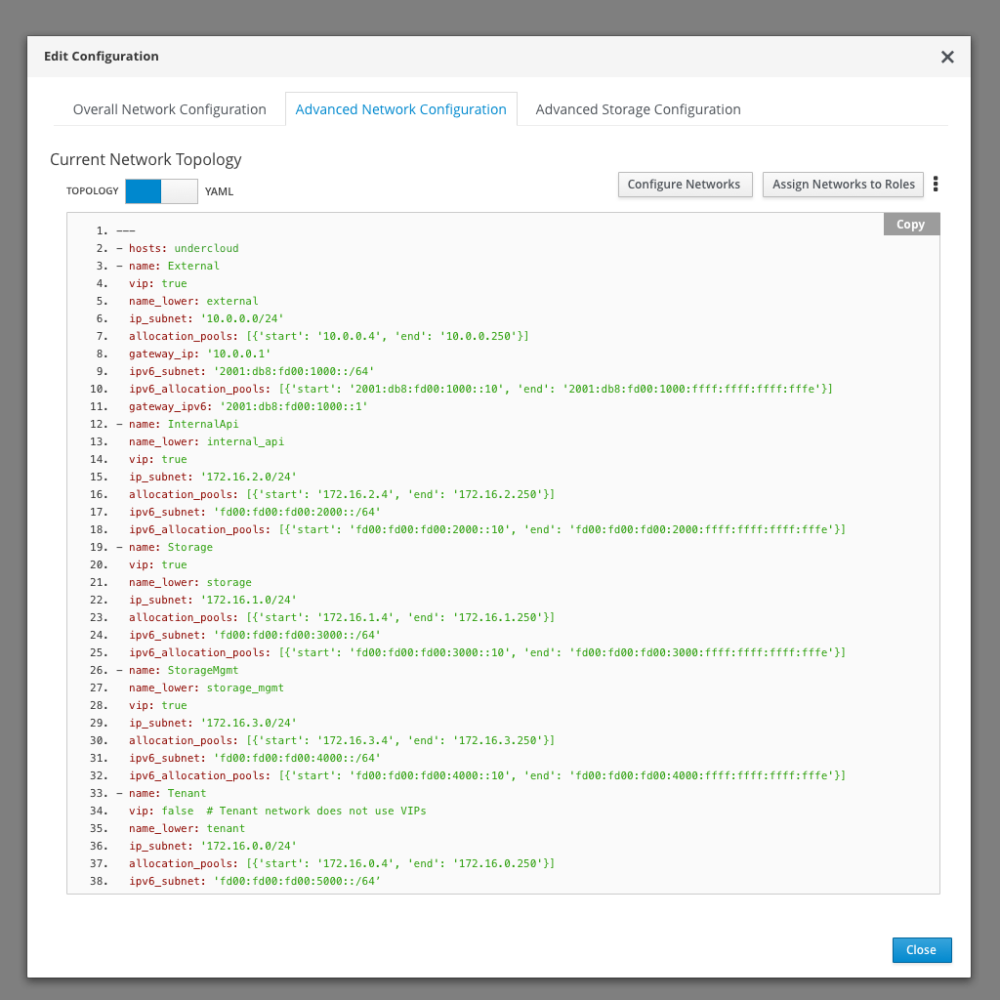
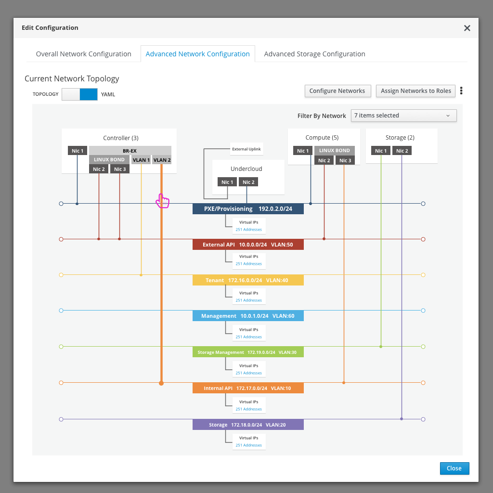

# Network Configuration
Making sure that the network configuration for the OpenStack deployment is correct is an essential part of the workflow.

## Today's flow in TripleO UI - Queens
Today in the TripleO UI, the user has access to Network Configuration in a few different areas. The first is under the Edit Configuration modal where they can turn on Network Isolation and then choose the template to use based on the type of NIC configuration they want to have. In this example, I'm choosing to use VLANs on a single NIC for each isolated network.

The second place to edit Network Configuration is per Role (by clicking the settings icon on the Role card).

## An Ideal Flow

### Login

- First, the user needs to log in to the TripleO UI.

### Edit Network Configuration

- An advanced user (or preparation expert) might use the UI to setup advanced Networking configuration. To access the configuration, they can click on the "Edit Configuration" button on the 4th step of the deployment workflow.

### High Level Network configuration

- First, the user has access to high level network configuration options. This includes enable or disabled things like network isolation, choosing the NIC layout, and enabling or disabling any networking plugins.
- Any plugins that are enabled are added to the accordion below along with any parameters that can be configured.

### Network Topology

- Once the user has clicked on the Edit Configuration button, they will see the current Network Topology as a base view. They will have a number of actions they could perform from here that are in buttons at the top of the modal.
- The network topology is a visual representation of the roles, their NIC configuration, along with which networks each NIC is configured for.
- The user can see the high level network information as well.

### Configure Networks

- The network configuration will slide over the topology view. It will allows users to edit the configuration of the base networks, enable or disable the networks, and add/delete their own networks.
- After making any updates, clicking save will return the user back to the network topology view.

### Assign Networks to Roles
- Clicking the "Assign Networks to Roles" button will present the user with another modal.

- This matrix allows the user to define which roles will be able to access which networks.
- After making any updates, clicking save will return the user back to the network topology view.

### Configure NICs
- The kebab will present the user with a number of additional options. One is to "Configure NICs".

- Clicking on the "Configure NICs" button gives the user the option to define a network profile that will be used for the nodes assigned to each role. The role can be selected at the top of the modal.
- The user will be able to create and configure NICs, bridges, bonds, VLANs, and routes.
- After making any updates, clicking save will return the user back to the network topology view.

### Toggle YAML view
- One option that the user has is to toggle the view from the visual topology to the YAML view.

### Configure Provider Networks
- An additional option is to configure the provider networks.
- Provider networks will be created after a successful deployment, so they are a bit different from all other networks that are being configured here.

- Since the Provider networks are different from the network topology set up, an informational icon is included to help the user understand how and when to use these.

### Download Templates
- Note that there is an additional option in the kebab menu to allow the user to download the templates from this view.

### Hover States
- The user will be click on the different pieces of the network topology in order to drill in and edit these items quickly. Hover over states will be used to show the user that these items are clickable.

### Filter Networks
- If the user wants to filter down the number of networks being shown in the topology, they can use the filter dropdown.

### Role Network Configuration
- An alternate way to view the NIC configuration per role would be to navigate to the Role Configuration modal

- The initial screen the user sees is the overall configuration of that role, but they can navigate to the "NIC Configuration" section to view or edit the NIC config for this role.

