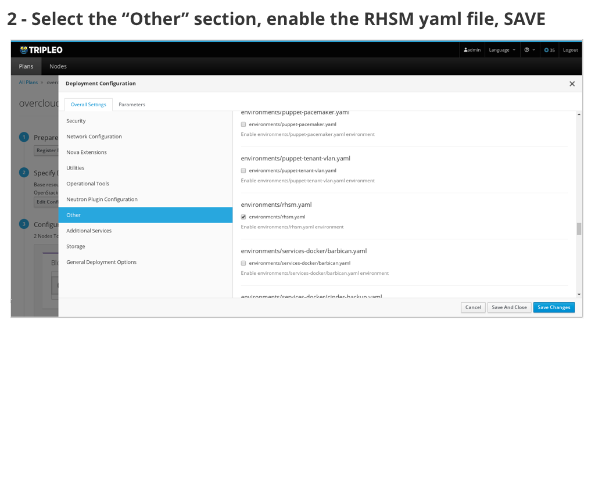
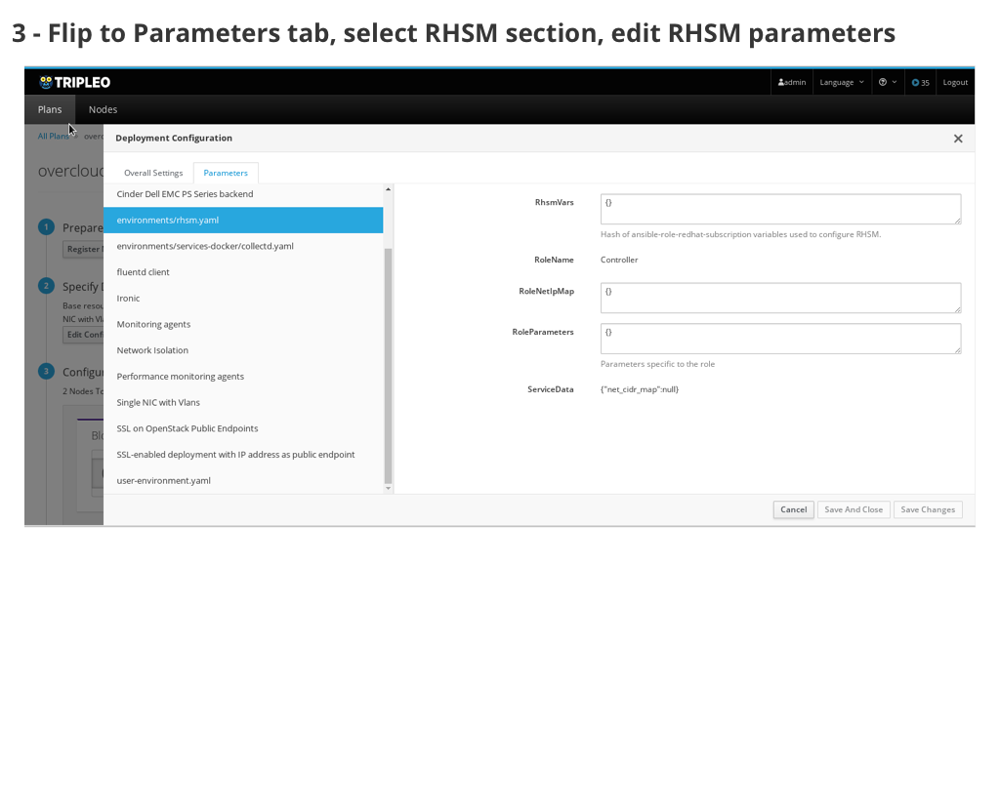
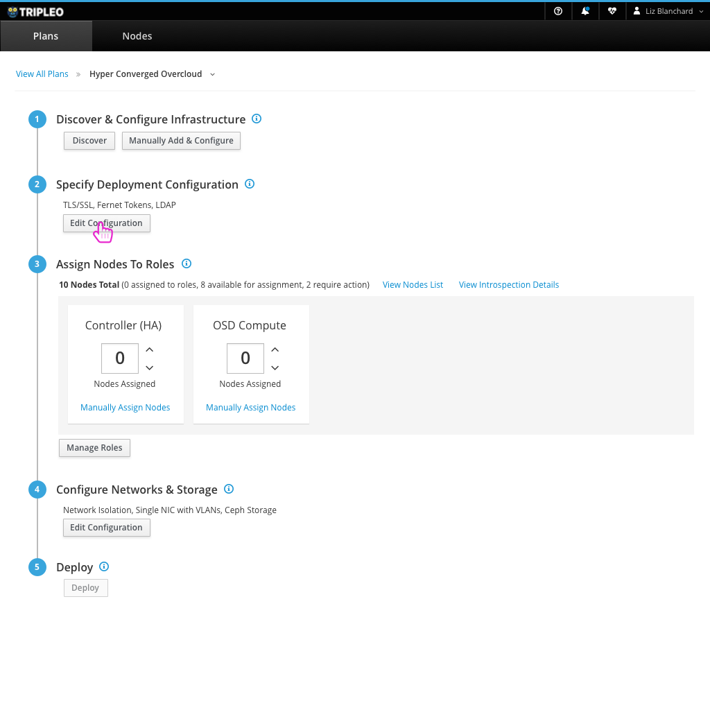
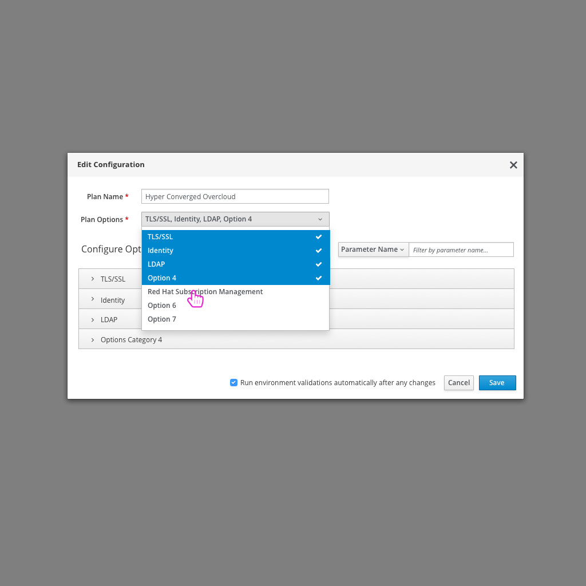
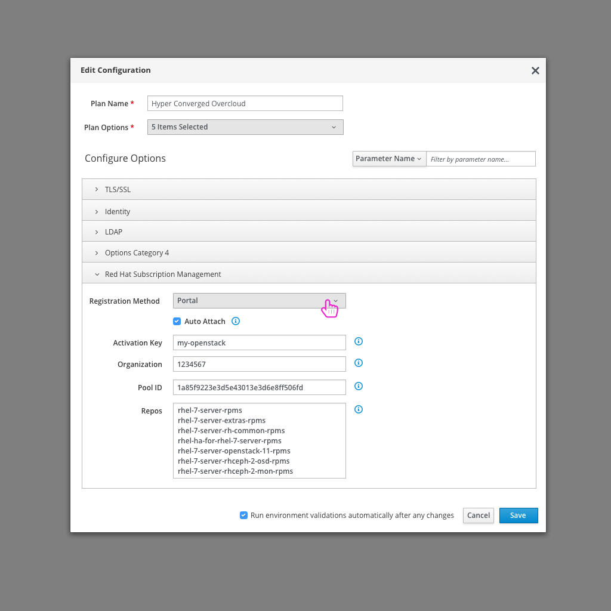
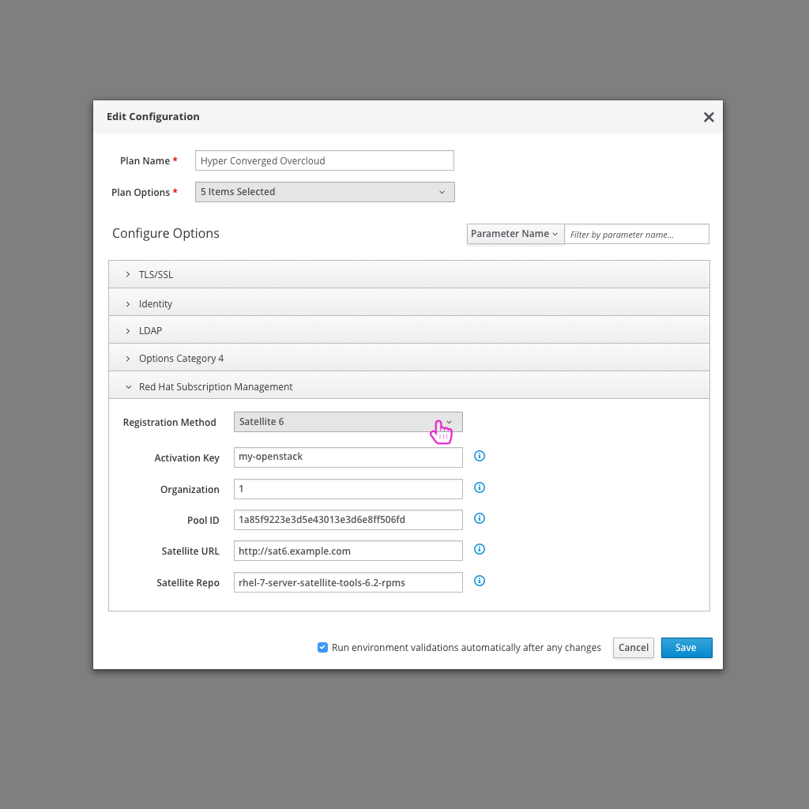
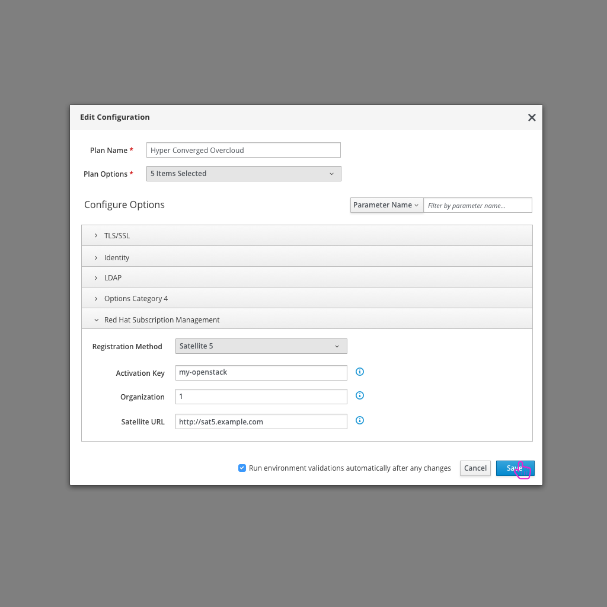
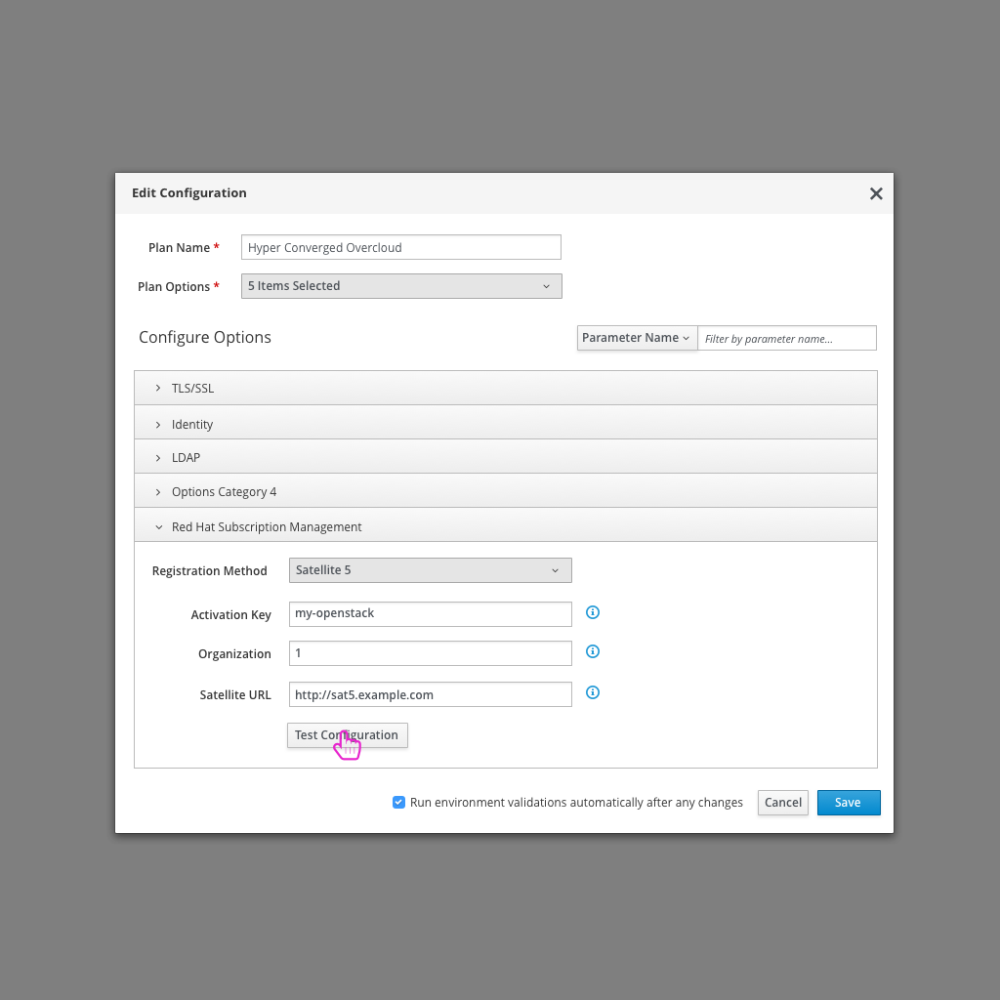

# Enable Subscription Management
Users may want to enable Subscription Management for their overcloud nodes running RHEL to be able to be registered.

## Today's flow in TripleO UI - Queens
Today in the TripleO UI, the user needs to enable RHSM by searching for the correct YAML file in the "Other" bucket of configuration.

### Usability Notes/Questions:
* Parameters don't seem to be the lowest level of Subscription Manager parameters that the user would want to fill out. Instead it looks like it's asking the user to write JSON objects.

## An Ideal Flow in the Future

- After logging in, the user clicks on the "Edit Configuration" button.

- From there, the user can select "Red Hat Subscription Management" from the list of Plan options.

- At this point, there would be a section for Red Hat Subscription Manager where the user would be able to see all of the parameters in one clear section. All of the parameters can be seen here: https://github.com/openstack/tripleo-heat-templates/blob/677f9e8198635b3eb564f1495f2e10a4c5fe11bf/extraconfig/pre_deploy/rhel-registration/environment-rhel-registration.yaml
- Ideally, the user could choose the subscription method (Portal, Sat 6, Sat 5) and then be presented with the applicable configuration parameters based on this selection.

- Another addition that would add value for the user is to be able to test the connection with either the Portal or Satellite based on the user provided data.
