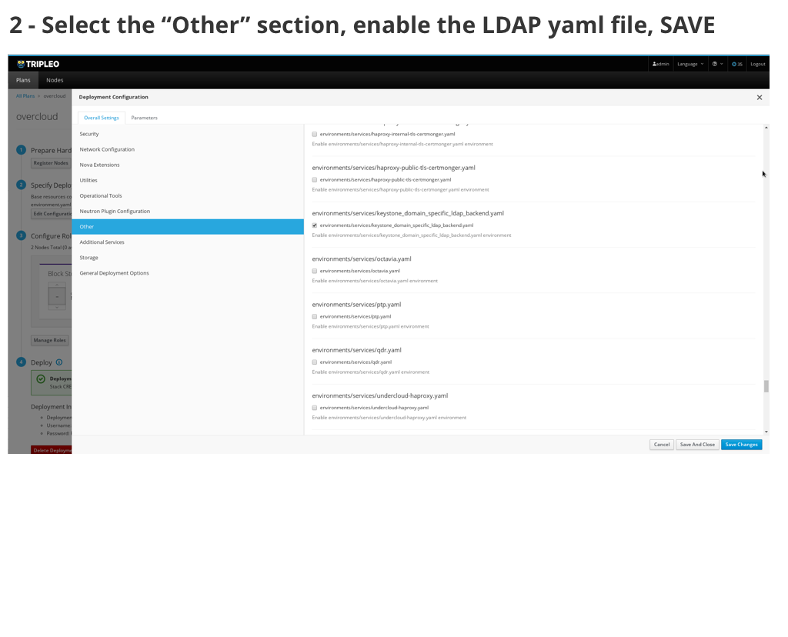
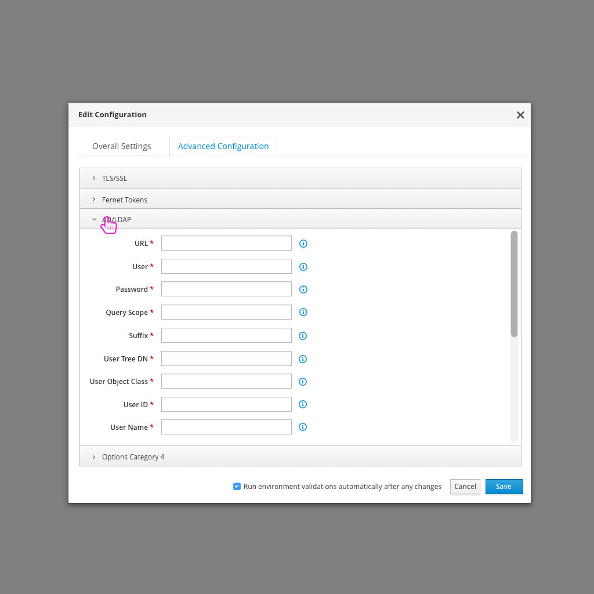

# Authentication Integration
A very common configuration change to make for an OpenStack Deployment is to enable LDAP for Authentication.

## Today's flow in TripleO UI - Queens
Today in the TripleO UI, the user needs to enable LDAP from the "Other" subsection of the configuration modal and then move over to the parameters section to define any LDAP configuration.

### Usability Notes/Questions:
* The two LDAP configuration parameters are repeated in the "Base Resource Configuration" section. This could get confusing to the user if they notice it in different areas. What happens if these are defined differently?
* Currently, the LDAP configuration parameters are represented as one parameter that calls for a JSON object of all of the parameters. It would be a much better experience to break these out into separate parameters in the UI.

## An Ideal Flow in the Future

- After logging in, the user clicks on the "Edit Configuration" button.

- From there, the user can select "LDAP" from the list of Plan options.

- At this point, there would be a section for LDAP where the user would edit any LDAP parameters necessary.

- There would be an optional button to test the configuration.
