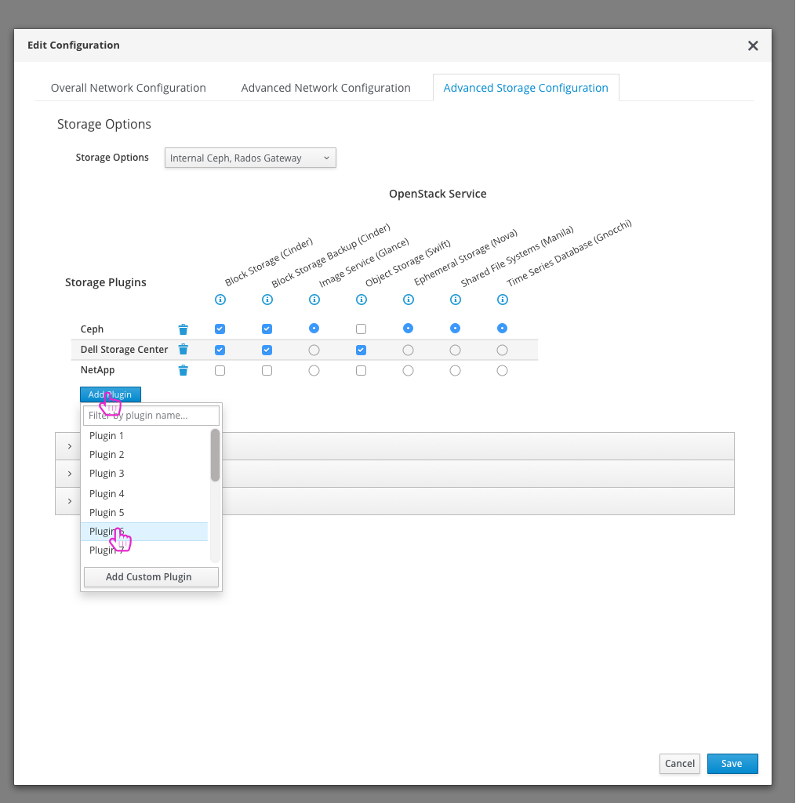

# Third Party Storage Configuration
A very common use case for TripleO UI users is to configure the third party storage plugins that they want to use in their OpenStack deployment.

## Today's flow in TripleO UI - Queens
Today in the TripleO UI, the user needs to choose their high level Storage plugins and then drill into the detailed parameters section to edit any configuration they wish. Each third party storage plugin maps to it's own section in the Parameters tab in the UI.

### Usability Notes/Questions:
* There are so many storage plugins today that it would be nice to allow the user to choose from a list, but not have to list them all out in check boxes and force the user to scroll the list to find out.

## An Ideal Flow in the Future

- If the user wants to configure any storage plugins, they need to open the Edit Configuration modal on Step 4 of the workflow.

- The modal will open to the Overall Network Configuration tab, but the user can quickly choose to view the Advanced Storage Configuration tab to choose and configure their third party storage plugins.

- In this section of the modal, the user can add or remove third party storage plugins that they wish to use in their OpenStack Deployment. Once a plugin is added, the user will have access to parameters for that plugin in the accordion section below.
