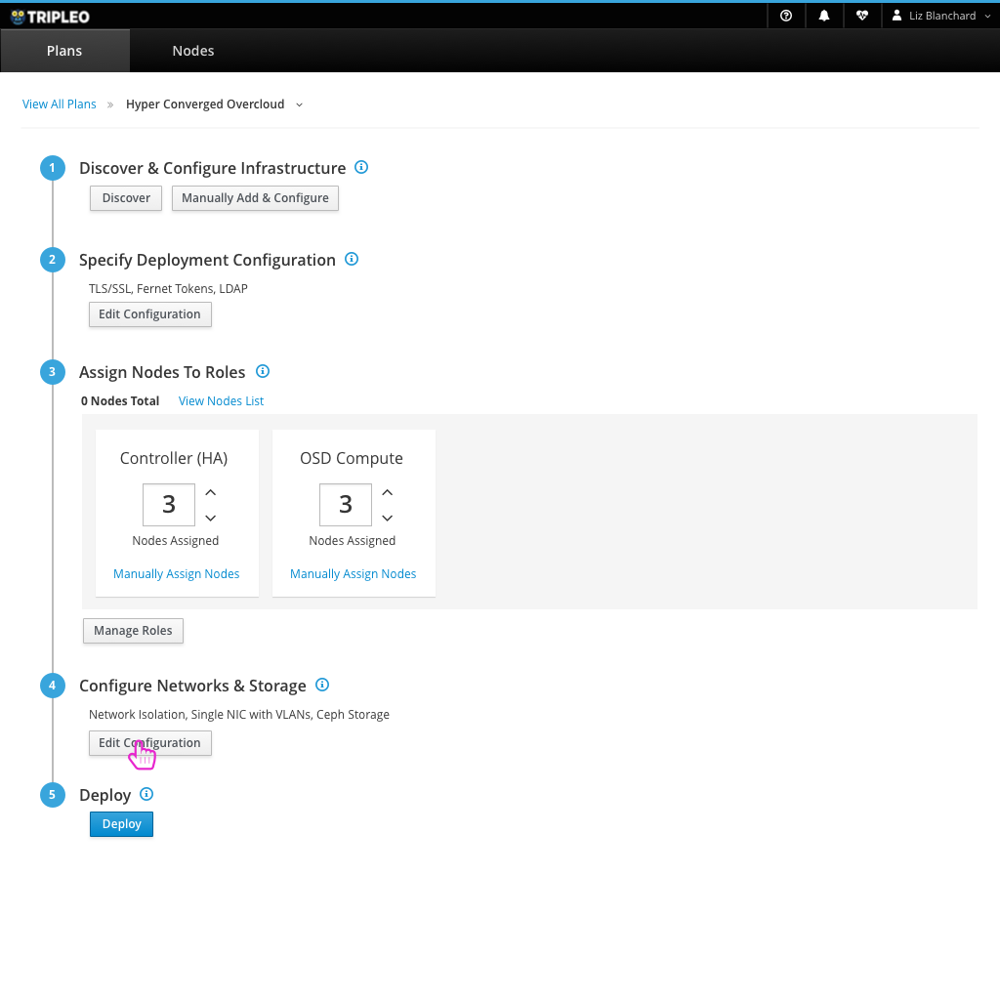
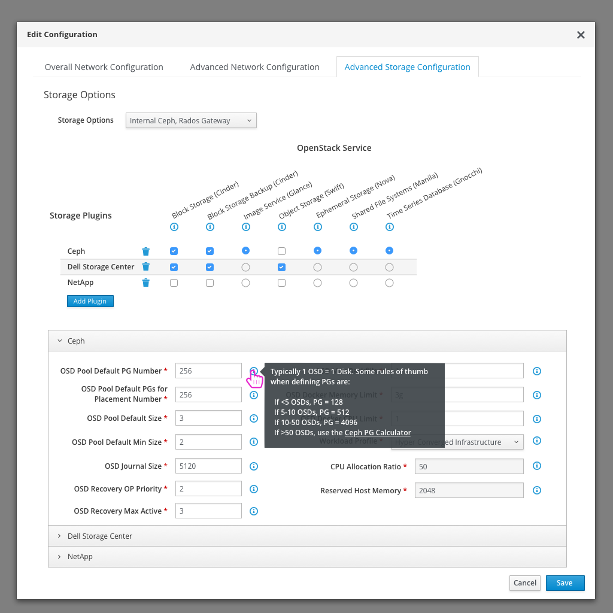
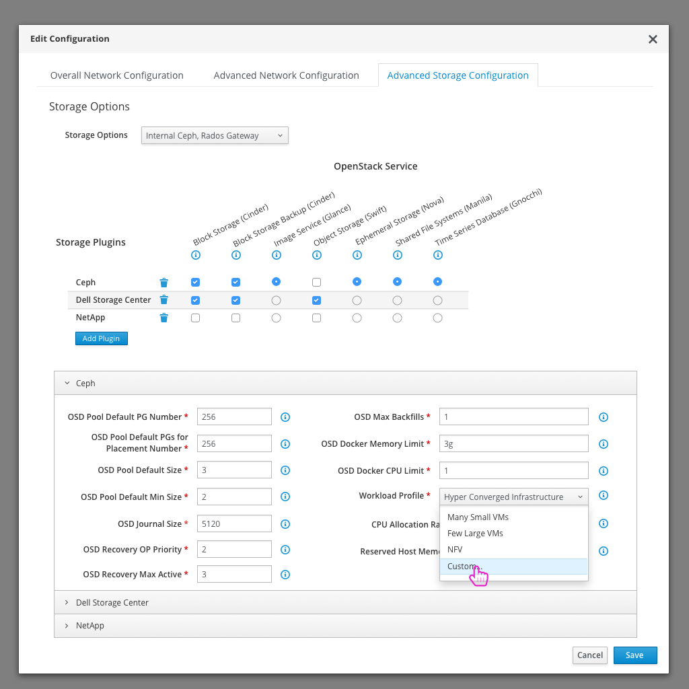
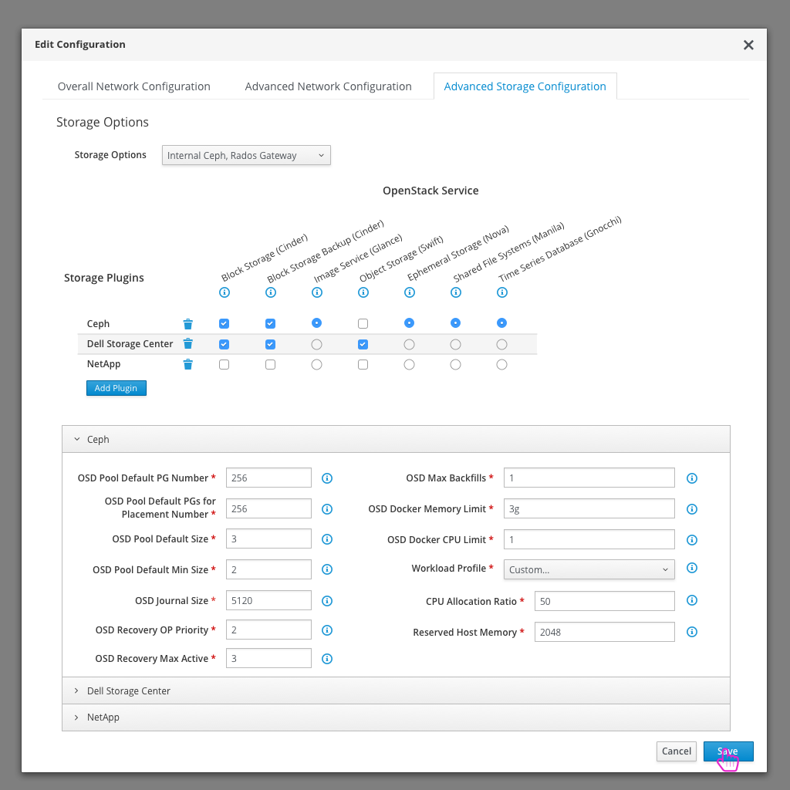
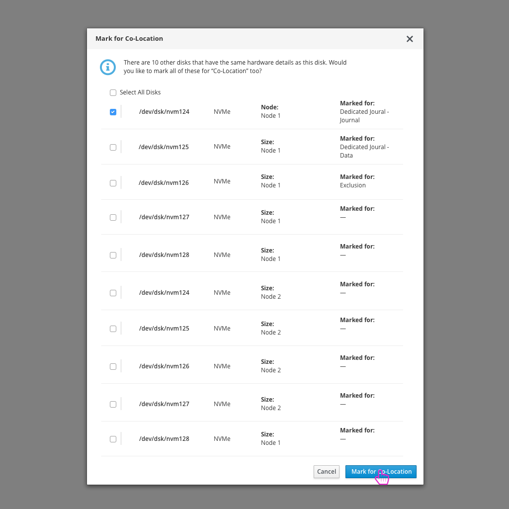

# Ceph Storage Tuning
Using Ceph for Storage is a common use case. This workflow shows the current way a user tunes Ceph vs. an ideal design moving forward.

## Today's flow in TripleO UI - Queens
Today, the user needs to select to use Ceph at a high level configuration, and then can switch to the Parameters tab to tune it further.

## An Ideal Flow in the Future

- If the user wants to configure their Ceph storage, they need to open the Edit Configuration modal on Step 4 of the workflow.

- The modal will open to the Overall Network Configuration tab, but the user can quickly choose to view the Advanced Storage Configuration tab to choose and configure their Ceph storage.

- In this section of the modal, the user can add ceph storage to their deployment. The specific ceph tuning options will be available in the the accordion section below.
- Some parameters have additional information that could be helpful to the end user. Hovering over the information icon will expose this info in a tooltip.

- One piece of this configuration will rely on derived parameters where the user can select the "Workload Profile". This will have a default selection of Hyper Converged Infrastructure and the CPU Allocation Ratio and Reserved Host Memory will be set for the user. They can select from a number of these profiles or choose the "Custom..." option where they can define the values themselves.

- After any changes have been made, the user can save this configuration.

- Jumping over to the Nodes section, the user can view a list of nodes that have been registered.

- From the Nodes view, one option that a user can take on a Node or set of Nodes is to view the Disks.

- Something specific to Ceph storage that a user could define for disks is whether it is marked for Co-Location, Dedicated Journal, or Exclusion.

- If there are a number of other disks that share the same profile as the disk that is being marked, the user will be asked if they'd like to mark all of those for Co-Location as well.
- Hovering over the number of disks will show a list of disk names for user confirmation.

