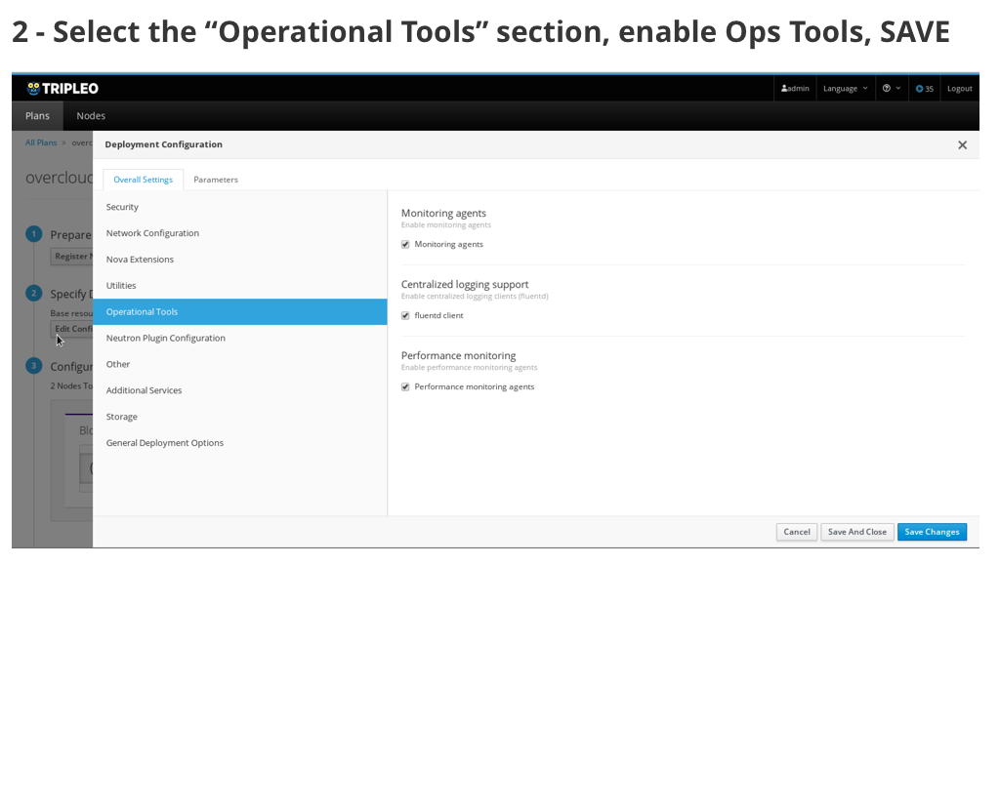
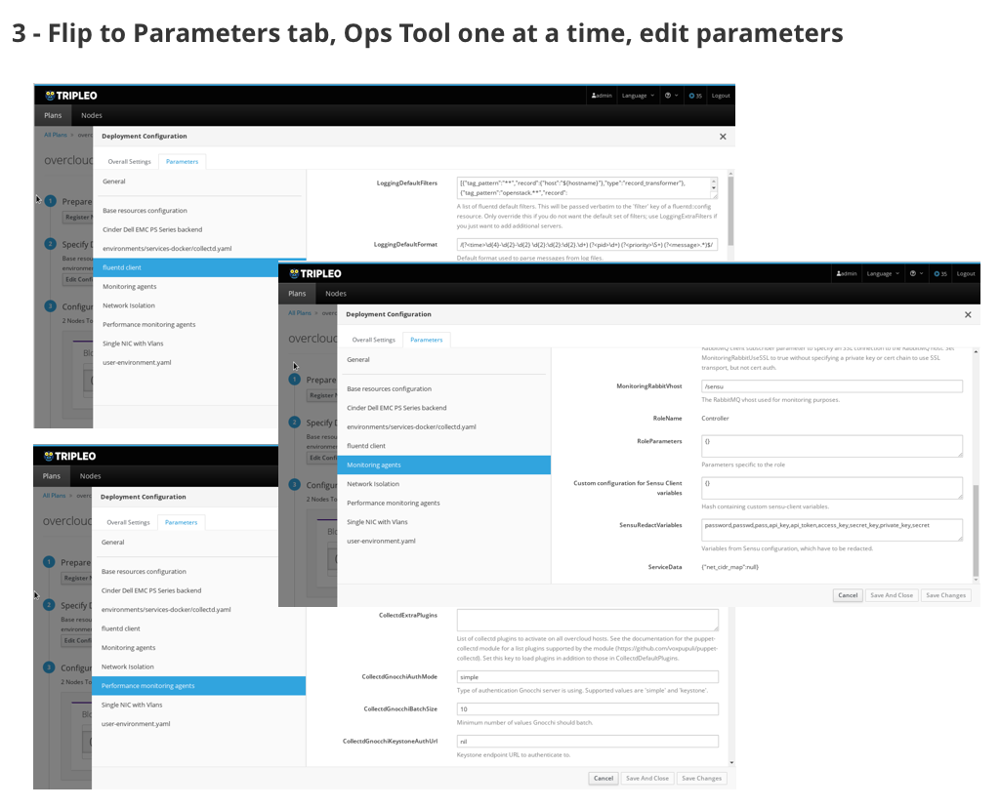
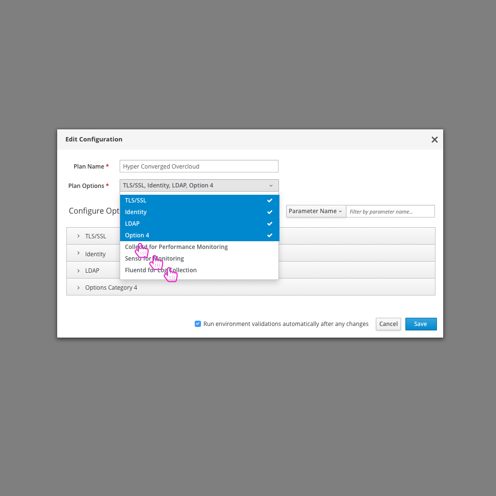
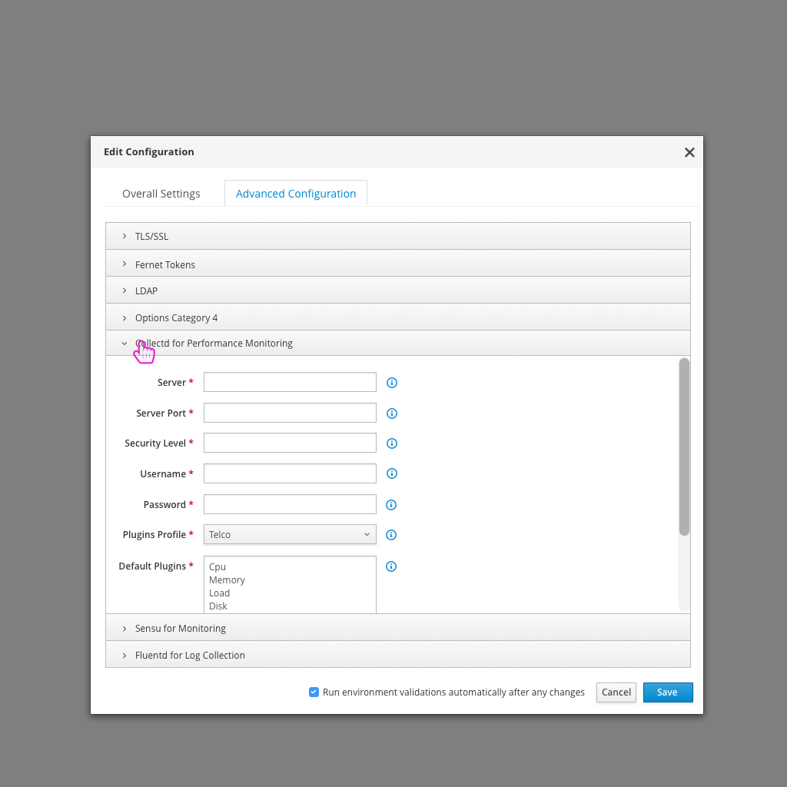
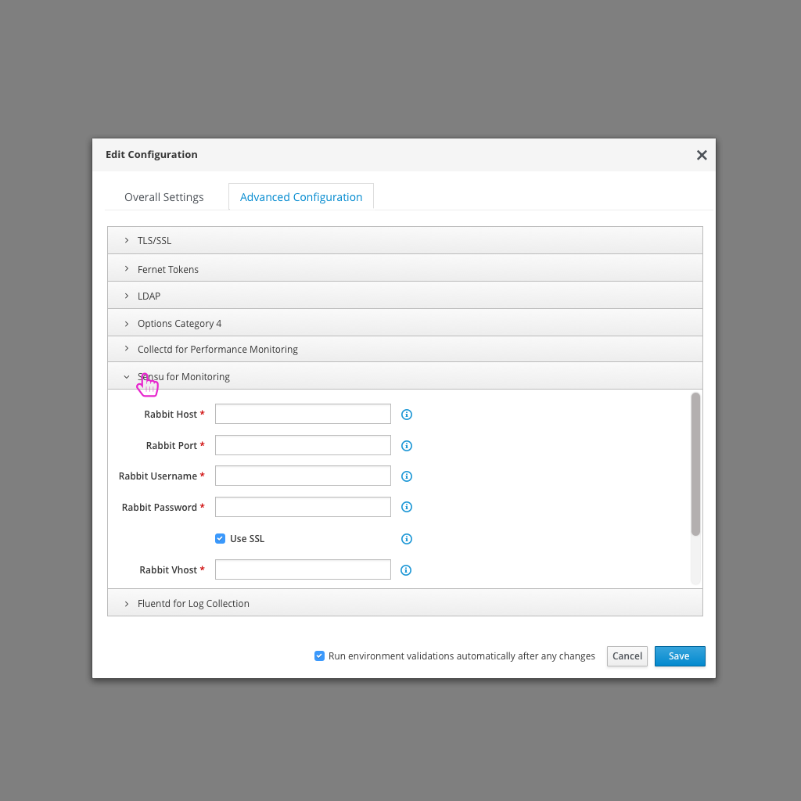
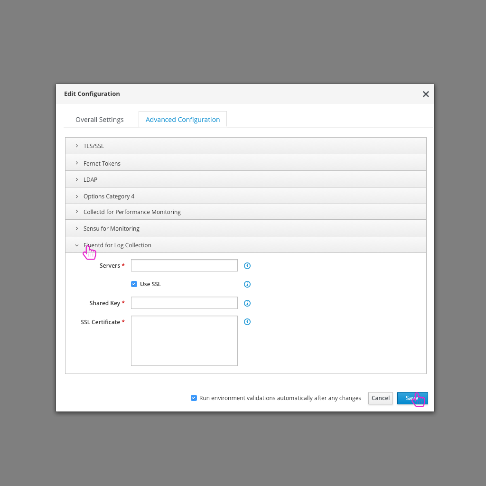

# Enable and Configure Operational Tools
Three common operational tools that users want to enable and configure for use in their OpenStack Deployment are Fluentd (for logging data collection), Sensu (for monitoring servers, services, and application health), and Collectd (for gathering metrics). Each of these integrate with different applications like Elasticsearch, Kibana, Uchiwa, and Grafana.

## Today's flow in TripleO UI - Queens
Today in the TripleO UI, the user can drill into the Edit Configuration modal of step 2 and navigate to the "Operational Tools" section. In this section there are options to enable monitoring agents, fluentd client, and performance monitoring agents. Next, the user can flip to the parameters tab to access specific settings for each of the selected options.

### Usability Notes/Questions:
* Current labeling and description of Operational Tools plugins isn't clear. In one case we label the option as fluentd and the other two are more general monitoring agents. It would be great to be more clear which services these are tied to. Monitoring agent should refer to Sensu while Performance Monitoring agent should refer to Collectd.

## An Ideal Flow in the Future

- After logging in, the user clicks on the "Edit Configuration" button.

- From there, the user can select "Collectd", "Sensu", and "Fluentd" from the list of Plan options.

- At this point, there would be a section for Collectd that the user could open to edit any parameters needed.
- One parameter for Collectd is the default plugins that should be enabled. There are two profiles (one for Web-Hosters, one for Telco) that we should support. The plugins include:
##### Web-Hosters
* Cpu
* Memory
* Load
* Disk
* Df
* Either ovs_stats or interface, with a sample rate of 10 secs
* Depending on installation, it may be good to have the ceph plugin installed

  ##### Telco
* Cpu
* Memory
* Load
* Disk
* Df
* Ovs_stats
* Mysql (requires specific config)
* Apache (requires changing apache config and configuring that plugin.
* (depending on using ceph: ceph)
* virt

- Similarly, there would be a section for Sensu that the user could open to edit any parameters needed.

- Similarly, there would be a section for Fluentd that the user could open to edit any parameters needed.
