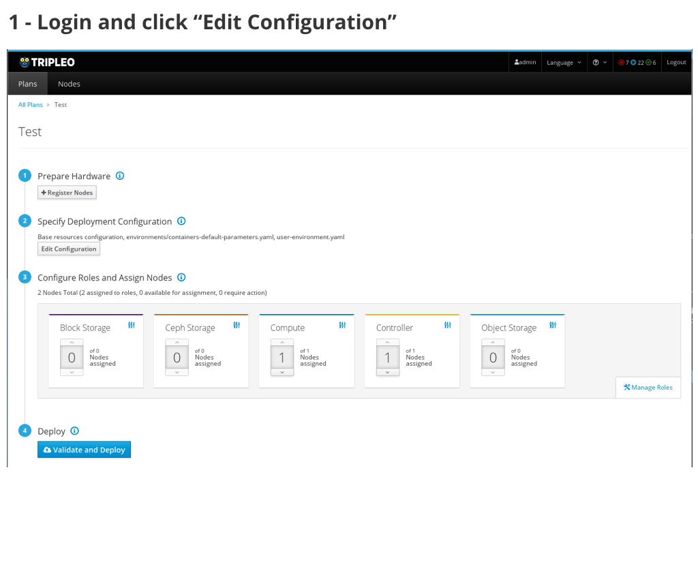
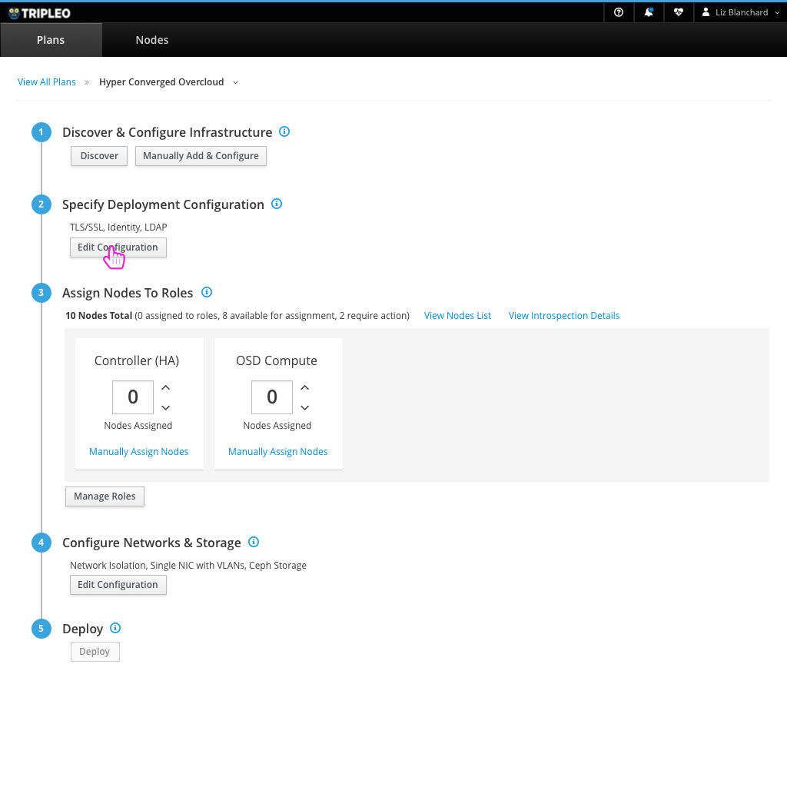

# Bare Metal Provisioning
Users will commonly want to allow provisioning of bare metal instances in their overcloud. This configuration of Ironic allows for that to be available.

## Today's flow in TripleO UI - Queens
Today in the TripleO UI, the user needs to enable Ironic at a high level in the Edit Configuration modal. At this point, they can flip over to the Parameters tab to change any specific configuration for Ironic.

### Usability Notes/Questions:
* All of the documentation calls out that the user will have to come back after configuring the Bare Metal network details to fill in that information here. Could we make this more seamless?

## An Ideal Flow in the Future

- After logging in, the user clicks on the "Edit Configuration" button.

- From there, the user can select "Bare Metal" from the list of Plan options.

- At this point, there would be a section for Bare Metal where the user would edit any parameters necessary.
